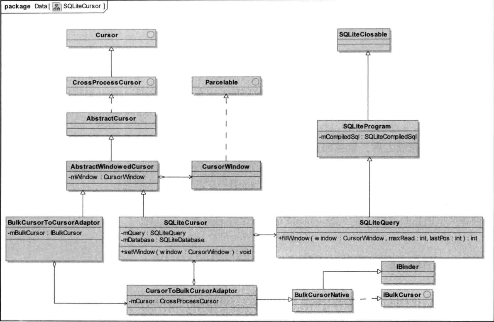

##### 1. Activity 的启动流程
1. ActivityStarter.startActivityLock 验证intent、Class、Permission等，保存将要启动的Activity的Record。
2. ActivityStarter.startActivityUnChecked 检查将要启动的Activity的launchMode和启动Flag，根据launchMode和Flag配置Task。
3. ActivityStack.startActivityLocked 任务栈历史栈配置
4. ActivityStack.resumeTopActivityInnerLocked 查找要进入暂停的Activity
5. ActivityStack.startPausingLocked 通过ipc告诉要暂停的Activity进入暂停
6. ActivityThread.handlePauseActivity
    1. 正式让之前的Activity暂停
    2. 告诉AMS已经暂停完成
7. ActivityManagerService.activityPaused
8. ActivityStack.activityPauseLocked
9. ActivityStackSupervisor.resumeTopAcitivitiesLocked
10. ActivityStack.resumeTopActivityLock 验证是否该启动的Activtiy所在的进程和app是否存在，若存在，直接启动（realStartActivityLocked），否则，准备创建该线程
11. ActivityStackSupervisor.startSpecificActivityLocked 该进程不存在，创建进程
12. ActivityManagerService.startProcessLocked 通过Process.start("android.app.ActivityThread")启动进程
13. ActivityThread.main
14. ActivityThread.attach 
15. IActivityManager.attachApplication
16. ActivityStackSupervisor.attachApplicationLocked 准备启动应用，先查找MainActivity
17. ActivityStackSupervisor.realStartActivityLocked IPC通知ActivityThread
18. ActivityThread.handleLaunchActivity
19. ActivityThread.performLaunchActivity
    > 里面会调用LoadedApk（r.packageInfo）的makeApplication方法加载系统资源。
19. Instrumentation.newActivity
20. activity.attach
21. Instrumentation.callActivityOnCreate

##### 2. Activity State 切换控制（以launch为例子）
1. ActivityStackSupervisor.realStartActivityLocked里面会新建ClientTransaction对象clientTransaction并传入app.thread（ActivityThread.ApplicationThread），r.appToken（ActivityRecord.Token，ActivityRecord构造方法里面新建的）。
2. 调用clientTransaction的addCallback方法新建LaunchActivityItem对象传入各个参数。
3. 调用clientTransaction的setLifecycleStateRequest方法传入希望结束的状态，ResumeActivityItem或者PauseActivityItem。
4. 调用``` mService.getLifecycleManager().scheduleTransaction(clientTransaction)```开始切换Activity状态，mService为ActivityManagerService，getLifecycleManager()获得的是AMS里面的一个ClientLifecycleManager对象。
5. 调用ClientLifecycleManager的scheduleTransaction方法实际上是调用了clientTransaction的schedule方法。最终调用的是ApplicationThread的scheduleTransaction方法，传入clientTransaction。（这一步实现了IPC）
6. ActivityThread里面会调用TransactionExecutor的execute方法传入transaction对象。
7. TransactionExecutor里面先会调用callbacks里面的item的execute方法，最后才调用lifecycleState的execute，即会先调用LaunchActivityItem的execute方法，调用的时候会把token传进去。
8. LaunchActivityItem的execute方法会新建ActivityClientRecord对象保存传进来的token，调用ActivityThread的handleLaunchActivity方法。
9. 其他还有preExecute，postExecute方法，在execute前后做一些处理（比如pause最后会在PostExecute里面调用AMS的activityPaused方法通知Activity已经paused）。

##### 3. <span id="zygote">zygote fork App进程</span>
1. [参考](http://gityuan.com/2016/03/26/app-process-create/)
2. 
3. 开机的时候zygote在fork完system_server进程之后就进入runSelectLoop等待客户端的连接来fork APP进程。
4. 客户端通(ZygoteProcess.start)过socket name zygote连接zygote，zygote进程会在runSelectLoop获得Socket请求，并里调用ZygoteConnection的processOneCommand方法。
5. 接着调用Zygote的forkAndSpecialize方法，其实是调用了native的fork方法fork一个新的进程。
6. 当pid==0时（fork进程是对父进程的复制，所以子父进程都会执行forkAndSpecialize方法以后的方法，只是这个时候子进程返回的pid为0），调用ZygoteInit的zygoteInit方法，接着调用到RuntimeInit的applicationInit方法，反射执行ActivityThread的main方法。
    > fork()采用copy on write技术</br>
    > fork()的主要工作是寻找空闲的进程号pid，然后从父进程拷贝进程信息，例如数据段和代码段，fork()后子进程要执行的代码等;</br>
    > copy-on-write过程：当父子进程任一方修改内存数据时（这是on-write时机），才发生缺页中断，从而分配新的物理内存（这是copy操作）。</br>
    > copy-on-write原理：写时拷贝是指子进程与父进程的页表都所指向同一个块物理内存，fork过程只拷贝父进程的页表，并标记这些页表是只读的。父子进程共用同一份物理内存，如果父子进程任一方想要修改这块物理内存，那么会触发缺页异常(page fault)，Linux收到该中断便会创建新的物理内存，并将两个物理内存标记设置为可写状态，从而父子进程都有各自独立的物理内存。
    > fork之后应用进程就自然得到了虚拟机还可以获得一个Binder线程池和一个消息循环，ProcessState初始化的时候就会open一个binder设备。
    1. ZygoteInit.nativeZygoteInit
        1. AppRuntime.onZygoteInit，初始化ProcessState 并start binder线程池
7. 在子进程里面执行ActivityThread的main方法之后就进入APP主进程后，接下来的事情就是ActivityThread里面的事情了。
8. Process.start()方法是阻塞操作，等待直到进程创建完成并返回相应的新进程pid，才完成该方法。
<!-- - 反射调用ActivityThread的main的时候为了防止调用栈太深，是throw了一个MethodAndArgsCaller错误出来，之后在ZygoteInit的main方法里面try了这个错误并调用其run方法才真正调用了ActivityThread的main。 -->

##### 4. Service的启动流程（bindService）
1. AMS.bindService，除了跟Activity启动流程一样传进来caller，token，intent之外，还有一个IServiceConnection的Binder对象，这个是client调用bindService的时候会调用LoadedApk的getServiceDispatcher方法把ServiceConnection封装成的一个代理分配类，用来回调（应用编程不需要关心）。
2. ActiveServices.bindServiceLocked
    1. bringUpServiceLocked 如果Service还没有create且flags & BIND_AUTO_CREATE ！= 0
        1. AMS.startProcessLocked 如果Service进程还没有启动
        2. ActivityThread.main
        3. ActivityThread.attach 
        4. IActivityManager.attachApplication
        5. ActiveServices.attachApplicationLocked
    7. realStartServiceLocked
    8. ActivityThread.scheduleCreateService
3. ActiveServices.requestServiceBindingLocked
4. ActivityThread.scheduleBindService
5. ActivityManagerService.publishService
6. ActiveServices.publishServiceLocked
7. IServiceConnection.connected
8. ServiceDispatcher.connected
9. ServiceConnection.onServiceConnected

##### 5. 广播
1. 广播注册
    1. 广播注册跟服务的绑定一样会通过LoadedApk封装一个Binder IIntentReceiver。
    2. AMS.registerReceiver。保存IntentFilter和IIntentReceiver（BroadcastFilter）到ReceiverList对象里面，并加入以IIntentReceiver为key，ReceiverList为value的HashMap（mRegisteredReceivers）里面。
    3. filter跟ReceiverList保存在一个BroadcastFilter对象里面并add到mReceiverResolver里面（AMS，保存着动态注册的receiver）
2. 广播发送
    1. ActivityManagerService.broadcastIntent
    2. ActivityManagerService.broadcastIntentLocked如果是无序广播，则先回调动态注册的recevier，再回调静态注册的；如果是有序广播的话就按照优先级来。
    3. BroadcastQueue.enqueueOrderedBroadcastLocked
    4. BroadcastQueue.scheduleBroadcastsLocked
    5. BroadcastQueue.processNextBroadcastLocked
        1.  BroadcastQueue.scheduleBroadcastsLocked 如果是mOrderedBroadcasts里面的非有序广播或receiver==null，动态注册。
        2. 静态注册的广播
            1. Is this receiver's application already running？ BroadcastQueue.processCurBroadcastLocked
            2. 否则 AMS.startProcessLocked
                1. 进程没有起来：BroadcastQueue.scheduleBroadcastsLocked
                2. 否则 mPendingBroadcast=r；mPendingBroadcastRecvIndex = recIdx
                3. AMS.sendPendingBroadcastsLocked
                4. BroadcastQueue.sendPendingBroadcastsLocked
                5. BroadcastQueue.processCurBroadcastLocked
                6. AplicationThread.scheduleReceiver
                7. ActivityThread.handleReceiver
    6. BroadcastQueue.deliverToRegisteredReceiverLocked
    7. BroadcastQueue.performReceiveLocked
    8. ApplicationThread.scheduleRegisteredReceiver
    9. ReceiverDispatcher.Args.Runnable

##### 6. ContentProvider
1. ContentProvider有两套跨进程的获取数据的方案：
    1. query，insert，delete，update 这些都是通过共享内存共享数据的。
    2. call 这个是通过binder Bundle来共享数据的，传递数据量小但是效率高。
2. [getType](https://blog.csdn.net/liyang_nash/article/details/79758816)方法：这个函数会根据传进来的URI，生成一个代表MimeType的字符串；而此字符串的生成也有规则：
    1. 如果是单条记录应该返回以vnd.android.cursor.item/ 为首的字符串
    2. 如果是多条记录，应该返回vnd.android.cursor.dir/ 为首的字符串
    3. 返回的MIME类型，主要就是用来隐式匹配Intent的MIMETYPE域来启动Activity的
3. ActivityThread类有一个成员变量mProviderMap，他是一个HashMap，用来保存在当前应用程序进程中访问过的ContentProvider组件代理。
4. ActivityManagerService.getContentProvider
5. ActivityManagerService.getContentProviderImpl（AMS里面也有一个mProviderMap保存着已经published的ContentProvider）
    1. Wait for the provider to be published...（while循环等待，在此之前把对应的ContentProviderRecord对象保存在ProcessRecord.pubProviders里面，并且在ActivityManagerService的mProviderMap里面也有按照name，class保存对应的cpr）
    2. AMS.startProcessLocked 进程还没起来的话
    3. AMS.attachApplicationLocked
    4. AMS.generateApplicationProvidersLocked 启动其所有的ContentProvider
    5. ActivityThread.handleBindApplication
    6. ActivityThread.installContentProviders
        1. ActivityThread.installProvider
    7. AMS.publishContentProviders
    8. 退出while循环 返回获取的ContentProviderHolder，IContentProvider在其provider保存。
6. 匿名共享内存分析：
    1. SQLiteCursor类关系图
    2. ContentProviderNative(Binder的子类，ContentProvider.Transport的父类，Transport最后会调用ContentProvider里面的对应方法来完成逻辑)里面的onTransact方法把Service端返回的Cursor（数据库的话是SQLiteCursor，是一个支持CursorWindow的类）封装成CursorToBulkCursorAdaptor，并获取其中的BulkCursorDescriptor类，获取这个类的时候会调用：
        1. CursorToBulkCursorAdaptor.getBulkCursorDescriptor
        2. SQLiteCursor.getCount
        3. SQLiteCursor.fillWindow
        4. AbstractWindowedCursor.clearOrCreateWindow
        5. CursorWindow constructor
        6. CursorWindow nativeCreate
        7. native CursoorWindow.create
        8. cutils.ashmem_create_region
        ...在CursorWindow里面构造了一块匿名共享内存，之后通过这块匿名共享内存进行跨进程的数据共享。
7. 由于SQLiteCursor不是一个Binder对象，所以封装成CursorToBulkCursorAdaptor，到了ContentProviderProxy端会把他解封成BulkCursorToCursorAdaptor对象，可跨进程的Binder CursorToBulkCursorAdaptor对象保存在其mBulkCursor对象里面，具体关系如下：
    > 左边的BulkCursorToCursorAdaptor对象的成员变量mBulkCursor引用了右边的CursorToBulkCursorAdaptor对象</br>
    > 左边的CursorWindow对象和右边的CursorWindow对象引用了同一块匿名共享内存。</br>
    > ```cursor.moveToNext()```等于调用了:
    > 1. BulkCursorToCursorAdaptor.moveToNext
    > 2. BulkCursorToCursorAdaptor.onMove
    > 3. CursorToBulkCursorAdaptor.onMove 把数据放到CursorWindow的共享内存中
    > 
    >```cursor.getString(cursor.getColumnIndex```等于调用了:
    > 1. BulkCursorToCursorAdaptor.getString
    > 2. CursorWindow.getString 从CursorWindow的共享内存中拿数据
8. call bundle 的binder信息传递就不分析了
9. ContentProvider的数据更新通知机制
    1. registerContentObserver是把对应的uri和ContentObserver注册的ContentServiice里面，ContentProvider里面的数据更新也会通知ContentService，ContentService查找到对应的uri的ContentObserver并回调。
    2. ContentService里面是用树（ObserverNode）来维护这些observer关系的

##### 7. 其他
1. ActivityRecord.Token
    1. ActivityRecord的构造方法里面会新建ActivityRecord.Token并把this保存在里面。token会传递到client端并保存在ActivityClientRecord里面，token主要是来标注client端的ActivityClientRecord和server端的ActivityRecord，像调用activityPaused方法的时候就需要传入token，这样在server端就可以找到对应的ActivityRecord。
        > 通过这个token可以将service和client的ActivityRecord和ActivityClientRecord对应起来。因为只用token来标识Activity，client端和service端的Activity可以通过Hook使其不是同一个，这可以用来做插件化。
    2. <span id="createWindowContainer">ActivityStack的</span>startActivityLocked方法里面会调用ActivityRecord的createWindowContainer方法，这个方法会new一个AppWindowContainerController对象mWindowContainerController，AppWindowContainerController的构造方法会调用createAppWindow方法新建一个AppWindowToken对象，其父类的构造方法最终会调用到DisplayContent（每个DisplayId都会有一个对应的DisplayContent保存在RootWindowContainer里面，一个DisplayContent代表一块屏幕，屏幕可以是手机自身的屏幕，也可以是WifiDisplay的虚拟屏幕。RootWindowContainer是WindowManagerService的一个对象mRoot，在其构造方法里初始化）的addWindowToken方法保存token（ActivityRecord.Token）和对应的AppWindowToken对象。也会调用TaskWindowContainerController.mContainer.addChild(atoken（AppWindowToken）, index（add on the top）)。
    3. ActivityThread的performLaunchActivity方法里面调用Activity的Attach方法的时候会把ActivityClientRecord的token传进去保存在Activity的mToken里面。
        1. attach里面新建window（PhoneWindow）之后会调用其setWindowManager方法传入mToken保存在Window的mAppToken里面，并调用WindowManagerImpl的createLocalWindowManager（SystemServiceRegistry的机制，导致同一个Context.getSystemService得到的manager是相同的，通过createLocal可以新建一个自己的WM而不是Context共享的）方法传入this，新建WindowManagerImpl对象mWindowManager。这样就把WindowManagerImpl和PhoneWindow联系起来了。
            > WindowManagerImpl里面有一个mGlobal（WindowManagerImpl）单例，很多的操作都是通过mGlobal调用WMS完成的，相当与一个包装器模式，每个Window都有一个WindowManagerImpl，但是他们的mGlobal是相同的（同一个进程）。
        2. 在ActivityThread的handleResumeActivity里面调用addView的时候，WindowMnangerGlobal的addView方法会调用adjustLayoutParamsForSubWindow为window的Attributes的token赋值，因为是Activity的window（```mContainer==null```）所以token赋值为mParentWindow（即当前window，WindowManagerImpl的构造方法里传进来的window付给mParentWindow）的mAppToken。
    4. WindowManagerService新建WindowState前（WMS.addWindow）从DisplayContent获取对应ActivityRecord.Token（WindowManager.LayoutParams.token）的AppWindowToken，并传入。
2. FLAG_ACTIVITY_NEW_TASK：用该标志启动的Activity 如果该Activity已经在某个Task里面了，则把她显示到前台不重新新建Task，除非加 FLAG_ACTIVITY_MULTIPLE_TASK 这个flag。
3. android:taskAffinity：当开始一个没有Intent.FLAG_ACTIVITY_NEW_TASK标志的Activity时，任务共用性affinities不会影响将会运行该新活动的Task:它总是运行在启动它的Task里。但是，如果使用了NEW_TASK标志，那么共用性（affinity）将被用来判断是否已经存在一个有相同共用性（affinity）的Task。如果是这样，这项Task将被切换到前面而新的Activity会启动于这个Task的顶层。
4. Launcher的启动