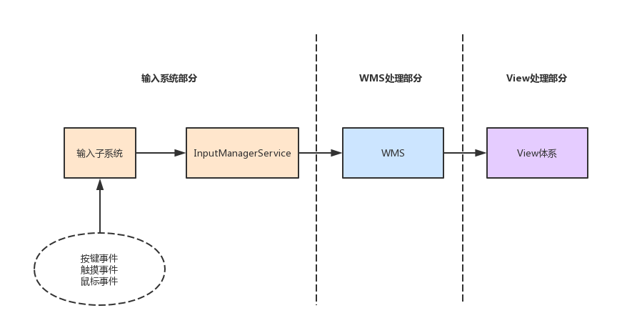
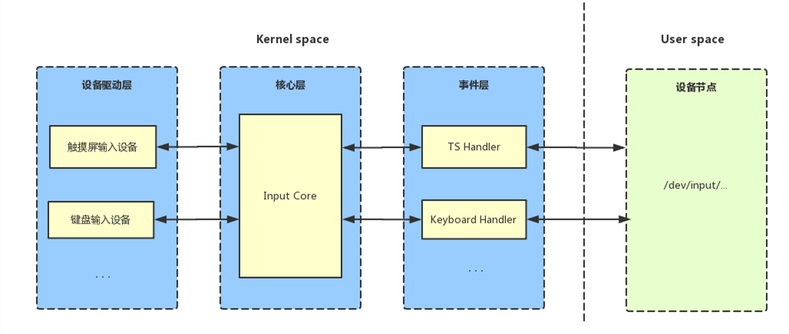
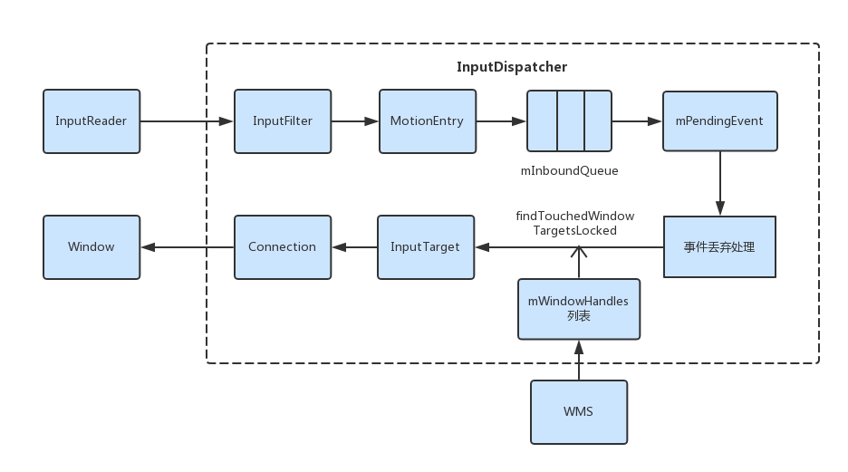
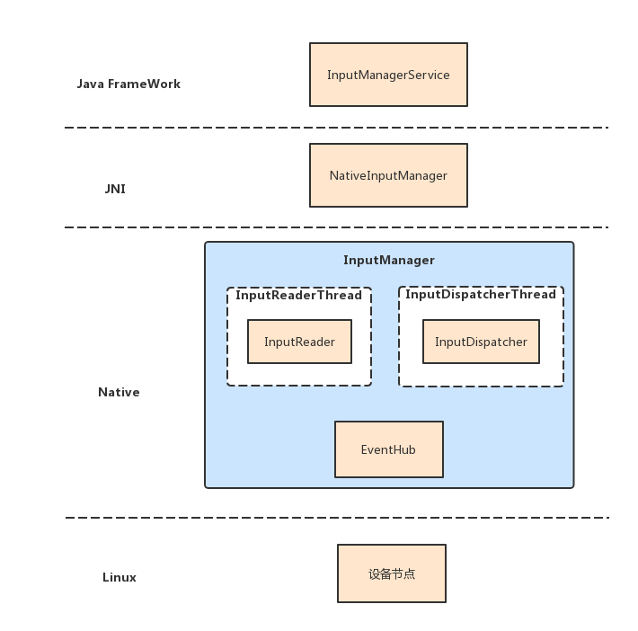
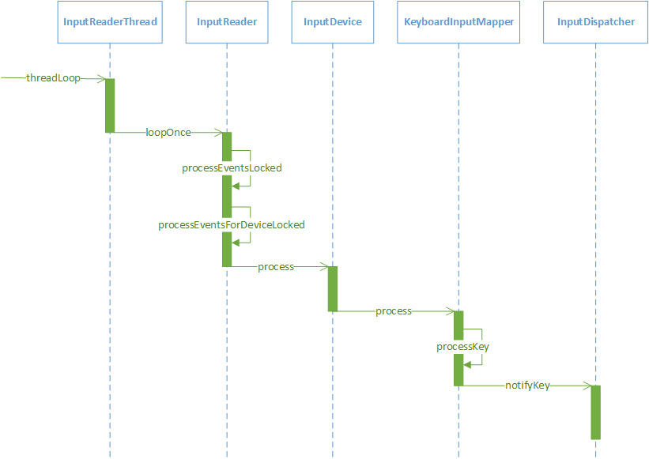
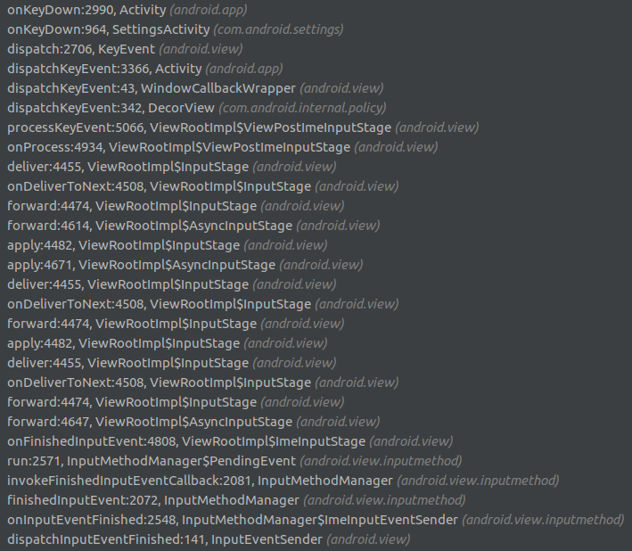
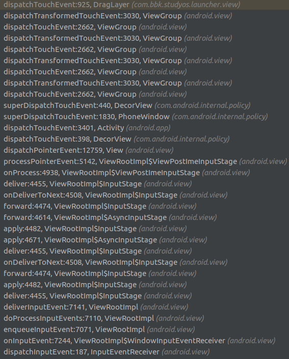
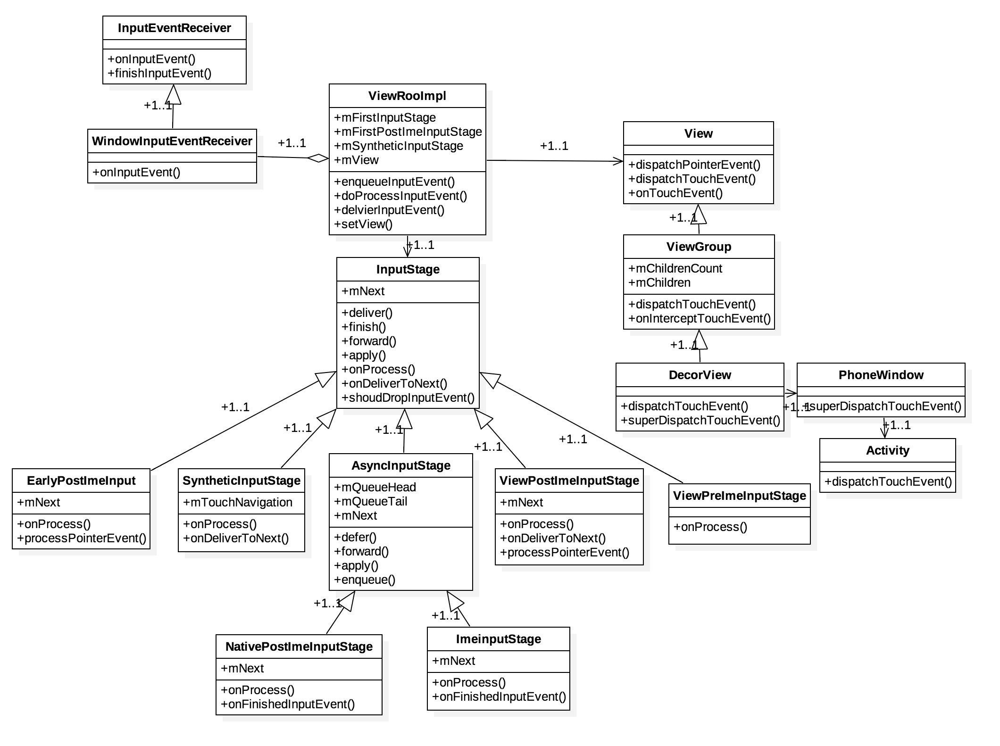
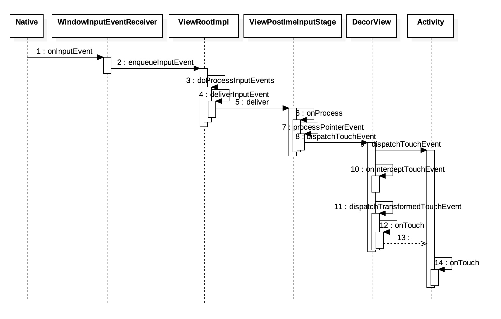

##### 1. 输入事件传递的大概流程
1. 
2. 
3. 
4. InputManager类图
    1. 由上图可知WindowManagerService里面有一个InputManagerService对象mInputManager，这是开机的时候由SystemServer创建WindowManagerService对象的时候传进来的。
    2. InputManagerService对象的构造方法会调用nativeInit方法初始化一个native层的InputManager NativeInputManager，传入其InputManagerHandler对象mHandler对应Looper里面的MessageQueue，最后将NativeInputManager对象地址保存在mPtr里面。
        1. 把上面传经来的java层的MessageQueue，获取其native层的MessageQueue并保存其对应的native Looper在mLooper里面。
        2. NativeInputManager的构造方法里会构造一个InputManager对象mInputManager。
    3.  InputManager（native）里面有两个成员变量mDispatcher和mReader，他们分别指向了一个InputDispatcher对象和一个InputReader对象，前者是用来分发键盘事件给系统当前激活的应用程序，后者用来监控系统的键盘事件，他们分别运行在一个独立的线程中。
        1. InputDispatch有两个成员变量mLooper和mFocusedWindowHandle，他们分别指向一个Looper对象和一个InputWindowHandle对象，前者用来和InputReader通信，后者用来描述系统当前激活的应用程序窗口。
        2. 当一个应用程序窗口被激活时，WMS就会调用java层的InputManagerService的setInputWindows将他设置到InputDispatcher的mFocusedWindowHandle中以便InputDispatcher可以将时间分发给他处理。
            > WMS里面有一个InputMonitor对象mInputMonitor是用来专门处理Input事件和Focus管理的。上面说WMS调用InputManagerService的setInputWindows其实也是间接调用，是通过调用InputMonitor.updateInputWindowsLw->UpdateInputForAllWindowsConsumer.updateInputWindows->mService.mInputManager.setInputWindows。
        3. InputReader有一个成员变量mEventHub，他指向一个EventHub对象，这个EventHub对象是正在用来监控系统的键盘事件的。

##### 2. 开机后Input系统的建立
1. 开机过程中在构造完WMS之后会调用InputManagerService的start方法，里面会最终调用到InputManager（native）的start，把mReader和mDispatcher所在的线程mReaderThread，mDispatcherThread run起来。
    > SystemServer在start InputManagerService之前还调用其setWindowManagerCallbacks传入WMS的mInputMonitor
2. InputDispatcher启动起来之后会不断调用他的成员函数dispatchOnce来检查InputReader是否给他分发了一个事件，如果没有会调用其成员变量的mLooper的成员函数[pollOnce](消息处理机制.md#looper)进入睡眠等待状态直到被InputReader唤醒。
3. InputReader在启动的完成之后，会不断的调用他的成员函数loopOnce来监控系统是否有键盘事件发生（当线程运行时，会调用threadLoop函数，如果它返回true并且没有调用requestExit函数，就会接着循环调用threadLoop函数）。InputReader类的成员函数loopOnce实际上是通过调用成员变量mEventHub的成员函数getEvents来监控系统是否有键盘事件发生的。

##### 3. Key事件到来时的处理
1. 当getEvents返回值count不为0的时候就会调用InputReader.processEventsLocked；getEvents是个阻塞方法，调用了epoll_wait，如果device.fd没有写入数据，或其他监听的fd（如mWakeReadPipeFd，用来wake的）没有写入数据，就会在这儿陷入阻塞睡眠。
    > 第一次调用getEvents的时候会因为mNeedToScanDevices=true，故会调用EventHub.scanDevicesLocked，扫描dev/input目录下的input device节点，open之后加入到mOpeningDevices链表里面，并且用epoll监听打开的fd，然后遍历mOpeningDevices链表把scan的数据以type=DEVICE_ADDED返回给InputReader event数据，InputReader判断接收到的event是Device_ADDED event之后会调用InputReader.addDeviceLocked新建对应的InputDevice对象，并保存在mDevices里面。
2. 如果event type不是DEVICE_ADDED、DEVICE_REMOVED或FINISHED_DEVICE_SCAN则调用InputReader.processEventsForDeviceLocked方法。通过获得的deviceId获取对应InputDevice并调用其process方法。
3. 循环调用InputDevice Mapper的process，一般会调用到的是KeyboardInputMapper.process -> KeyboardInputMapper.processKey
4. 封装inputEvent事件之后调用InputDispatcher.notifyKey唤醒InputDispatcher分发input Event
    > notifyKey里面会调用mPolicy（NativeInputManager）的<font color=#00CED1>interceptKeyBeforeQueueing</font>方法，然后会调用到InputManagerService的interceptKeyBeforeQueueing，接着调用mWindowManagerCallbacks（InputMonitor）的interceptKeyBeforeQueueing方法，最后调到mService（WMS）.mPolicy（PhoneWindowManager）.interceptKeyBeforeQueueing返回1就是不拦截，返回其他就是拦截，在NativeInputManager.hanleInterceptActions里面对这个返回值做了处理，如果不拦截（```wmActions & WM_ACTION_PASS_TO_USER```），则```policyFlags |= POLICY_FLAG_PASS_TO_USER```
5. 上面步骤的流程图
6. notifyKey 里面如果AccessiBilityManagerService没有实现InputFliter的话，就把KeyEvent排队到mInboundQueue的尾部，唤醒InputDispatcherThread（如果需要的话）执行dispatchOnce方法，接着执行dispatchOnceInnerLocked方法，如果````mPendingEvent->policyFlags & POLICY_FLAG_PASS_TO_USER```则调用InputDispatcher.dispatchKeyLocked。
    1. 调用doInterceptKeyBeforeDispatchingLockedInterruptible最终回调到PhoneWindowManager.<font color=#00CED1>interceptKeyBeforeDispatching</font>，官方说法：“Give the policy a chance to intercept the key.”方法返回值代表的是delay，如果delay<0则skip这个keyevent，如果delay=0则继续分发，否则延时delay分发。
    2. 调用InputDispatcher.findFocusedWindowTargetsLocked找到InputTargets的Focusewindow。
        1. 在Session.relayout -> WMS.relayoutWindow的时候会调用WMS.updateFocusedWindowLocked来更新WMS.mCurrentFocus（通过调用mRoot.computeFocusedWindow()计算的），并调用InputMonitor.setInputFocusLw来更新InputMonitor.mInputFocus。
        2. Window在很多情况下都会调用InputMonitor.updateInputWindowsLwl来更新mInputWindowHandles，实际上是通过调用WMS.mRoot.forAllWindows来递归整个mRoot树来找，最后会回调UpdateInputForAllWindowsConsumer.accept把找到的WindowState回传回来，更新mInputWindowHandles，最后调用WMS.mInputManager.setInputWindows把mInputWindowHandles设置到InputDispatcher里面（里面Focus的window ```windowHandle->getInfo()->hasFocus```为1）。
        3. InputDispatcher.addWindowTargetLocked添加InputTarge到inputTargets，inputTarget的数据指向mFocusedWindowHandle.mInfo保存的数据，包括inputChannel（ViewRootImpl里面传进来的）
    3. 调用InputDispatcher.addMonitoringTargetsLocked添加InputTarget到inputTargets，inputChannel指向InputManagerService.monitorInput传进来的InputChannel。
    4. 调用InputDispatcher.dispatchEventLocked获取inputTarget对应inputChannel的connection，并调用InputDispatcher.prepareDispatchCycleLocked传入connection，eventEntry，inputTarget
    5. InputDispatcher.prepareDispatchCycleLocked -> InputDispatcher.enqueueDispatchEntriesLocked -> InputDispatcher.startDispatchCycleLocked
    6. 调用connection->inputPublisher（InputPublisher）.publishKeyEvent发布Key事件。实际上就是调用了<font color=#7FFFAA>inputChannel.sendMessage</font>把事件传出去。（framework/native/lib/input/InputTransport文件）

##### 4. Key事件的接受
1. [WMS.md](WMS.md)里面可以知道Client通过调用WMS.addWindow把Client端的Window跟Service联系起来，新建的WindowState就是为了记录client端的Window状态。
2. 在新建完WindowState之后会调用WindowState.openInputChannel来建立一个服务端inputChanel-service跟IMS的联系，并把client的inputChanel（传进来的outInputChannel）赋值并回传给client端（ViewRootImpl）
    > WindowState在构造方法里面新建了一个InputWindowHandle，在openInputChannel方法里面把inputChannel赋值给InputWindowHandle.inputChannel
    1. 服务端的inputChannel调用IMS.registerInputChannel传进inputChannel和inputWindowHandle，最后是调用到InputDispatcher.registerInputChannel把inputChannel，inputWindowHandle保存在一个Connection对象connection里面，并保存在InputDispatcher.mConnectionsByFd里面以inputChannel.getFd为key，connection为value（发送事件的时候会根据inputChannel.getFd获取到connection）。并调用```mLooper->addFd(fd, 0, ALOOPER_EVENT_INPUT, handleReceiveCallback, this);```（消息处理机制里面有讲过的addFd）
    2. ViewRootImpl得到mInputChannel之后新建WindowInputEventReceiver把mInputChannel保存在里面并传入Looper.myLooper，可以获得对应的MessageQueue。接着会调用InputEventReceiver（WindowInputEventReceiver的父类）.consumeBatchedInputEvents -> NativeInputEventReceiver.consumeEvents，最后会调用到InputConsumer.consume -> <font color=#7FFFAA>mChannel->receiveMessage</font>。和3.6.6对应，一个是服务端的send，一个是客户端的receive，他们是一对socketFd。
        > 1. WindowInputEventReceicer的父类InputEventReceiver的构造方法会调用一个nativeInit把自己和inputChannel和mMessageQueue传进去，在jni层建立一个NativeInputEventReceiver对象并返回给java层保存在mReceiverPtr里面。nativeInit会调用NativeInputEventReceiver对象的initialize方法，里面实际上是```mMessageQueue->getLooper()->addFd(mInputConsumer.getChannel()->getFd(), 0, ALOOPER_EVENT_INPUT, this, NULL)```把fd保存到当前线程的Looper里面，监听fd的ALOOPER_EVENT_INPUT时间，如果监听到了就会回调LooperCallback.handleEvent方法，然后调用NativeInputEventReceiver.consumeEvents方法去receiver msg。
        > 2. android_view_InputEventReceiver调用InputConsumer.consume之后会回调Java层的dispatchInputEvent方法，把Event传递到Java层。</br>
        > 3. onKeyDown堆栈
        > 4. Touch Move事件堆栈
    3. 总的来说：
        1. Service端的inputChannel是保存在InputDispatcher里面的mConnectionsByFd里面的，通过InputDispatcher.registerInputChannel注册进去。
        2. Client端的inputChannel保存在InputEventReceiver里面，保存在NativeInputEventReceiver对象里面。
        3. 有事件的时候通过Service的inputChannel send，通过Client的inputChanel receive
3. dispatchInputEvent到控件树的派发，[InputStage责任链。](https://xiaozhuanlan.com/topic/8946537021)
    1. 
    2. 
    3. 责任链：NativePreImeInputStage -> ViewPreImeInputStage -> ImeInputStage -> EarlyPostImeInputStage -> NativePostImeInputStage -> ViewPostImeInputStage -> SyntheticInputStage
        > 从责任链的头开始调用，如果这个Stage不处理这个Input事件就放回FORWARD，把事件传给下一个节点，找到处理节点之后可以return FINISH_HANDLED或FINISH_NOT_HANDLED表示事件finish，不需要再在责任链上传递（责任链模式）。
    