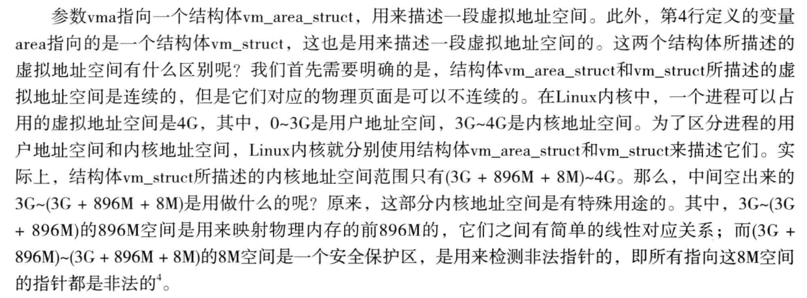
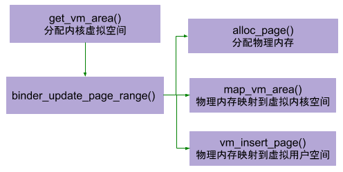
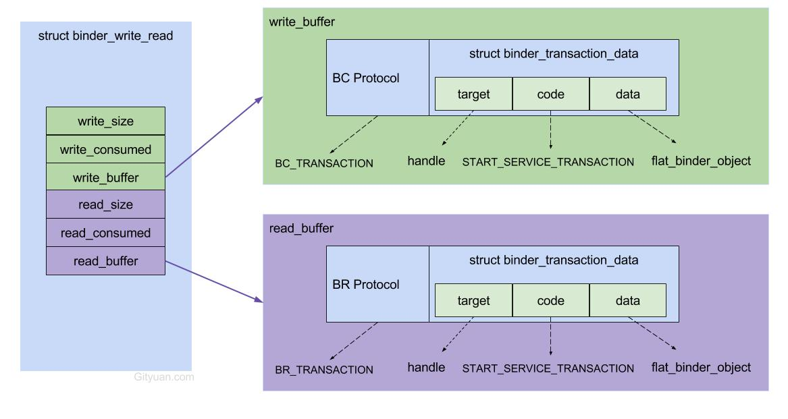

1. framework的binder service manager在/framework/native/cmds/servicemanager/service_manager.c里面
2. Service服务打开binder之后就会调用IPCThreadState的joinThreadPool方法，这个方法会调用getAndExecuteCommand->talkWithDriver之后陷入沉睡，当获取的command的时候才会调用executeCommand方法对相应的cmd做出反应，如果cmd是BR_TRANSACTION，这个时候就会调用BBinder的transact方法，接着调用onTransact方法把接收到的丢给对应的Binder处理（通向native的Binder是BBinder，而通向java层的JavaBBinder 多态)。
    1. JavaBBinder的onTransact方法会调用Binder.java的execTransact方法，实现Binder操作从native层传到java层。接着就是调用Java层的onTransact方法。
    2. ...
3. client通过serviceManager拿到的Bp，本质上只是拿到了保存在内核内存的服务端对应的ref handle（如serviceManager固定是0），而其BpIInterface的相关方法最终也只是封装了数据，并传给ref handle对应的node
4. binder transaction默认的第一个code IBinder::FIRST_CALL_TRANSACTION
5. open("/dev/binder", O_RDWR | O_CLOEXEC)，通过系统调用（syscall）最终是调用到binder.c文件binder驱动里面的binder_open方法
6. binder_init方法是在linux里面的回调device_initcall调用的
7. binder设备属于杂项设备，在[device_initcall](https://blog.csdn.net/TongxinV/article/details/54754901)的时候会init device，把binder设备注册到miscdev的杂项设备列表里面。open binder实际上是先调用了misc的open-misc_open(drivers/char/misc.c，open之后会在杂项设备列表里面找到对应从设备号的杂项设备,调用其open方法，这个时候才真正调用了binder的open-binder_open)。
    > 杂项设备驱动，是对字符设备的一种封装，是一种特殊的字符型设备驱动，也是在Linux嵌入式设备中使用的比较多的一种驱动。之所以很大一部分驱动使用的是杂项设备驱动，主要有以下几个方面的原因（由知乎网友整理）:</br>
    - 第一，节省主设备号：</br>
    使用普通字符设备，不管该驱动的主设备号是静态还是动态分配，都会消耗一个主设备号，这太浪费了。而且如果你的这个驱动最终会提交到内核主线版本上的话，需要申请一个专门的主设备号，这也麻烦。
    如果使用misc驱动的话就好多了。因为内核中已经为misc驱动分配了一个主设备号。当系统中拥有多个misc设备驱动时，那么它们的主设备号相同，而用子设备号来区分它们。</br>
    - 第二，使用简单：</br>
    有时候驱动开发人员需要开发一个功能较简单的字符设备驱动，导出接口让用户空间程序方便地控制硬件，只需要使用misc子系统提供的接口即可快速地创建一个misc设备驱动。</br>
    当使用普通的字符设备驱动时，如果开发人员需要导出操作接口给用户空间的话，需要自己去注册字符驱动，并创建字符设备class以自动在/dev下生成设备节点，相对麻烦一点。而misc驱动则无需考虑这些，基本上只需要把一些基本信息通过struct miscdevice交给misc_register()去处理即可。</br>
    > 本质上misc驱动也是一个字符设备驱动，可能相对特殊一点而已。在drivers/char/misc.c的misc驱动初始化函数misc_init()中实际上使用了MISC_MAJOR（主设备号为10）并调用register_chrdev()去注册了一个字符设备驱动。同时也创建了一个misc_class，使得最后可自动在/dev下自动生成一个主设备号为10的字符设备。总的来讲，如果使用misc驱动可以满足要求的话，那么这可以为开发人员剩下不少麻烦。
8. 引用计数技术和死亡通知机制
9. binder_node里面有一个refs的hash表保存着引用该node的ref（binder_ref）；binder_ref里面有一个binder_ref_death *death保存引用该ref的一个死亡通知回调，binder_ref_death里面保存的cookie是对应client端的Bp；当service端的node退出的时候会清除refs，如果refs里面的ref对应的death有注册（客户端可以调用binder的linkToDeath注册死亡回调），则配置对应的work插入client的todo通知service端的死亡。
10. Android中服务的注册，对于binder驱动是在服务所在的pro插入对应的node节点，并新建ref插入serveice_manager的refs_by_desc,refs_by_node。
11. Android中获取服务，对于binder驱动是在client所在的pro的refs_by_desc,refs_by_node插入handle，并保存在服务端node 的refs里面。每个服务端在不同client的handle可以是不同的，且从1开始递增，0为manager的handle。
12. /sys/kernel/debug/binder下有一些节点可以获取当前binder驱动的某些状态（debugfs_create_dir）；
13. binder_mmap
    
    ```
    static int binder_mmap(struct file *filp, struct vm_area_struct *vma)
    {
        ...
        if (vma->vm_flags & FORBIDDEN_MMAP_FLAGS) {
		    ret = -EPERM;
		    failure_string = "bad vm_flags";
		    goto err_bad_arg;
	    }
        vma->vm_flags |= VM_DONTCOPY | VM_MIXEDMAP;
	    vma->vm_flags &= ~VM_MAYWRITE;
        ...
        struct vm_struct *area;
        ...
    }
    ```
    > 1. 
    > 2. Binder驱动为进程分配的内核缓冲去在用户空间只可以读，不可以写，因此如果进程指定要映射的用户地址空间可写（vma->vm_flags & FORBIDDEN_MMAP_FLAGS）则错误。内核缓冲在用户空间除了不可以写之外，也是不可以拷贝以及禁止设置可能会执行写操作标志为的，因此下面两行|=和&=。
    > 3. <table><tr><td bgcolor=white></td></tr></table>
14. BWR核心数据图表

15. BBinder是派生自RefBase类的，他在用户空间创建并运行在service进程中。service进程中的其他对象可以简单的通过智能指针来引用这些BBinder来控制他们的声明周期，Binder驱动中的Binder实体对象是运行在内核空间中的，没法通过智能指针...，故Binder驱动需要跟service进程约定一套规则来维护他们的引用计数。（BR_DECREFS,BR_RELEASE,BR_INCREFS,BR_ACQUIRE）
