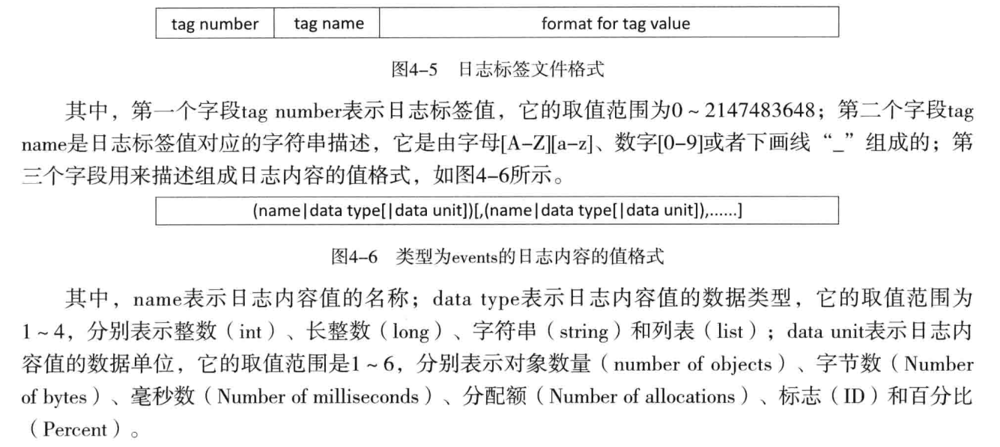

1. [参考](https://www.jianshu.com/p/bc5645e4e69b)
2. 不管是Log还是ALOG、SLOG之类的java，native层的log接口，最终都是通过调用liblog的方法通过logdw socket把log写到logd的环形缓冲中，当然不同log type（main、system、event）对应不同的环形缓冲。而不管是logcat（system/core/logcat）还是自己定义的log文件保存程序，都是通过liblog的方法通过logdr socket把logd环形缓冲的东西读出来。当然环形缓冲的siz是有限制的，而logcat -C可以清除环形缓冲。
3. on post-fs会start logd，service logd里面就会启动logd、logdw、logdr三个socket
4. 低版本4.*及以下则不存在logd service，log通过liblog的方法写到dev/log下的不同设备：main、system、radio、events。
5. 由于events类型的日志标签是一个整数值，在显示是不具有可读性。因此Android系统使用设备上的日志标签文件/system/etc/event-log-tags来描述这些标签值的含义。这样Logcat工具在显示events类型的日志时就可以把日志中的标签值转成字符串

6. <log/log.h> < <cutils/log.h> < <utils/log.h> （include关系，<log/log.h>是最基础的）
    1. 是否显示打印
        > 在include <log/log.h>之前定义#define LOG_NDEBUG 0
        > 在<log/log.h>里面有定义开关 LOG_NDEBUG 和 tag LOG_TAG