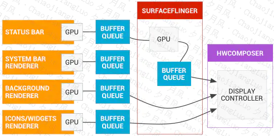
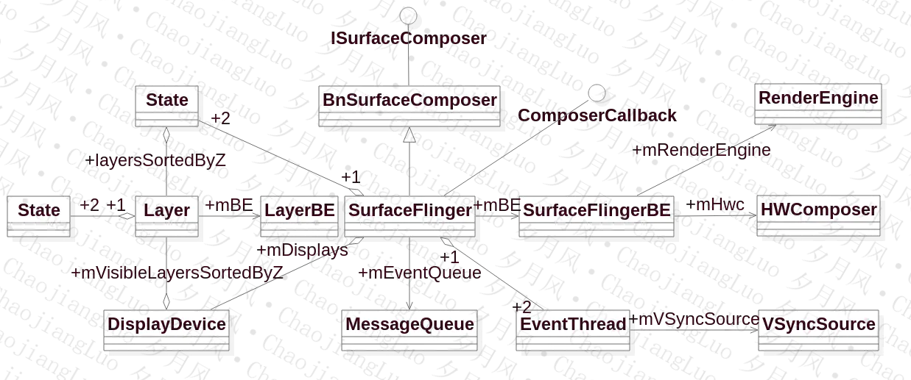
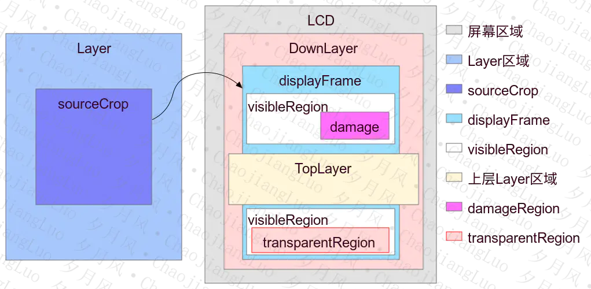

##### 1. 其他
1. [BufferQueue，一个系列的文章](https://zhuanlan.zhihu.com/p/62813895)
2. [内存的分配、传递、使用（匿名共享内存）](https://www.jianshu.com/p/2fb8cc9e63cb)
3. [SurfaceFlinger启动原理 gityuan](http://gityuan.com/2017/02/11/surface_flinger/)
4. 合成方式（Client：cpu合成，Device：硬件合成）
    <table><tr><td bgcolor=white></td></tr></table>
5. SurfaceFlinger的相关类
    <table><tr><td bgcolor=white></td></tr></table>
    1. "+2"表示SurfaceFlinger有两个状态，Layer也有两个状态，一个mCurrentState，一个mDrawingState。
6. Layer Region
    <table><tr><td bgcolor=white></td></tr></table>

    1. Layer区域和屏幕区域，就是Layer和屏幕本身的大小区域
    2. sourceCrop 剪切区域。</br>sourceCrop是对Layer进行剪切的，值截取部分Layer的内容进行显示；sourceCrop不超过Layer的大小，超过没有意义。
    3. displayFrame 显示区域。
displayFrame表示Layer在屏幕上的显示区域，具体说来，是sourceCrop区域在显示屏上的显示区域。displayFrame一般来说，小于屏幕的区域。而displayFrame可能比sourceCrop大，可能小，这都是正常的，只是需要做缩放，这就是合成时需要处理的。
    4. visibleRegion 可见区域。</br> displayFrame 区域不一定都能看到的，如果存在上层Layer，那么displayFrame区域可能部分或全部被盖住，displayFrame没有被盖住的部分就是可见区域visibleRegion。
    5. damageRegion 受损区域，或者称之为更新区域。</br> damageRegion表示Layer内容被破坏的区域，也就是说这部分区域的内容变了，所以这个属性一般是和上一帧相比时才有意义。这算是对合成的一种优化，重新合成时，我们只去合成damageRegion区域，其他的可见区域还是用的上一帧的数据。
    6. visibleNonTransparentRegion 可见非透明区域。</br> 透明区域transparentRegion是可见区域visibleRegion的一部分，只是这一部分透明的看到的是底层Layer的内容。在SurfaceFlinger的Layer中定义visibleNonTransparentRegion，表示可见而又不透明的部分。
    7. coveredRegion 被覆盖的区域。</br> 表示Layer被TopLayer覆盖的区域，一看图就很好理解。从图中，你可以简单的认为是displayFrame和TopLayer区域重合的部分。

##### 2. <span id="createsurface">以ViewRootImpl</span>和WindowManagerService为例分析跟Surface的联系。
1. ViewRootImpl有一个mSurface初始化的时候调用了Surface的空构造方法。
2. ViewRootImpl的setView方法最后会调用到WindowManagerService的addWindow方法在新建WindowState之后会调用WindowState的attach方法，最后会调用Session的windowAddedLocked新建一个SurfaceSession对象mSurfaceSession，每个进程只有一个，SurfaceSession的构造方法会调用nativeCreate新建一个对应的native的SurfaceComposerClient对象保存在mNativeClient里面。
3. ViewRootImpl的performTraversals方法会调用relayoutWindow方法会调用到WMS的relayoutWindow方法。
4. 接着会调用到createSurfaceControl方法传入outSurface（跨进程的一个Surface，在Bn的时候new的一个Surface传进来的）。
5. 接着调用WindowStateAnimator类的createSurfaceLocked方法获取一个WindowSurfaceController对象，WindowSurfaceController类里面包含这一个SurfaceControl对象mSurfaceControl，在其构造方法的时候对其进行赋值。
6. SurfaceControl的构造方法会调用nativeCreate方法构造native的<font color=#00CED1>SurfaceCoontroll</font>，nativeCreate方法会获取SurfaceSession里面的client，并调用其createSurfaceChecked方法新建一个native的SurfaceControl对象保存在mNativeObject里面。返回给outSurface（其实是把SurfaceComposerClient新建的SurfaceControl对象转移到outSurface的mNativeObject里面）。
7. SurfaceComposerClient的createSurfaceChecked方法最终会调用到SurfaceFlinger的createLayer方法获取Layer的handle（Handle）和producer（IGraphicBufferProducer，MonitoredProducer生产者，BufferQueueProducer的代理类），并封装在SurfaceControl里面。把handle和layer保存在Client里面的mLayers。
8. 最后createSurfaceControl的方法会调用得到的surfaceController的getSurface方法获取一个outSurface，这个方法最终是调到native的surfaceController的generateSurfaceLocked方法新建一个native的Surface对象并保存在Surface的mNativeObject里面。
9. draw的时候如果是soft（不是硬件加速型的渲染），会调用surface的lock方法，最终会调用BufferQueueProducer的dequeueBuffer方法从core（BufferQueueCore）的mFreeBuffers或者mFreeSlots里面获取一个slot，如果这个slot的对应的BufferSlot的mGraphicBuffer还未分配则会调用new GraphicBuffer方法分配一个匿名共享内存，Client端（Surface）得到的是一个slot，如果Client端对应slot的内存还未分配，则通过调用BufferQueueProducer的requestBuffer把共享内存mmap到本地（IPC的时候服务端只传了GraphicBuffer共享内存的handle过来，Client通过mmap把handle生成共享内存，详情可见GraphicBuffer的flatten和unflatten方法）。
10. 把得到的内存付给Bitmap，再把Bitmap付给Canvas就可以通过在这个Canvas上draw而把对应的东西画的buffer上面，SurfaceFlinger那边的内存通过消费共享内存上buffer把生产者端的buffer渲染到屏幕。
11. Surface的unlockAndPost方法（draw之后会调用的）会调用mGraphicBufferProducer的queueBuffer方法，最后会回调到BufferLayer里面的onFrameAvailable方法，他会调用SurfaceFlinger的signalLayerUpdate方法，给EventQueue发送invalidate事件。

##### 3. EventThread，EventThread::Connection，gui::BitTube的事件传递
1. SurfaceFlinger的init（服务启动的时候调用，main_surfaceflinger）方法里面会初始化两个EventThread：mSfEventThread（sf用的）和mEventThread（app用的，ISurfaceComposer::VsyncSource::eVsyncSourceApp DisplayEventReceiver【Choreographer里面监听Vsync信号的时候需要，FrameDisplayEventReceiver】的构造方法里面会调用sf的createDisplayEventConnection方法去构造一个EventConnection）。最后调用mEventQueue（impl::MessageQueue对象，在SurfaceFlinger.h定义的时候就付了初值，SurfaceFlinger重新定义的MessageQueue）的setEventThread方法把mSFEventThread设置进去。
2. MessageQueue的setEventThread里面会保存eventThread到mEventThread里面，并通过```eventThread->createEventConnection()```新建EventThread::Connection对象赋值给mEvents，Connection的构造方法会新建一个gui::BitTube对象mChannel（包含一个4KB buffer的socket，并得到对应的rec、send的fd）。
3. 调用mEvents的stealReceiveChannel方法传入mEventTube（把mChannel的mReceiverFd传给mEventTube）。
    > DisplayEventReceiver的构造方法通过调用EventConnection.stealReceiveChannel方法获得到一个服务端的receiver fd保存在mDataChannel里面，并在DisplayEventDispatcher的initialize方法调用Looper的addFd方法监听这个fd的EVENT_INPUT时间，如果服务端SF有vsync信号就会写进send fd，这里receiver fd就会监听到写入事件而唤醒。
4. 最后调用mLooper（MessageQueue的构造方法里面new的，是Android native Looper）的addFd，监听mEventTube fd的Looper::EVENT_INPUT事件，事件来时回调cb_eventReceiver方法。
5. 调用EventThread::Connection的postEvent方法会往mChannel的mSendFd里面send对应的东西。