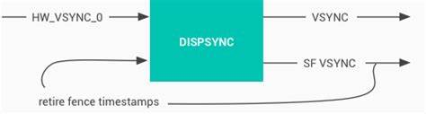
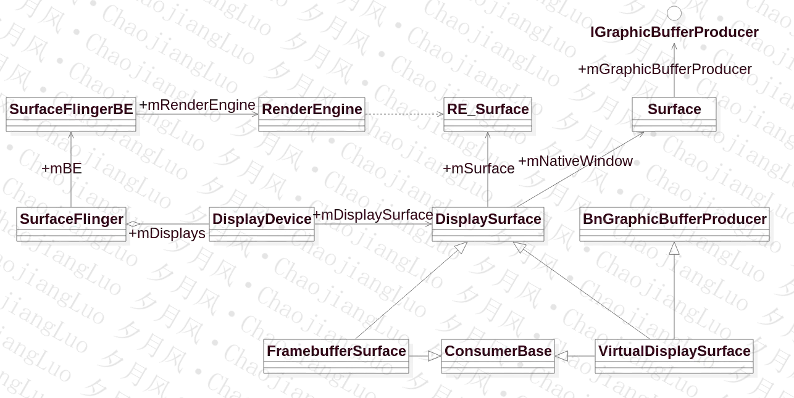
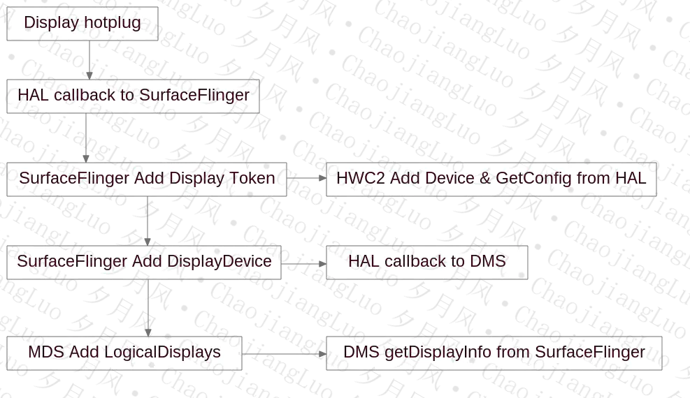

##### 1. 其他
1. [BufferQueue，一个系列的文章](https://zhuanlan.zhihu.com/p/62813895)
2. [内存的分配、传递、使用（匿名共享内存）](https://www.jianshu.com/p/2fb8cc9e63cb)
3. [SurfaceFlinger启动原理 gityuan](http://gityuan.com/2017/02/11/surface_flinger/)
4. 合成方式（Client：cpu合成，Device：硬件合成）
    <table><tr><td bgcolor=white></td></tr></table>
5. SurfaceFlinger的相关类
    <table><tr><td bgcolor=white></td></tr></table>
    
    1. "+2"表示SurfaceFlinger有两个状态，Layer也有两个状态，一个mCurrentState，一个mDrawingState。
        1. mCurrentState状态， 准备数据，应用传过来的数据保存在mCurrentState中。</br>
        2. mDrawingState状态，进程合成状态，需要进行合成的数据保存在mDrawingState中。
6. Layer Region
    <table><tr><td bgcolor=white></td></tr></table>

    1. Layer区域和屏幕区域，就是Layer和屏幕本身的大小区域
    2. sourceCrop 剪切区域。</br>sourceCrop是对Layer进行剪切的，值截取部分Layer的内容进行显示；sourceCrop不超过Layer的大小，超过没有意义。
    3. displayFrame 显示区域。
displayFrame表示Layer在屏幕上的显示区域，具体说来，是sourceCrop区域在显示屏上的显示区域。displayFrame一般来说，小于屏幕的区域。而displayFrame可能比sourceCrop大，可能小，这都是正常的，只是需要做缩放，这就是合成时需要处理的。
    4. visibleRegion 可见区域。</br> displayFrame 区域不一定都能看到的，如果存在上层Layer，那么displayFrame区域可能部分或全部被盖住，displayFrame没有被盖住的部分就是可见区域visibleRegion。
    5. damageRegion 受损区域，或者称之为更新区域。</br> damageRegion表示Layer内容被破坏的区域，也就是说这部分区域的内容变了，所以这个属性一般是和上一帧相比时才有意义。这算是对合成的一种优化，重新合成时，我们只去合成damageRegion区域，其他的可见区域还是用的上一帧的数据。
    6. visibleNonTransparentRegion 可见非透明区域。</br> 透明区域transparentRegion是可见区域visibleRegion的一部分，只是这一部分透明的看到的是底层Layer的内容。在SurfaceFlinger的Layer中定义visibleNonTransparentRegion，表示可见而又不透明的部分。
    7. coveredRegion 被覆盖的区域。</br> 表示Layer被TopLayer覆盖的区域，一看图就很好理解。从图中，你可以简单的认为是displayFrame和TopLayer区域重合的部分。
7. BufferLayer的初始化
    1. onFirstRef方法里面会调用BufferQueue::createBufferQueue构造IGraphicBufferProducer和IGraphicBufferConsumer对象producer和consumer，这两个对象里面都保存了同一个BufferQueueCore对象core。
        1. 接着会new一个BufferLayerConsumer保存在mConsumer，BufferLayerConsumer的基类ConsumerBase的构造方法里面会新建一个ProxyComsumerListener保存在core里面（consumer和producer都可以取到这个listener，BufferQueueProducer的queueBuffer方法里面就会拿到这个listener回调onFrameAvailable方法，而ProxyComsumerListener的onFrameAvailable方法会回调ConsurmerBase的onFrameAvailable方法）
        2. 调用mConsumer的setContentsChangeListener方法传入this，上面说的ConsurmerBase的onFrameAvailable方法最后是回调到这个this（BufferLayer派生了BufferLayerConsumer::ContentsChangedListener）的onFrameAvailable方法。
        3. 综上BufferLayer就知道producer那边queue了Buffer了，可以通知SurfaceFlinger进行合成。
8. SurfaceFlinger的init方法会调用getBE().mHwc->registerCallback方法，监听onHotplugReceived和onVsyncReceived；在回调onHotplugReceived里面会调用EventThread的onHotplugReceived
9. [DispSync 是什么？](http://tinylab.org/android-dispsync/)在 Android 4.1 的时候，Google 提出了著名的 “Project Butter”，引入了 VSYNC，把 app 画图，SurfaceFlinger 合成的时间点都规范了起来，减少了掉帧，增强了渲染的流畅度。但是这里有个问题，因为 VSYNC 是由硬件产生的，一旦产生了你就必须开始干活，不灵活。假设有这么一种需求，我希望在 VSYNC 偏移一段时间以后再干活，那么这个是硬件 VSYNC 提供不了，所以这个时候就必须引入软件模型。而 DispSync 就是为了解决这个需求引入的软件模型。DispSync 类似于一个 PLL（phase lock loop，锁相回路），它通过接收硬件 VSYNC，然后给其他关心硬件 VSYNC 的组件（SurfaceFlinger 和需要渲染的 app）在指定的偏移以后发送软件 VSYNC，并且当误差在可接受的范围内，将会关闭硬件 VSYNC。谷歌的这篇文档里面详细有一张非常准确的图：</br>
（为了方便，后面所有的硬件 VSYNC 使用 HW-VSYNC 代指，软件 VSYNC 使用 SW-VSYNC 代指）。DispSync 是一个模拟 HW-VSYNC 的软件模型，在这个模型里面包含几个部分：
    1. DispSync：DispSync 的主体，主要负责启动 DispSyncThread，接收 HW-VSYNC 并且更新计算出 SW-VSYNC 间隔—— mPeriod
    2. DispSyncThread：DispSync 的一个内部线程类，主要功能是模拟 HW-VSYNC 的行为，大部分时间都处于阻塞状态，利用 DispSync 算出的 mPeriod，周期性地在下一个 SW-VSYNC 时间点（加了偏移的）醒来去通知对 VSYNC 感兴趣的 Listener —— DispSyncSource
    3. DispSyncSource：SurfaceFlinger 的一个内部类，实现了 DispSync::Callback 的接口，DispSyncThread 和 EventThread 的中间人
    4. EventThread：VSYNC 的接收实体，收到 DispSync 的 SF-VSYNC 再进行分发，SurfaceFlinger 和 app 分别有自己的 EventThread—— sfEventThread 和 appEventThread
    5. Connection：EventThread 内部类，任何一个对 VSYNC 感兴趣的（SurfaceFlinger，需要渲染画面的 app）都会在 EventThread 里面抽象为一个 Connection
    6. EventControlThread：大部分博客都将其描述为硬件 VSYNC 的“闸刀”，也就是负责控制硬件 VSYNC 的开关
    7. MessageQueue：SurfaceFlinger 用来在 sfEventThread 注册
    8. DisplayEventReceiver：app 用来在 appEventThread 注册
10. DisplayDevice和Surface相关的类图</br> <table><tr><td bgcolor=white></td></tr></table>
11. Android系统添加屏幕时的处理流程/br> <table><tr><td bgcolor=white></td></tr></table>
12. layerStack：Layer的栈，Android支持多个屏幕，layer可以定制化的只显示到某个显示屏幕上。其中就是靠layerStack来实现的。Layer的stack值如果和DisplayDevice的stack值一样，那说明这个layer是属于这个显示屏幕的。

##### 2. <span id="createsurface">以ViewRootImpl</span>和WindowManagerService为例分析跟Surface的联系。
1. ViewRootImpl有一个mSurface初始化的时候调用了Surface的空构造方法。
2. ViewRootImpl的setView方法最后会调用到WindowManagerService的addWindow方法在新建WindowState之后会调用WindowState的attach方法，最后会调用Session的windowAddedLocked新建一个SurfaceSession对象mSurfaceSession，每个进程只有一个，SurfaceSession的构造方法会调用nativeCreate新建一个对应的native的SurfaceComposerClient（通过Client与SurfaceFlinger通信）对象保存在mNativeClient里面。
3. ViewRootImpl的performTraversals方法会调用relayoutWindow方法会调用到WMS的relayoutWindow方法。
4. 接着会调用到createSurfaceControl方法传入outSurface（跨进程的一个Surface，在Bn的时候new的一个Surface传进来的）。
5. 接着调用WindowStateAnimator类的createSurfaceLocked方法获取一个WindowSurfaceController对象，WindowSurfaceController类里面包含这一个SurfaceControl对象mSurfaceControl，在其构造方法的时候对其进行赋值。
6. SurfaceControl的构造方法会调用nativeCreate方法构造native的<font color=#00CED1>SurfaceCoontroll</font>，nativeCreate方法会获取SurfaceSession里面的client，并调用其createSurfaceChecked方法新建一个native的SurfaceControl对象保存在mNativeObject里面。返回给outSurface（其实是把SurfaceComposerClient新建的SurfaceControl对象转移到outSurface的mNativeObject里面）。
7. SurfaceComposerClient的createSurfaceChecked方法最终会调用到SurfaceFlinger的createLayer方法获取Layer的handle（Handle）和producer（IGraphicBufferProducer，MonitoredProducer生产者，BufferQueueProducer的代理类），并封装在SurfaceControl里面。把handle和layer保存在Client里面的mLayers。
8. 最后createSurfaceControl的方法会调用得到的surfaceController的getSurface方法获取一个outSurface，这个方法最终是调到native的surfaceController的generateSurfaceLocked方法新建一个native的Surface对象并保存在Surface的mNativeObject里面。
9. draw的时候如果是soft（不是硬件加速型的渲染），会调用surface的lock方法，最终会调用BufferQueueProducer的dequeueBuffer方法从core（BufferQueueCore）的mFreeBuffers或者mFreeSlots里面获取一个slot，如果这个slot的对应的BufferSlot的mGraphicBuffer还未分配则会调用new GraphicBuffer方法分配一个匿名共享内存，Client端（Surface）得到的是一个slot，如果Client端对应slot的内存还未分配，则通过调用BufferQueueProducer的rframeAvailableListenerflatten和unflatten方法）。
10. 把得到的内存付给Bitmap，再把Bitmap付给Canvas就可以通过在这个Canvas上draw而把对应的东西画的buffer上面，SurfaceFlinger那边的内存通过消费共享内存上buffer把生产者端的buffer渲染到屏幕。
11. Surface的unlockAndPost方法（draw之后会调用的）会调用mGraphicBufferProducer的queueBuffer方法，最后会回调到BufferLayer里面的onFrameAvailable方法，他会调用SurfaceFlinger的signalLayerUpdate方法，给EventQueue发送invalidate事件。

##### 3. EventThread，EventThread::Connection，gui::BitTube的事件传递
1. SurfaceFlinger的init（服务启动的时候调用，main_surfaceflinger）方法里面会初始化两个EventThread：mSfEventThread（sf用的）和mEventThread（app用的，ISurfaceComposer::VsyncSource::eVsyncSourceApp DisplayEventRection 的标志是 connection->count 的值：-1 代表不接收 SW-VSYNC；0 代表只接收一次，EventThread 发现 connection->count 的值为 0 的时候，会把它加到 signalConnections 以便其能够接受到这一次的 SW-VSYNC 之后，会将其 count 置为 -1；大于 0 就表明会一直接收ceiver【Choreographer里面frameAvailableListenerurfaceFlinger.h定义的时候就付了初值，SurfaceFlinger重新定义的MessageQueue）的setEventThread方法把mSFEventThread设置进去。
2. MessageQueue（sf端的，只会创建一个Connection）的setEventThread里面会保存eventThread到mEventThread里面，并通过```eventThread->createEventConnection()```新建EventThread::Connection对象赋值给mEvents，Connection的构造方法会新建一个gui::BitTube对象mChannel（包含一个4KB buffer的socket，并得到对应的rec、send的fd）。
3. 调用mEvents的stealReceiveChannel方法传入mEventTube（把mChannel的mReceiverFd传给mEventTube）。
    > DisplayEventReceiver（app端的）的构造方法通过调用EventConnection.stealReceiveChannel方法获得到一个服务端的receiver fd保存在mDataChannel里面，并在DisplayEventDispatcher的initialize方法调用Looper的addFd方法监听这个fd的EVENT_INPUT时间，如果服务端SF有vsync信号就会写进send fd，这里receiver fd就会监听到写入事件而唤醒。
4. 最后调用mLooper（MessageQueue的构造方法里面new的，是Android native Looper）的addFd，监听mEventTube fd的Looper::EVENT_INPUT事件，事件来时回调cb_eventReceiver方法。
5. 调用EventThread::Connection的postEvent方法会往mChannel的mSendFd里面send对应的东西。

##### 4. 小结
当整个初始化(SurfaceFlinger::init())完成以后，整个 DispSync 模型就开始运作起来了。</br>
SurfaceFlinger 通过实现了 HWC2::ComposerCallback 接口，当 HW-VSYNC 到来的时候，SurfaceFlinger 将会收到回调并且发给 DispSync。DispSync 将会把这些 HW-VSYNC 的时间戳记录下来，当累计了足够的 HW-VSYNC 以后（目前是大于等于 6 个），就开始计算 SW-VSYNC 的偏移 mPeriod。计算出来的 mPeriod 将会用于 DispSyncThread 用来模拟 HW-VSYNC 的周期性起来并且通知对 VSYNC 感兴趣的 Listener，这些 Listener 包括 SurfaceFlinger 和所有需要渲染画面的 app。这些 Listener 通过 EventThread 以 Connection 的抽象形式注册到 EventThread。DispSyncThread 与 EventThread 通过 DispSyncSource 作为中间人进行连接。EventThread 在收到 SW-VSYNC 以后将会把通知所有感兴趣的 Connection，然后 SurfaceFlinger 开始合成，app 开始画帧。在收到足够多的 HW-VSYNC 并且在误差允许的范围内，将会关闭通过 EventControlThread 关闭 HW-VSYNC