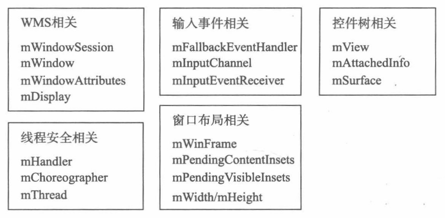

1. 由WindowManagerGlobal创建并保存在其mRoots里面。

2. ViewRootImpl的构造方法会调用WindowManagerGlobal.getWindowSession，获取一个IWindowSession对象mWindowSession，这是个单例，每个进程只有一个IWindowSession对象用于与WMS通信。

3. 在setView的时候会调用mWindowSession的addToDisplay方法传入W对象，跟WindowManagerService建立联系，WindowManagerService端会给其建立对应的WindowState对象，并保存W对象用于回调（包括触摸事件的传递）。

4. setView里面会调用enableHardwareAcceleration方法来判断是否打开硬件加速。

5. setView -> requestLayout -> scheduleTraversals ->mTraversalRunnable.run() -> doTraversal -> performTraversals -> (view的measure layout draw)
    1. scheduleTraversals
        1. 当当前没有Traversals Schedule的时候（！mTraversalScheduled）这个方法才会调用逻辑，并设置```mTraversalScheduled = true```
        2. 调用```mHandler.getLooper().getQueue().postSyncBarrier()```在Handler对应Looper（主线程Looper）里面的MessageQueue设置[同步屏障](消息处理机制.md#sync)。
        3. 调用Choreographer.postCallback方法实在Vsync信号到来的回调，回调最终会调用到doTraversal方法，这个方法会先移除同步屏障，在调用performTraversals，遍历View树进行Measure，Layout，Draw。

6. ViewRootlmpl身负了很多职责，主要有以下几点:
    1. View树的根并管理View树。
    2. 触发View的测量、布局和绘制。
    3. 输入事件的中转站。
    4. 管理Surface。
    5. 负责与WMS进行进程间通信。

7. ViewRootImpl中的主要成员</br>


8. performTraversals()
    1. 工作阶段
        - 预测量阶段（measureHierarchy）：这是进入performTraversals方法后的第一个阶段，它会对控件树进行第一次测量，在此阶段中将会计算出控件树为显示其内容所需的尺寸，即期望的窗口尺寸。View机器子类的onMeasure方法都会沿着控件树依次得到回调。
        - 布局窗口阶段（relayoutWindow）：根据预测量的结果，通过IWindowSession.relayout方法向WMS请求调整窗口的尺寸等属性，这将引发WMS对窗口进行重新布局，并将布局结果返回给ViewRootImpl。
        - 最终测量阶段（performMeasure）：预测量的结果是控件树所期望的窗口尺寸。然而在WMS中影响布局的因素很多，WMS不一定会将窗口准确的布局为控件树所要求的尺寸。因此在这个阶段，将以窗口的实际尺寸对控件树进行最终的测量，在这个阶段中，View及其子类的onMeasure方法将会沿着控件树依次回调。
        - 布局空间树阶段：完成最终测量之后便可以对控件树进行布局。onLayout方法将会被回调。
        - 绘制阶段：这是过程的最终阶段。onDraw方法将会被回调。
    2. 一般来说，子控件的测量结果影响父控件的测量结果，因此测量过程是后根遍历。而父控件的布局结果影响子控件的布局结果（例如位置），所以布局过程是先根遍历。