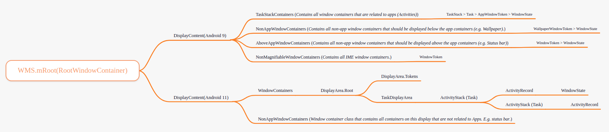
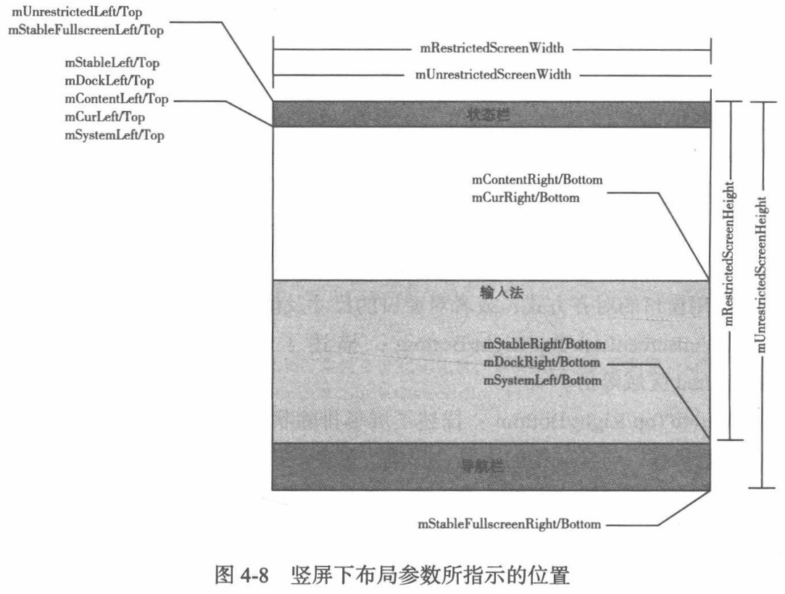

##### 1. 其他
1. 
1. 
2. WindowState用来代表WMS中的窗口，而InputWindowHandle用来代表输入系统中的窗口。
3. WMS.mRoot里面的层级关系，最终所有的WindowState都保存在以mRoot为根的树里面。查找Focus也是遍历这棵树找到Focus的Window。

4. WindowToken的构造方法会调用DisplayContent.reParentWindowToken -> DisplayContent.addWindowToken以ActivityRecord.Token为key把AppWindowToken保存在DisplayContent.mTokenMap里面。
5. 每个DisplayContent保存着WindowState树，并可以调用他的assignWindowLayers方法来对这个WindowState树进行排序（zorder）。
6. WMS的重要成员
    1. mInputManager，InputManagerService的实例。用于管理每个窗口的输入事件通道（InputChannel）以及向上通道上的派发事件。
    2. mAnimator，WindowAnimator的实例。他是所有窗口动画的总管（窗口动画是一个WindowStateAnimator对象）。在Choreographer的驱动下，逐个渲染所有的动画。
        > 包括屏幕旋转动画ScreenRotationAnimation，WindowAnimator.scheduleAnimation方法会设置监听到Choreographer里面，当VSYNC到来的时会回调WindowAnimator.mAnimationFrameCallback，最后调用到他的animate方法，进行Window的各种动画的处理。
7. ViewRootImpl作为控件系统到窗口系统的桥梁，采用了协商式的函数来绘制控件。在窗口显示之前，VIewRootImpl首先对整个控件树进行尺寸测量，得到一个理想尺寸，并将这个理想尺寸作为relayWindow的参数交给WMS进行布局。布局之后，ViewRootImpl会根据WMS的实际布局结果重写对控件树进行一次测量得到最终的尺寸。

##### 2. Window与WMS的联系
1. 每个App进程都会和WMS建立一个IWindowSession会话，这个会话被App进程用于和WMS通信。而WMS会保存每个ViewRootImpl.W（IWindow），这是个Binder对象，用来从WMS向client端Window的IPC调用。
2. WindowManagerImpl.addView最终调用到ViewRootImpl.setView，每一个Window都有与之联系的ViewRootImpl，不管是Activity还是Toast的Window。ViewRootImpl的setView会调用到Session（frameworks/base/service/core/java/com/android/server/wm目录下）的addToDisplay，最后调用到WMS的addWindow。客户端向WMS添加一个窗口的过程，其实就是WMS为其分配一块Surface的过程。
    > WMG.addView，主要是用来新建ViewRootImpl，并保存view（DecoderView），wparams和root（ViewRootImpl）到WMG对应的List里面，最后调用root.setView
    > ActivityThread.handleResumeActivity，Toast.handleShow都会调用addView。
3. WMS.addWindow，里面会新建Window在Service的一个代表WindowState，保存这传进来的IWindowSession和IWindow。
    > AMS里面说过Activity启动的时候在ActivityStack的startActivityLocked方法调用的过程中会新建AppWindowToken对象并保存在mRoot里面的某个结构里面，并以ActivityRecord.Token为key。在WMS.addView里面会通过ActivityRecord.Token来获取在ActivityRecord里面新建的[AppWindowToken](AMS.md#createWindowContainer)。

##### WindowManager
1. 常用Flag
    1. FLAG_NOT_FOCUSABLE：不许获得焦点。
    2. FLAG_NOT_TOUCHABLE：不接受触摸屏事件。
    3. FLAG_LAYOUT_NO_LIMITS：允许窗口延伸到屏幕外。
    4. FLAG_LAYOUT_IN_SCREEN：窗口占满整个屏幕，忽略周围的装饰边框（例如状态栏）。此窗口需要考虑到装饰边框的内容。
    5. FLAG_WATCH_OUTSIDE_TOUCH：如果设置了这个flag，当触屏事件发生在窗口之外时，可以通过设置此标志接收到一个 MotionEvent.ACTION_OUTSIDE事件。注意，你不会收到完整的down/move/up事件，只有第一次down事件时可以收到 ACTION_OUTSIDE。
    6. FLAG_NOT_TOUCH_MODAL：当窗口可以获得焦点（没有设置 FLAG_NOT_FOCUSALBE 选项）时，仍然将窗口范围之外的点击事件（鼠标、触摸屏）发送给后面的窗口处理。否则它将独占所有的点击事件，而不管它们是不是发生在窗口范围内。
    7. FLAG_SECURE：不允许屏幕截图。
    8. FLAG_HARDWARE_ACCELERATED：开启硬件加速。
2. WindowManager的关联类

##### 深入理解Android卷三
1. WindowState的构造方法里面有窗口排序的逻辑，窗口的显示次序由两个成员字段描述：主序mBaseLayer和自序mSubLayer。主序用于描述窗口及其子窗口在所有窗口中的显示位置。而子序则描述一个子窗口在其兄弟窗口中的显示位置。主序越大，则窗口及其子窗口的显示位置相对于其他窗口的位置越靠前；子序越大同理。
2. WMS.relayoutWindow会[create](SurfaceFlinger.md#createsurface) Surface，Activity stop的时候会destroy Surface。
    1. performSurfacePlacementLoop方法的开头会先回收僵尸窗口的Surface（在内存不足的时候遍历窗口树，找出僵尸窗口-窗口Session不在WMS.mSessions里面）
3. 
4. 屏幕旋转动画是PhoneWindowManager里面监听了对应Sensor的变化，当接收到屏幕旋转的状态时会调用WMS的updateRotation方法，最后会调用到对应DisplayContent的updateRotationUnchecked方法处理，这个方法会调用WMS的scheduleAnimationLocked方法开始动画处理（开始动画前会调用WMS的startFreezingDisplayLocked方法冻结一下状态）。
    > WMS.updateRotationUnchecked方法还会调用sendNewConfiguration，最后调用到AMS的updateDisplayOverrideConfiguration方法更新Configuration。