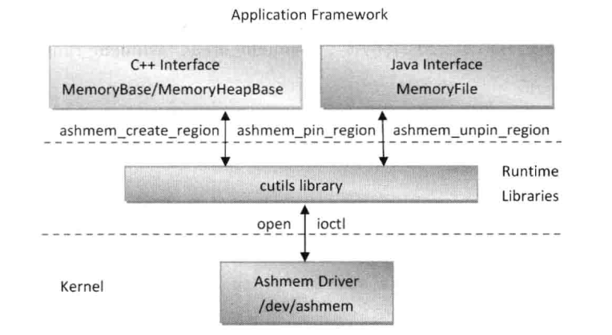
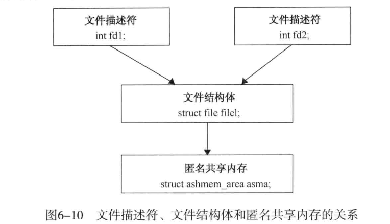
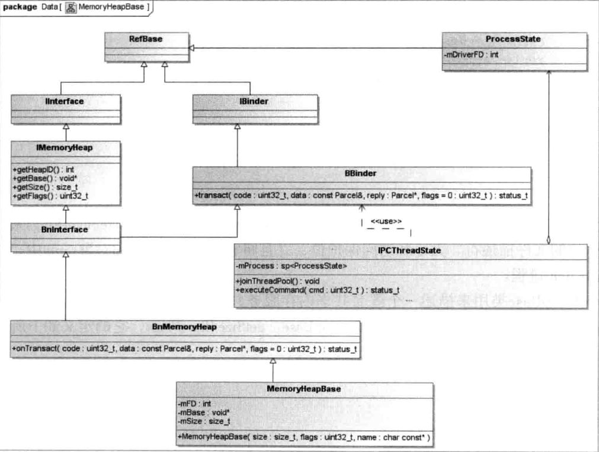

##### 1. 驱动
1. [参考](https://www.jianshu.com/p/d9bc9c668ba6)
2. Ashmem匿名共享内存系统架构
    1. kernel的ashmem驱动主要是kernel目录下的ashmem.h和ashmem.c两个文件。
    2. cutils library主要为ashmem-dev.c和ashmem.h两个文件，在system文件夹下。
3. 传统的Linux系统使用一个整数来标志一块共享内存，而Android系统使用一个fd来标志的。这么做的好处是：一是可以方便地将它映射到进程的地址空间，从而可以直接访问它的内容；二是可以使用Binder进程间通信机制来传输这个fd，从而实现在不同的应用程序间共享一块匿名内存。Binder进程通信机制使用一个类型为BINDER_TYPE_FD的Binder对象来描述一个fd。
4. 三个主要的结构体：ashmem_area（描述一块匿名共享内存）、ashmen_range（描述一小块处于解锁状态的内存）和ashmem_pin（用来描述一小块即将被锁定或解锁的内存）。
    1. 每一块匿名共享内存在临时文件系统tmpfs中都有一个对应的文件，这个文件的大小即为对应的匿名共享内存的大小。
5. ashmem_init的最后调用函数register_shrinker向内存管理系统注册一个内存回收函数ashmem_shrinker。当系统内存不足时，内存管理系统就会通过一个页框回收算法来回收内存，这时候所有注册的内存回收函数都会被调用，一般他们可以回收空闲的内存。
6. 当Ashmem驱动程序为一块匿名共享内存创建了临时文件之后（调用mmap），应用程序就不可以再修改他的名称了（unlikely(asma->file)为true）。
7. 匿名共享内存能够在两个不同的进程中共享的奥妙就在于，这两个进程分别有一个文件描述符fd1和fd2，他们指向了同一个文件结构体file1，而这个文件结构体又指向了一块匿名共享内存asma。这时候，如果两个进程的文件描述符分别被映射到各自的地址空间，那么他们就会把同一块匿名共享内存映射到各自的地址空间，从而实现在两个不同的进程中共享同一块匿名共享内存。
8. binder驱动里面会对BINDER_TYPE_FD的flat_binder_object做特殊处理，在client进程中将在client获取的一个fd与service匿名共享内存的fd对应的文件结构体通过调用task_fd_install方法关联起来。

##### 2.cutils (ashmem.h, ashmem-dev.cpp)
1. int ashmem_valid(int fd);
2. int ashmem_create_region(const char *name, size_t size);
    > open /dev/ashmem，并设置name和size。
3. int ashmem_set_prot_region(int fd, int prot);
    > 设置访问权限，包括： 
    > #define PROT_READ	0x1		/* page can be read */ 
    > #define PROT_WRITE	0x2		/* page can be written */ 
    > #define PROT_EXEC	0x4		/* page can be executed */ 
    > #define PROT_SEM	0x8		/* page may be used for atomic ops */ 
    > #define PROT_NONE	0x0		/* page can not be accessed */ 
    > #define PROT_GROWSDOWN	0x01000000	/* mprotect flag: extend change to start of growsdown vma */ 
    > #define PROT_GROWSUP	0x02000000	/* mprotect flag: extend change to end of growsup vma */
4. int ashmem_pin_region(int fd, size_t offset, size_t len);
    > 锁定一小块区域的共享内存。
5. int ashmem_unpin_region(int fd, size_t offset, size_t len);
6. int ashmem_get_size_region(int fd);

##### 3.C++层接口
1. MemoryHeapBase和MemoryBase是用来创建和管理匿名共享内存的C++访问接口。如果一个进程需要与其他进程共享一块完整的匿名共享内存，那么它就可以使用MemoryHeapBase类创建这块匿名共享内存；如果一个进程创建一块匿名共享内存之后，只希望与其他进程共享其中的一部分，那么它就可以使用MemoryBase（多了offset，size控制）类来创建这块匿名共享内存。MemoryBase类是在MemoryHeapBase类的基础上实现的。
2. MemoryHeapBase类在Service端的实现关系图

##### 4.java层接口
1. MemoryFile.java

##### 5.例子
1. view传递渲染数据给SurfaceFlinger
2. MediaCodec传递数据给对应的解码器
3. AudioTrack跟AudioFlinger之间的数据传递
4. ContentProvider query，insert，delete，update 方法。