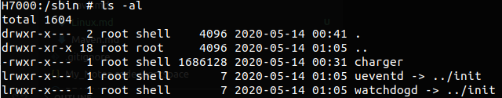
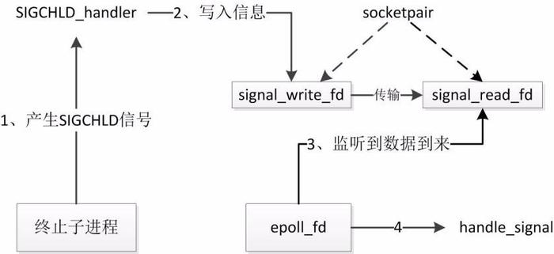

##### 1. 概括 [参考](https://blog.csdn.net/qq_19923217/article/details/81240302)
1. 
2. Boot层
    1. Boot Rom：当手机处于关机状态时，长按Power键开机，引导芯片开始从固化在ROM里的预设代码开始执行，然后加载引导程序到RAM
    2. Boot Loader：引导程序bootloader是开机运行的第一个小程序，因此它是针对特定的主板与芯片的，它不是Android操作系统的一部分。引导程序也是OEM厂商或者运营商加锁和限制的地方。引导程序初始化硬件设备、创建存储器空间的映射等软件运行时所需要的最小环境；加载Linux内核镜像文件到RAM中某个地址处执行，此时引导程序的控制权就交给了内核。这些对于运行内核是必要的，为了达到特殊的目标，引导程序可以根据配置参数或者输入数据设置内核。
3. Linux内核：Android是基于Linux内核的系统平台。开机启动时首先通过BootLoader加载Linux内核，在Android系统中Linux加载启动与普通的Linux启动过程相同，先初始化内核然后调用init进程。(kernel/init/main.c，#TODO)
4. init进程：init进程是Linux系统创建的第一个用户进程，将会对各种设备进行初始化，运Android Framework所需要的各种Daemon，Service Manager，Media Server，Zygote等。
5. Zygote：用于缩短Android应用程序加载的时间，每当执行Java应用程序时，Zygote就会Fork出一个子程序来执行应用程序，该子进程就是用来执行应用程序的虚拟机。

##### 2. system/core/init/init.cpp
1.  init 进程有两个其他入口，ueventd(进入 ueventd_main)以及 watchdogd(进入 watchdogd_main)
    1. 
    2. ueventd 主要是负责设备节点的创建、权限设定等一些列工作
    3. watchdogd 俗称看门狗，用于系统出问题时重启系统
1. 清空环境变量
2. 挂载基础的文件系统节点，新建基础文件夹并配置相关文件夹权限，剩下的由rc文件挂载。
    1. mount /dev, /dev/pts, /proc, /sys, sys/fs/selinux（用来存放 SELinux 安全策略文件）, /mnt, 
    2. mkdir /dev/pts, /dev/socket, /mnt/vendor
3. 初始化日志输出InitKernelLogging
4. 启用 SELinux 安全策略
5. ```execv(path, args);```重新执行main方法，进入第二阶段
    > execv会停止执行当前的进程，并且以path应用进程替换被停止执行的进程，进程ID没有改变，如果执行成功则函数不会返回, 执行失败则直接返回-1, 失败原因存于errno 中.
3. 初始话属性服务并设置某一些属性
4. sigchld_handler_init();  //初始化子进程退出的信号处理过程
    > Init进程中会启动很多服务子进程，若init启动的某个进程终止则会对系统的运行产生影响。比如“服务管理器”（servicemanager），它是应用程序使用系统服务必须运行的进程，如果该进程出现意外终止，那么进程间的通信等功能将无法使用。因此在init启动的进程中，其他大部分进程出现意外终止时，init进程要重新启动它们。
    > 
    1. init 进程接收到 SIGCHLD 信号
    通过 sigaction 函数将信号处理过程转移到 sigaction 结构体
    2. sigaction 成员变量 sa_flags 另外指定所关心的具体信号为 SA_NOCLDSTOP，也就是子进程终止信号
    成员变量 sa_handler 表明当子进程终止时，通过 SIGCHLD_handler 函数处理。
    3. SIGCHLD_handler 信号处理函数中通过 s[0] 文件描述符写了一个"1"，
    由于 socketpair 的特性，s[1] 能接读到该字符串。
    4. 通过 register_epoll_handler 将 s[1] 注册到 epoll 内核事件表中
    handle_signal 是 s[1] 有数据到来时的处理函数 
    5. handle_signal： ReapAnyOutstandingChildren 
4. 加载默认的属性（default.prop之类的文件）
5. 启动属性服务 [参考](https://blog.csdn.net/csdn_of_coder/article/details/55798789)
    > 之前的分析中 property_set 可以轻松设置系统属性，那为什么这里还要启动一个属性服务呢？这里其实涉及到一些权限的问题，不是所有进程都可以随意修改任何的系统属性，Android 将属性的设置统一交由 init 进程管理，其他进程不能直接修改属性，而只能通知 init 进程来修改，而在这过程中，init 进程可以进行权限检测控制，决定是否允许修改。
    1. 首先创建一个 socket 并返回文件描述符，然后设置最大并发数为 8，其他进程可以通过这个 socket 通知 init 进程修改系统属性。
    2. 最后注册 epoll 事件，也就是当监听到 property_set_fd 改变时调用 handle_property_set_fd。
    - 属性设置之后会调用property_changed方法，然后调用ActionManager::GetInstance().QueuePropertyChange来触发某一下Action。
6. 加载rc文件的Action和Service
7. 触发early-init Action（/system/core/init/builtins.cpp）
8. 触发init Action
9. 触发late-init Action
10. 在 while(true) 循环中不断处理子进程信号以及其他的配置或者控制操作。

##### 3. zygote启动
1. init.zygote64.rc
    > ```
    > service zygote /system/bin/app_process64 -Xzygote /system/bin  --zygote --start-system-server
    > class main
    > priority -20
    > user root
    > group root readproc reserved_disk
    > socket zygote stream 660 root system
    > onrestart write /sys/android_power/request_state wake
    > onrestart write /sys/power/state on
    > onrestart restart audioserver
    > onrestart restart cameraserver
    > onrestart restart media
    > onrestart restart netd
    > onrestart restart wificond
    > writepid /dev/cpuset/foreground/tasks
    > ```
2. 从上面的的rc文件可以看出：
    1. class_start main 的时候就会启动zygote
        > class_start对应builtins.cpp文件下的do_class_start，最后会调用到service.cpp的Service::Start方法。
    2. zygote对应的软件是/system/bin/app_process64
    3. 启动zygote之后会启动system-server
    4. 启动zygote的时候会create一个名为zygote的socket，权限为666，所有用户可访问。
    5. zygote重启的时候会重启audioserver，cameraserver，media，netd，wificond
3. socket启动之后会publish到系统里面，即把key=ANDROID_SOCKET_zygote，value=fd（create_socket获得的fd）格式化为一个字符串，在系统中增加一个环境变量，Zygote进程启动的过程中会根据这个环境变量创建一个Server端的Socket
4. frameworks/base/cmd/app_process/app_main.cpp main方法
5. 新建AppRuntime对象；添加"start-system-server"参数
6. 调用AppRuntime.start方法，传入"com.android.internal.os.ZygoteInit", args, true
7. 调用AndroidRuntime.startVm方法创建虚拟机实例mJavaVM（#TODO）
8. 回调onVmCreated方法
9. 调用AndroidRuntime.startReg方法在这个虚拟机实例中注册一系列JNI方法
    > ```register_jni_procs(gRegJNI, NELEM(gRegJNI), env)```
10. 调用ZygoteInit的main方法
    1. 新建ZygoteServer对象zygoteServer
    2. zygoteServer.registerServerSocketFromEnv：根据环境变量创建一个Server端的socket，这个socket是用来等待ams请求zygote进程创建新的应用进程的。
    3. ZygoteInit.forkSystemServer
    4. Zygote.forkSystemServer
    5. com_android_internal_os_Zygote.cpp ForkAndSpecialiizeCommom
        > 同 [AMS.md中zygot的fork App进程](../Android/AMS.md#zygote)