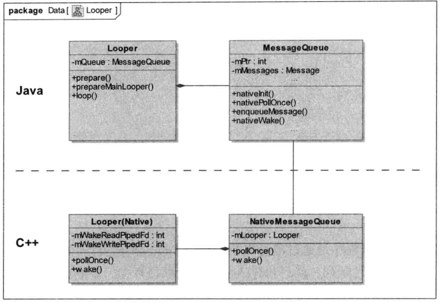

1. 消息处理机制主要包括Handler，MessageQueue，Looper，Message，NativeMessageQueue，Looper（native）。他们的关系是：
2. AndroidThread.main调用了Looper.prepareMainLooper是为了主线程配置Looper，其他线程调用prepare方法。这两个方法主要是在线程里面新建了Looper，保存在对应线程的threadLocals里面，key为ThreadLocal.sThreadLocal。
    1. 新建Looper，Looper的构造方法里面会新建MessageQueue对象mQueue和保存当前线程对象mThread，创建MessageQueue对象会传入一个quitAllowed，MainThread不允许quit，所以传进来的是false，其他的线程传进来的是true。
    2. MessageQueue的构造方法里面会调用nativeInit方法，构建一个native的MessageQueue，并把地址保存在mPtr里面。
    3. NativeMessageQueue会创建一个native Looper并保存在当前线程中。
    4. native Looper的构造方法里面会构造一个mWakeEventFd，并且epoll_ctl EPOLL_CTL_ADD到mEpollFd的观察fd中。
3. <span id="looper">要构成消息循环还必须调用Looper.loop进入循环，在AndroidThread.main的最后也调用了这个方法。</span>
    1. loop方法里面主要是一个for循环```for(;;)```，由上面的代码可知这是个死循环，在这个循环里面会调用mQueue的next方法获取下一个需要handler的msg。
        1. MessageQueue的next方法也是个死循环```for(;;)```
        2. 判断当前timeout是否!=0 如果不等于0，就调用Binder.flushPendingCommands来处理那些正在等待处理的Binder进程见通信请求，避免他们长时间得不到处理。
        2. <span id="jump"> MessageQueue.nativePollOnce调用native MessageQueue的nativePollOnce方法，由于是第一次进入循环，故传入nativePollOnce的nextPollTimeoutMillis=0（没有获取到msg也不进入阻塞，直接跳出）</span>
            1. 最后调用到native Looper的pollOnce->pollInner，接着调用epoll_wait等待mEpollFd（native Looper初始化的时候create的，用做[epoll](../Others/Linux.md#epoll)）监听的fd的写入时间，由于timeout=0，所以这个时候即使没有fd（mWakeEventFd也是其中一个）有写入事件也不会陷入阻塞，而是直接返回没有数据。
                > 这个时候如果有数据就会在接下来的Done里面去做一些回调处理，主要是一些native的msg，通过addFd加入的，跟java层的关系不大，像我们一般的input事件就是通过这个mEpollFd监听input fd来处理的，具体的input事件传递在另外的笔记写。
        3. nativePollOnce退出阻塞后会在mMessages链表里面找到当前需要处理的msg，如果有需要处理的msg则退出死循环，返回到loop处理；如果当前mMessages链表里面有msg只是还没到处理时间，就把timeout时间设为两者的差值；如果当前的mMessages为null，则把timeout时间设为-1（epoll_wait陷入永久的阻塞，除非mEpollFd监听到有fd有写操作）。
        4. 如果当前没有需要处理的msg，就判断当前mIdleHandlers有没有需要在闲时需要处理的msg（mIdleHandlers.size()>0），如果有则回调```keep = idler.queueIdle();```且timeout时间设为0，官方的解释是“While calling an idle handler, a new message could have been delivered so go back and look again for a pending message without waiting.”
        5. 回到循环开头，如果epoll没有监听到mEpollFd监听的fd有写入事件，就按上面设置的timeout进入wait或者不阻塞进入下一步。
        6. 极端情况timeout=-1 且 mEpollFd没有监听到fd写入时，会一直陷入epoll_wait阻塞，当MessageQueue有msg插入时（调用其enqueueMessage方法，如Handler.enqueueMessage就会调用）会调用nativeWake，最后调用到native Looper.wake 他会往mWakeEventFd里面写数据（mEpollFd也监听了该fd，在native Looper的构造方法中Add的），这个时候epoll_wait就会不阻塞，进入下一步如[3.1,2](#jump)。
        7. <span id="sync">同步屏障：</span>如果当前有需要处理的msg，判断msg.target如果为null的话，证明这个msg是设置的一个同步屏障，遍历当前msg往下的msg，如果有```msg.isAsynchronous()```或msg为null则退出循环处理msg（这样做的意思是在存在同步屏障的时候只处理isAsynchronous的msg，其他的msg先不处理，直到同步屏障移除，同步屏障一般是ViewRootImpl里面定时遍历设置的）。
    2. 返回到这里的msg会把其传给对应的target（Handler）处理。```msg.target.dispatchMessage(msg);```，回调结束后回收msg；如果返回来的msg为null，则证明mQueue已经退出（quit）循环，Looper也会return。
    3. Handler.dispatchMessage如果msg.callback不为空，即msg里面是Runnable的，则调用其run方法；否则回调handleMessage。
4. Handler里面还有一个getMessenger方法，是用来返回一个MessengerImpl对象作为跨进程用的。[例子](https://www.jb51.net/article/108668.htm)