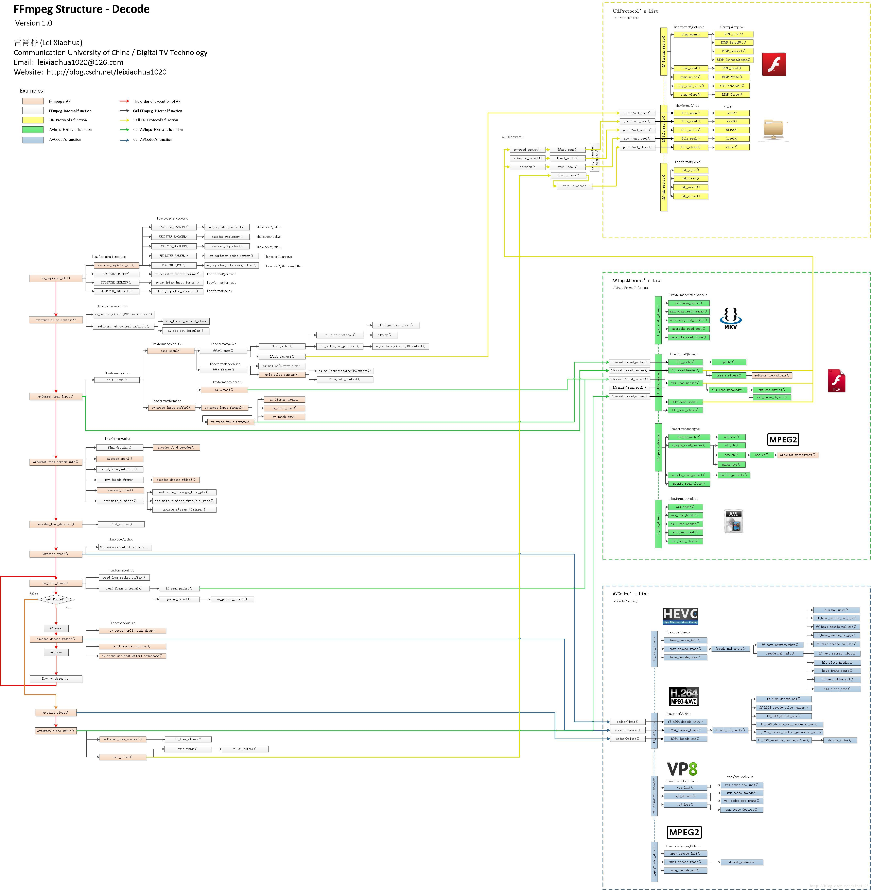
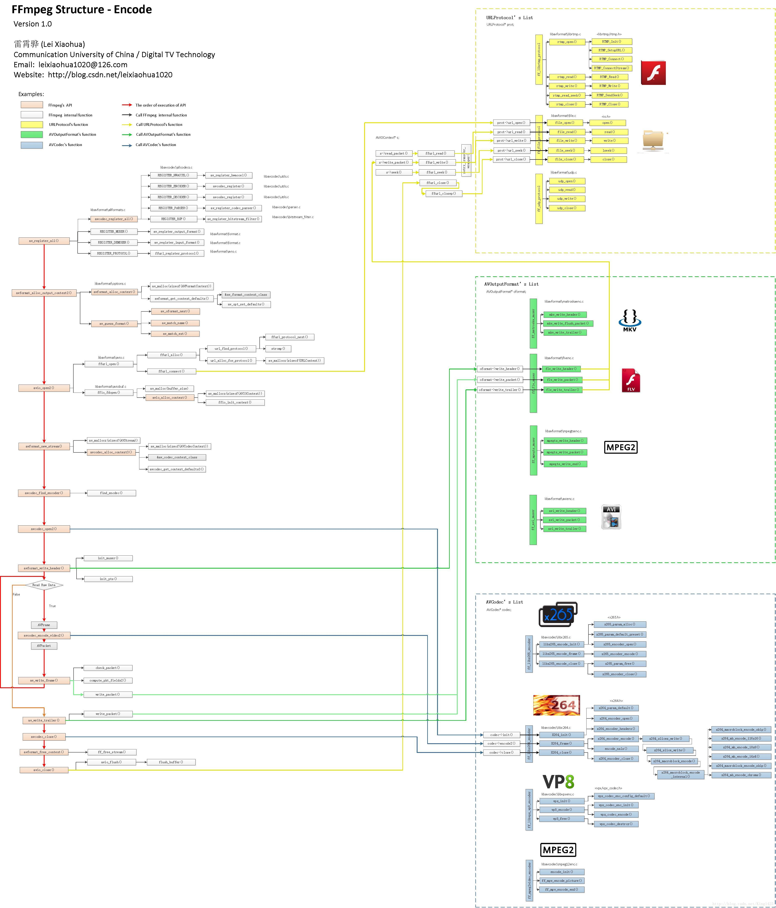
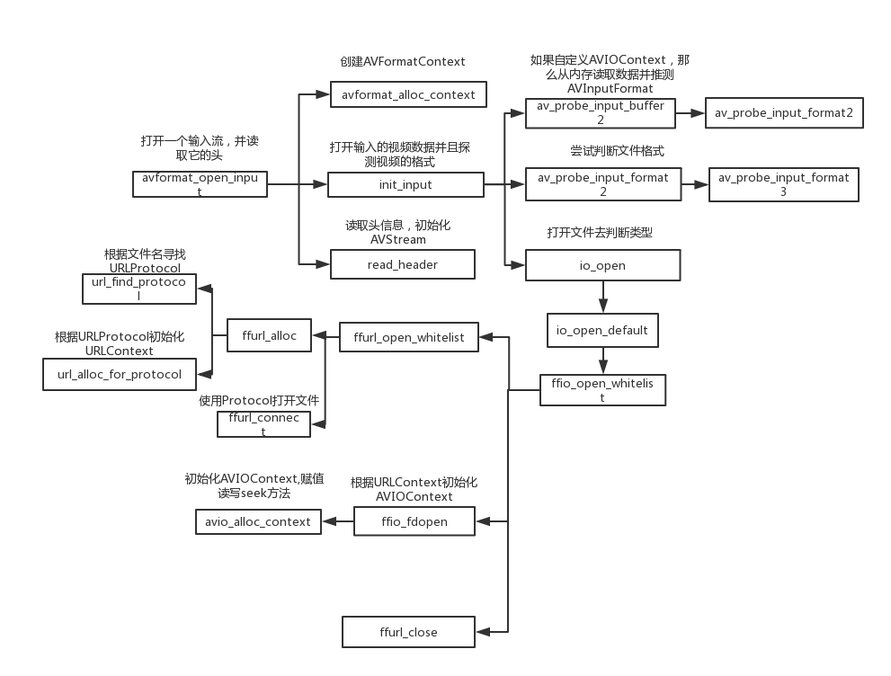
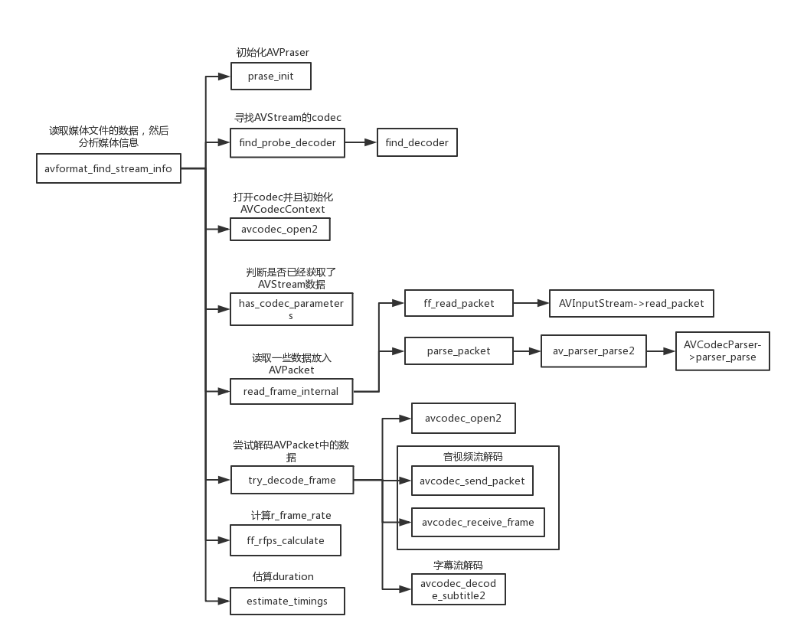
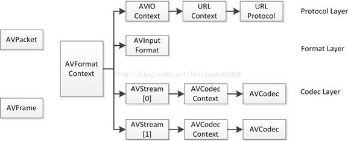

1. #### ffmpeg decoder流程图
    

2. ####  ffmpeg encoder流程图
    

3. #### avformat_open_input调用流程
    <table><tr><td bgcolor=white></td></tr></table>

4. #### avformat_find_stream_info调用流程
    <table><tr><td bgcolor=white></td></tr></table>

5. #### 主要结构体
    

6. #### 其他
    1. 滤镜链（filter： ffmpeg -i input.mp4 -vf "split [main][tmp]; [tmp] crop=iw:ih/2:0:0, vflip [flip]; [main][flip] overlay=0:H/2" output.mp4）
        1. 命令中同一个滤镜链中的滤镜之间通过逗号分隔开，如上例中[crop]和[vflip]处于同一个滤镜链，而知以逗号分隔开。
        2. 不同的滤镜链之间以分号隔开，如上例中[crop]和[vflip]组成的滤镜链与[split]、[overlay]之间。
        3. 滤镜链的输入输出通过方括号标记命名，若示例中[split]滤镜产生了两路输出，分别被标记为[main]和[tmp]
        4. 有的滤镜可以指定参数列表，通过在滤镜名后面接一个等号，然后等号后指定需要的参数即可，不同的参数之间需要使用冒号隔开。如示例中[crop]的参数iw:ih/2:0:0。