#### 概念
##### 1. OMX方法
1. OMX_FillThisBuffer：传入空的buffer，待OMX对应的解码器解码后返回相应的数据填入buffer。
2. OMX_EmptyThisBuffer: 传入解码前数据buffer，给OMX对应的解码器解码。

##### 2. 消息系统
1. <font color="#ff0000">ALooper</font>::start()会新建一个<font color="#ff0000">LooperThread
</font>（继承Thread）并且调用其run方法，最终调用ALooper::loop()（可对比java层的Looper，功能一致）
    > GenericSource的prepareAsync方法里面就会新建一个ALooper并调用start方法开始loop处理message
2. 一般<font color="#ff0000">AMessage</font>的使用是 new AMessage(what, handler)，new的时候AMessage里面的mLooper会用handler.getLooper赋值；最后调用AMessage::post把msg post到looper里面的<font color="#ff0000">EventQueue</font>里面，通过Condition的wait，signal和waitRelaßtive方法在适当的时间取出queue的msg并调用其deliver方法；实际上是调用handler的deliverMessage方法；AHandler::deliverMessage里面调用了自己的虚方法onMessageReceived；<font color="#ff0000">AHandler</font>派生类只需要重写onMessageReceived方法即可在这个方法里面接收msg。

##### 3. 其他概念
1. mOffloadAudio这个参数为true表示音频可以用硬件解码。
2. generation：里面很多用到了这个概念，其实是一个int值，每次环境改变+1，如果方法执行完后generation改变了，即在方法执行的过程中环境已经变了，方法执行的结果忽略。这是因为执行方法的时候没有加锁使用的一种方案，验证方法前后的代数是否一致保证方法执行前后环境的一致性。
3. AudioTrack播放音频是的两种方式
    1. MODE_STATIC 预先将需要播放的音频数据读取到内存中，然后才开始播放。
    2. MODE_STREAM 边读边播，不会将数据直接加载到内存
5. shareBuffer：共享内存，STREAM模式需要用户一次次写，所以就不用共享内存了。这里的共享内存是指C++AudioTrack和AudioFlinger之间共享的内容，因为真正播放的工作是由AudioFlinger来完成的。
4. frame：1个采样点的字节数*声道。为啥搞个frame出来？因为对于多声道的话，用1个采样点的字节数表示不全，因为播放的时候肯定是多个声道的数据都要播出来才行。所以为了方便，就说1秒钟有多少个frame，这样就能抛开声道数，把意思表示全了。
5. UnderRun：往底层喂数据喂慢了，OverRun：往底层喂数据喂快了。

#### 主要流程
##### 1 . 文件关系
- MediaPlayer.java -> android_media_MediaPlayer.cpp （连接native和java层的MediaPlayer） -> mediaplayer.cpp（native 层的MediaPlayer）-> MediaPlayerService.cpp（Client） ->（通过MediaPlayerFactory.cpp）-> NuPlayerDriver.cpp -> （通过AVNuFactory.cpp）-> NuPlayer.cpp -> GenericSource.cpp（[NuPlayerDecoder.cpp，NuPlayerRenderer]（通过AVNuFactory.cpp））-> ACodec.cpp -> OMXNodeInstance.cpp

##### 2. 时序图
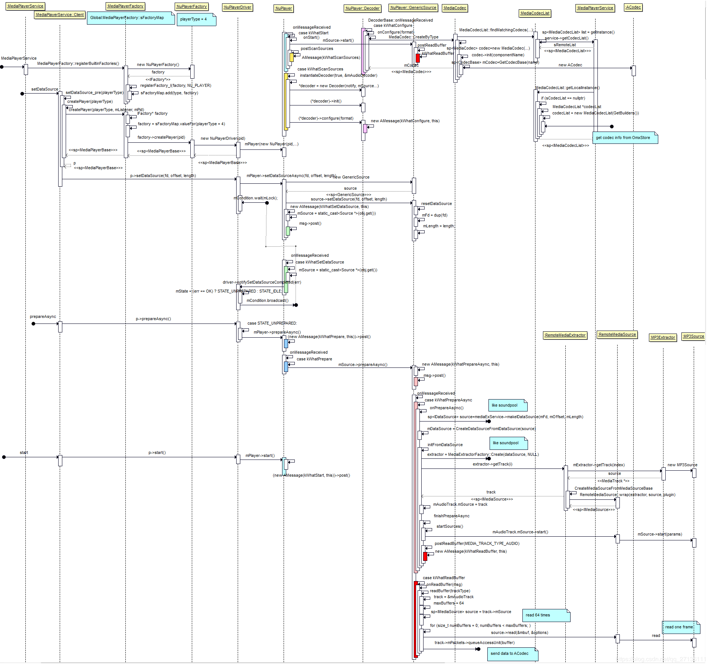
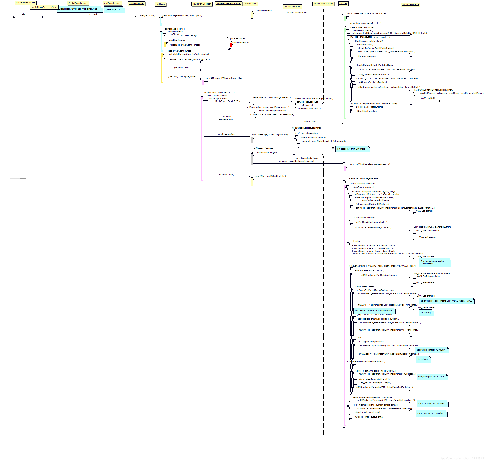
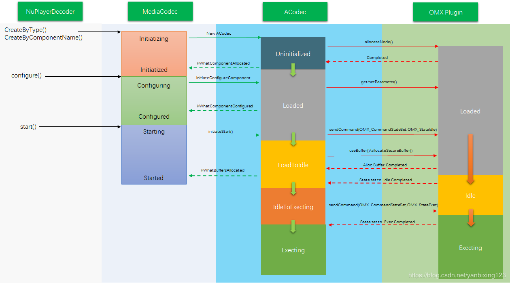

##### 3. setDataSource（[参考](https://blog.csdn.net/qq_27136111/article/details/94594673) java层省略）
1. native MediaPlayer（下称nMP，是一个可IPC的对象<font color=#ff0000>IMediaPlayerClient</font>） 调用 MediaPlayerService（下称MPS）的create方法创建一个可IPC的player（<font color=#ff0000>IMediaPlayer</font> MPS端的Client，下称MPSC的Bp）并保存为mPlayer；同时也把自己传递过去保存在MPSC的mClient（IMediaPlayerClient）里面，用于远程的回调。
2. 调用player（MPSC）的setDataSource方法 
3. MPSC调用MediaPlayerFactory（下称MPF）的getPlayerType方法，根据相应的DataSource类型获取对应的PlayerType，Android9.0的Type只有NU_PLAYER（5.1.1还有STAGEFRIGHT_PLAYER，SONIVOX_PLAYER，TEST_PLAYER）
4. MPSC调用setDataSource_pre方法做一些设置DataSource之前的准备。
    1. 根据PlayerType 调用MPF的createPlayer方法，最终调用了NuPlayerFactory的createPlayer生成NuPlayerDriver（<font color=#ff0000>MediaPlayerBase</font>；把pid和listener保存在里面，下称NPD），NPD通过AVNuFactory生成NuPlayer保存在mPlayer里面。
    2. 设置分离器binder（media.extractor）和解码器binder（omx）的死亡通知监听。
    3. 调用NPD的setAudioSink 保存新建的AudioOutput。
5. MPSC调用setDataSource_post保存生成的NPD到mPlayer里面。
6. 调用NuPlayerDriver的setDataSource方法，实际上是调用了NuPlayer的setDataSourceAsync方法，根据不同的播放DataSource生成不同的<font color=#00CED1>Nuplayer::Source</font>（GenericSource，HttpLiveSource，RtspSource，StreamingSource）并调用它的setDataSource方法（保存DataSource，如：fd，offset，length），最后把生成的source保存在mSource里面。
7. 通知NPDsetDataSource setDataSource completed 设置mState为 STATE_UNPREPARED。

##### 4. prepare（[参考](https://blog.csdn.net/qq_27136111/article/details/95357167)）
1. 同步的话调用nMP的prepare方法，异步调用nMP的prepareAsync方法（prepare 先设置 mPrepareSync=true 后调用prepareAsync_l方法，再用mSignal.wait等待方法执行结束；prepareAsync则直接调用prepareAsync_l方法）
2. 调用MPSC的prepareAsync方法，最后调用到NuPlayer的mSource（GenericSource）的prepareAsync方法，通过消息系统实际上是调用了onPrepareAsync。
3. 调用MediaExtractorService（下称MES）的makeIDataSource方法获取<font color=#ff0000>IDataSource</font>对象，MES调用DataSourceFactory的CreateFromFd获取FileSource（<font color=#ff0000>DataSource</font>）对象，再调用CreateIDataSourceFromDataSource把DataSource包装成可IPC的RemoteDataSource（IDataSource）。
4. GenericSource获取到IDataSource后调用CreateDataSourceFromIDataSource把其包装成TinyCacheSource（DataSource）并保存在mDataSource里面。
5. GenericSource调用initFormDataSource方法初始化extractor，实际上调用了MediaExtractorFactory的Create方法新建一个<font color=#ff0000>IMediaExtractor</font>对象（9.0 MediaPlayerService和Extractor不在一个进程，需要IPC）；接着调用CreateFromService，这个方法里面会判断是否需要调用UpdateExtractors更新Extractor信息（遍历system/lib64/extractors和vendor/lib64/extractors里面的extractor，解析后保存在一个List里面）；遍历List调用每个extractor的sniff方法，找到最适合source的<font color=#ff0000>MediaExtractor</font>，并调用CreateIMediaExtractorFromMediaExtractor方法把其封装成一个可IPC的IMediaExtractor（RemoteMediaExtractor）；
6. 根据返回的IMediaExtractor对象，获取保存mDurationUs，[mAudioTrack，mVideoTrack]（track都保存在mSources里面）,mBitrate
7. 如果有视频notifyVideoSizeChanged；
8. finishPrepareAsync
    1. 调用startSources配置IMediaExtractor一些初始参数
    2. 调用notifyPrepared，其调用了NPD的notifyPrepareCompleted方法，里面会调用mListener（MediaPlayerService里面的Listener类）的notify方法，createPlayer的时候setNotifyCallback设置的，接着调用到nMP的notify方法，里面会判断如果是同步的prepare会调用mSignal.signal。
    3. 调用postReadBuffer预读一些source里面的视频音频数据（在start里面分析）

##### 5. start（[参考](https://blog.csdn.net/qq_27136111/article/details/94594719?utm_source=distribute.pc_relevant.none-task)）
1. 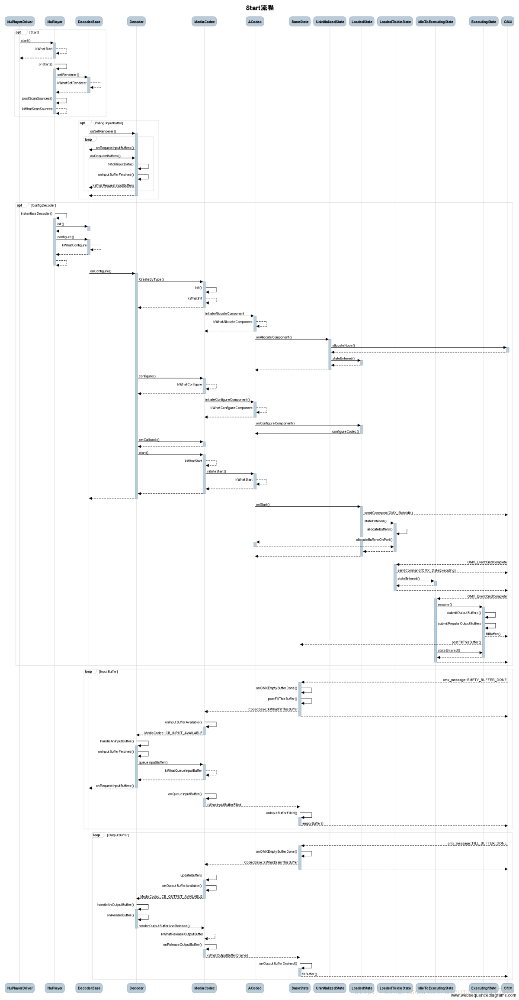
2. java层最后调用到nMP的start方法，设置mPlayer（NuPlayerDriver）的Looping，音量之类的数据，把mCurrentState改为MEDIA_PLAYER_STARTED，调用NuPlayerDriver的start方法，接着根据当前的状态STATE_PREPARED调用NuPlayer的start方法。
3. 调用NuPlayer的onStart方法，调用mSource（GenericSource）的start方法，调用postReadBuffer方法读取source数据（prepare的最后也有这个阶段）
4. 调用readBuffer方法，video类型读取8个buffer，audio类型读取64个buffer，调用source（prepare的时候从IMediaExtractor里面get到track 保存在mAudioTrack或者mVideoTrack的mSource（<font color=#ff0000>IMediaSource</font>）里面）的readMultiple或read方法，取决于supportReadMultiple。获取到MediaBufferBase类型的buffer数据。
5. 调用mediaBufferToABuffer把MediaBufferBase类型的buffer数据换成ABuffer类型的buffer数据保存在track（mAudioTrack，mVideoTrack，或其他）的mPackets对象里面（调用其queueAccessUnit方法，与dequeueAccessUnit方法相对）。
6. mSource的start后，NuPlayer会通过AVNuFactory的createRenderer方法新建渲染器mRenderer（<font color=#00CED1>NuPlayer::Renderer</font>），新建ALooper对象mRendererLooper，并跟mRenderer（AHandler的派生类对象）绑定，然后进行mRenderer的各种设置（setPlaybackSettings，setVideoFrameRate）。
7. onStart的最后会调用接着调用postScanSources，最终会调用instantiateDecoder（实例化mAudioDecoder，mVideoDecoder），调用AVNuFactory的createDecoder来新建一个NuPlayer::Decoder对象decoder（<font color=#00CED1>NuPlayer::DecoderBase</font>）
    1. 调用decoder的init方法registerHandler(this)
    2. 调用decoder的configure方法配置解码器（见8）
8. configure方法实际上是调用了NuPlayerDecoder的onConfigure方法
    1. 通过AVUtils的createCustomComponentByName方法获取一个自定义的MediaCodec对象mCodec，默认返回NULL。
    2. 通过MediaCodec的CreateByType方法获取一个MediaCodec对象mCodec。
        1. 通过MediaCodecList的findMatchingCodecs方法获取跟mime匹配的```Vector<AString> matchingCodecs```，遍历matchingCodecs得到componentName。
            > MediaCodecList的构造方法里会去OmxStore获取一个解码列表，这个解码列表是在开机的时候OmxStore使用MediaCodecsXmlParser去解析xml文件得到的。
        2. 新建MediaCodec对象mCodec，并调用其init方法传入componentName（形如：OMX.google.vorbis.decoder）。
            1. 调用GetCodecBase获取mCodec（CodecBase的派生类ACodec）
                > ACodec的构造方法会配置``` mPortMode[kPortIndexInput] = IOMX::kPortModePresetByteBuffer;
    mPortMode[kPortIndexOutput] = IOMX::kPortModePresetByteBuffer;```
            2. 调用mCodec的setCallback方法设置解码回调CodecBase::CodecCallback
            3. 调用mCodec的getBufferChannel方法获取mBufferChannel（ACodecBufferChannel），并设置其回调CodecBase::BufferCallback。
            4. post what=kWhatInit的message异步做一些最后的init，调用到mCodec的initiateAllocateComponent方法，最后调用到UninitializedState状态的onAllocateComponent方法（见8）。
    3. 调用mCodec（MediaCodec）的configure方法
        1. 配置一些format信息
        2. PostAndAwaitResponse what=kWhatConfigure的message（需要异步的一些configure操作）
        3. what=kWhatConfigure的message最后会调用MediaCodec的mCodec（的ACodec）的initiateConfigureComponent方法做最后的配置（见9）
    4. <span id="jump1">调用mCodec（MediaCodec）的setCallback方法，MediaCodec中如果callback不为NULL设置mFlags |= kFlagIsAsync。
    5. 调用mCodec（MediaCodec）的start方法</span>
        1. 通过kWhatStart异步调用
            1. 设置状态为STARTING
            2. <span id="jump">调用mCodec（ACodec）的initiateStart方法实际调用到onStart方法，里面调用到mOMXNode的```sendCommand(OMX_CommandStateSet, OMX_StateIdle)```方法，返回值OK的话把状态机的状态变成LoadedToIdleState（见10）。</span>
9. ACodec的onAllocateComponent方法
    1. 新建CodecObserver对象地址保存在observer
    2. 新建OMXClient对象并调用connect方法获取对应service(<font color=##1E90FF>OMX</font>)，并包装成LWOmx对象omx
    3. 调用omx的allocateNode传入componentName，message里面的"componentName"，最后很明显就调用到service的allocateNode方法。
    4. 新建<font color=##1E90FF>OMXNodeInstance</font>对象instance，保存componentName，service，和ACodec新建的observer的封装mObserver``` new LWOmxObserver(new TWOmxObserver(observer))```可IPC。
    5. 调用<font color=##1E90FF>OMXMaster</font>对象的makeComponentInstance方法（传入```OMX_COMPONENTTYPE *handle```，```&OMXNodeInstance::kCallbacks```）。这个方法会找到包含componentName的一个Plugin（SoftOMXPlugin，还有其他如硬解，由Master管理这这些Plugin）调用对应Plugin的makeComponentInstance方法。
    6. SoftOMXPlugin的makeComponentInstance方法主要是根据componentName找到对应的so，dlopen出来，再通过```(CreateSoftOMXComponentFunc)dlsym(libHandle, "_Z22createSoftOMXComponentPKcPK16OMX_CALLBACKTYPE"
    "PvPP17OMX_COMPONENTTYPE");```获取createSoftOMXComponent方法，然后调用这个createSoftOMXComponent方法传入handle（makeComponentInstance方法中对应的形参是OMX_COMPONENTTYPE **component）获取到对应的软解codec（SoftOMXComponent），Component的构造方法里面会把一些操作方法包装后传给component（SoftOMXComponent的构造方法）。
    7. 调用OMXNodeInstance的setHandle方法把handle保存起来（后面通过handle可以调用SoftOMXComponent的派生类的各个方法）。
        1. 如果handle不为NULL，OMXNodeInstance会新建CallbackDispatcher（回调分配器），然后新建线程进入run起来后调用dispatcher的loop方法（自己搞了一个消息分配系统）。
    8. 保存instance和observer（```new TWOmxObserver(observer)```）对象到mLiveNodes，吗NodeObserver。
    9. 把instance封装成TWOmxNode返回。
    10. ACodec中保存componentName(```mRenderTracker.setComponentName(componentName)```)，omx(mOMX)，omxNode（mOMXNode,```new TWOmxNode(instance)```可IPC），回调MediaCodec的onComponentAllocated方法（kWhatComponentAllocated 如果```(mComponentName.startsWith("OMX.google.") && (owner == nullptr || strncmp(owner, "default", 8) == 0))```则设置```mFlags |= kFlagUsesSoftwareRenderer```），<span id="jump2">把状态机的状态变成LoadedState</span>
    > 补充:ACodec里面使用了状态机的机制有UninitializedState，LoadedState，LoadedToIdleState，IdleToExecutingState，ExecutingState，OutputPortSettingsChangedState，ExecutingToIdleState，IdleToLoadedState，FlushingState九种状态，初始化的最后会changeState到UninitializedState状态。Acodec派生于状态机控制类AHierarchicalStateMachine和消息控制类AHandler，ACodec重写了AHandler的onMessageReceived方法调用AHierarchicalStateMachine的handleMessage方法，该方法里面会根据当前的状态调用对应状态的onMessageReceived方法。
    11. OMX类图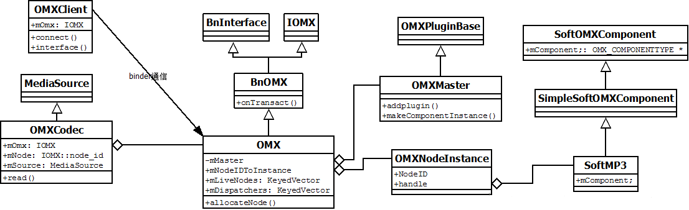
10. ACodec的initiateConfigureComponent会异步调用到其onConfigureComponent方法。
    1. 调用自己的configureCodec方法，配置是否是encoder，mIsVideo或者mIsImage。
    2. 调用自己的setComponentRole方法，根据mime，encoder调用AVUtils的getComponentRole方法获取role并调用omxNode的setParameter方法设置role，index为<font color="#FFB6C1">OMX_IndexParamStandardComponentRole</font>
    3. 调用自己的setPortMode方法设置端口模式，index为<font color="#FFB6C1">kPortIndexOutput</font>
    4. 调用自己的setupVideoDecoder设置数据格式和颜色空间
11. changState时状态机会调用对应状态的stateEntered方法，LoadedToIdleState状态的stateEntered方法里面会调用allocateBuffers分配端口buffer。（具体待补充）
    1. 分别传入kPortIndexInput，kPortIndexOutput，调用allocateBuffersOnPort方法。
        1. 调用mOMXNode的getParameter方法传入OMX_IndexParamPortDefinition，获取端口的定义def（端口的定义都是各个解码器自己定义后调用addPort保存在自己的mPorts里面的，如SoftAAC2.cpp的构造方法就会调用initPorts初始化input output端口）。
        2. 调用```TAllocator::getService("ashmem")```获取hidl的匿名共享内存服务（AshmemAllocator）。
        2. for循环def.nBufferCountActual次调用hidl的匿名共享内存服务的alocate方法传入bufSize，打开匿名共享内存驱动并ioctl分配大小为size,把打开的fd等保存在<font color=#FF4500>hidl_memory</font>并返回（hidlMemToken）。
        3. 把打开的fd mmap到本地保存在hidlMem（<font color=#FF4500>IHidlMemory</font>）里面
        4. 调用mOMXNode的useBuffer传入portIndex，hidlMemToken和bufferId。用传入的hidlMemToken mmap之后获得IHidlMemory对象hidlMemory，进入```case OMXBuffer::kBufferTypeHidlMemory:```，调用useBuffer_l方法传入hidlMemory（hParams）等参数。（这个方法是在OMX端新建OMX_U8类型的buffer并得到bufferId，以便后面在ACodec端新建另外一个MediaCodecBuffer类型的buffer时共用同一个bufferId）。
            1. 通过hidlMemory->getPointer()获取void*指针paramsPointer，新建对象OMX_U8（```data = static_cast<OMX_U8 *>(paramsPointer);```）。
            2. 新建BufferMeta对象buffer_meta，并把hParams，portIndex等保存在里面。
            3. 调用OMX_UseBuffer方法新建OMX_BUFFERHEADERTYPE对象header，把data保存在header->pBuffer，把buffer_meta保存在header->pAppPrivate，把portIndex保存在header->nOutputPortIndex，header->nInputPortIndex。
            4. 调用makeBufferID方法获取最新的bufferId，并和header一起保存在mBufferIDToBufferHeader和mBufferHeaderToBufferID两个对应的映射里面。
            5. 调用addActiveBuffer方法新建ActiveBuffer对象active记录portIndex和bufferId并保存在mActiveBuffer里面。
            6. 如果portIndex是kPortIndexInput时，回调onInputBufferAdded方法。
        5. 把新建ACodec::BufferInfo对象info，```info.mStatus = BufferInfo::OWNED_BY_US```，bufferId保存在info.mBufferID里面，新建SharedMemoryBuffer（MediaCodecBuffer的派生类）对象保存在info.mCodecData里面，hidlMem保存在info.mCodecRef里面（实现ACodec端跟OMX端的OMXNodeInstance共享内存），```info.mData = info.mCodecData```，最后```mBuffers[portIndex].push(info);```
        6. 遍历mBuffers生成array：```std::vector<ACodecBufferChannel::BufferAndId> array(mBuffers[portIndex].size())；array[i] = {mBuffers[portIndex][i].mData, mBuffers[portIndex][i].mBufferID};```
        7. 回调mBufferChannel的setInputBufferArray或setOutputBufferArray方法。把上面新建的buffer和对应的bufferId，保存在ACodecBufferChannel的<font color=#7FFFAA>mInputBuffers（ACodecBufferChannel::BufferInfo）</font>或mOutputBuffers里面。
12. [5.8.5.2](#jump)中setCommand把OMX状态设置成OMX_StateIdle之后成功会回调LoadedToIdleState::onOMXEvent（event为OMX_EventComComplete），回调里面还会调用setCommand吧OMX状态设置成OMX_StateExecting，返回值OK的话设置ACodec状态机为IdleToExecutingState状态。
13. setCommand成功后，会先调用ExecutingState的resume方法<!-- ->submitOutputBuffers->submitOutputMetadataBuffer->fillBuffer-> -->遍历mBuffers对应端口的数据，如果info的mStatus为OWNED_BY_US的话，调用<font color="#00CED1">postFillThisBuffer</font>方法传入info。最后同上会调用IdleToExecutingState::onOMXEvent把ACodec状态机设置成ExecutingState。
<!-- 14. <font color="#FA8072">fillBuffer</font>方法会调用OMXNodeInstance的fillBuffer方法，接着调用OMX_FillThisBuffer方法传入空buffer给OMX保存解码后的数据。-->
15. <font color="#00CED1">postFillThisBuffer</font>传入info，接着调用mBufferChannel的fillThisBuffer方法，最后把info的mStatus改为BufferInfo::OWNED_BY_UPSTREAM
    1. fillThisBuffer方法，先调用findBufferId在<font color=#7FFFAA>mInputBuffers（ACodecBufferChannel::BufferInfo）</font>中找到对应bufferId的ACodecBufferChannel::BufferInfo对象it，回调MediaCodec的onInputBufferAvailable方法，并传入it->mClientBuffer（ACodec里面调用allocateBuffersOnPort的时候新建的info中的mData，即SharedMemoryBuffer对象）和index。
        > ACodecBufferChannel::BufferInfo
        >- mCodecBuffer：Channel跟ACodec通信息的buffer
        >- mClientBuffer：Channel跟MediaCodec通信的buffer
    2. BufferCallback::onInputBufferAvailable方法post了一个kWhatFillThisBuffer
        1. 调用了updateBuffer方法，把传过来的clientBuffer保存在mPortBuffers[portIndex][index]里面，把index保存在mAvailPortBuffers[portIndex]里面。
        2. 调用MediaCodec::onInputBufferAvailable方法，里面dequeue(mAvailPortBuffers里面的begin)出index，最后post CB_INPUT_AVAILABLE和index到NuPlayerDecoder里面。
        3. 调用NuPlayerDecoder的handleAnInputBuffer方法
16. 调用NuPlayerDecoder的handleAnInputBuffer方法。
    1. 调用mCodec（MediaCodec）的getInputBuffer方法在其mPortBuffers里面获取对应index的buffer
    2. 把buffer保存在<font color=#7FFFAA>mInputBuffers（NuPlayerDecoder）</font>里面的index处，设置```mInputBufferIsDequeued.editItemAt(index) = true```，把index添加到mDequeuedInputBuffers里面。
        >- MediaCodec里面的mPortBuffers保存这对应portIndex的对应index的BufferInfo
        >- NuPlayerDecoder里面只需在mInputBuffers里面对应的index保存MediaCodecBuffer
    3. 调用onRequestInputBuffers
        1. 调用doRequestBuffers方法，里面会调用fetchInputData方法，接着调用mSource（GenericSource）的dequeueAccessUnit方法（与上面的queueAccessUnit方法相对）获得ABuffer对象accessUnit。并保存在message里面key为"buffer"。
        2. 调用onInputBufferFetched方法，通过bufferId在<font color=#7FFFAA>mInputBuffers</font>里面获取对应的MediaCodecBuffer对象codecBuffer，并把message里面buffer（ABuffer，GenericSource从Extractor里面read出来的）的data memcpy到codecBuffer的data里面。调用mCodec（MediaCodec）的queueInputBuffer方法传入codecBuffer对应的信息。
            1. 调用onQueueInputBuffer方法，接着调用mBufferChannel方法的queueInputBuffer传入buffer对象，实际上是调用了ACodec的onInputBufferFilled方法。
            2. ACodec的onInputBufferFilled方法里面根据bufferID得到了对应的info，设置info->mData为传过来的buffer（```it->mCodecBuffer```），把buffer convert到info->mCodecData，最后调用mMXNode的emptyBuffer方法，传入bufferID，info->mCodecData等。
                1. 调用OMXNodeInstance的emptyBuffer_l方法，通过bufferID获取header（OMX_BUFFERHEADERTYPE），获取BufferMeta对象header->pAppPrivate并调用其CopyToOMX方法把buffer（getPointer获取ACodec复制进内存的）复制到header->pBuffer里面（共享内存同一个内存块里面不同位置的memcpy）。

##### 6. MediaCodecList解析
1. 解析media_codecs.xml文件得到对应的数据详见OmxStore，MediaCodecsXmlParser

##### 7.解码前后的数据流流向
1. Codec从Extractor里面read到数据，Extractor从DataSource（FileSource，NuCachedSource2）里面read到数据。
2. InputBuffer
    > loop
    1. OMX-->+BaseState: omx_message::EMPTY_BUFFER_DONE
        1. BaseState->BaseState: onOMXEmptyBufferDone()
        2. BaseState->BaseState: <font color="#00CED1">postFillThisBuffer</font>()
        3. BaseState-->MediaCodec: CodecBase::kWhatFillThisBuffer
    2. BaseState-->-OMX:
    3. MediaCodec->+MediaCodec: onInputBufferAvailable()
    4. MediaCodec-->-Decoder: MediaCodec::CB_INPUT_AVAILABLE
    5. Decoder->+Decoder: handleAnInputBuffer()
        1. Decoder->Decoder: onInputBufferFetched()
        2. Decoder->+MediaCodec: queueInputBuffer()
            1. MediaCodec-->MediaCodec: kWhatQueueInputBuffer
        3. MediaCodec-->-Decoder:
    6. Decoder-->-DecoderBase: onRequestInputBuffers()
    7. MediaCodec->+MediaCodec: doRequestBuffers()
    8. MediaCodec-->-BaseState: kWhatInputBufferFilled
    9. BaseState->+BaseState: onInputBufferFilled()
    10. BaseState-->-OMX: emptyBuffer()
    > end
    
    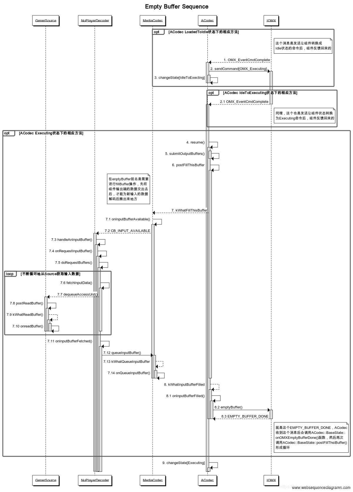
3. OutputBuffer
    > loop 
    1. OMX-->+BaseState: omx_message::FILL_BUFFER_DONE
        1. BaseState->BaseState: onOMXFillBufferDone()
        2. BaseState-->MediaCodec: CodecBase::kWhatDrainThisBuffer
    2. MediaCodec->+MediaCodec:updateBuffers
        >- 把buffer数据保存在mAvailPortBuffers对应port的List里面
        >- mAvailPortBuffers：存放相应port可用的index
        >- mPortBuffers：存放相应port可用的index对应的buffer
    3. MediaCodec->MediaCodec: onOutputBufferAvailable()
    4. MediaCodec-->-Decoder: MediaCodec::CB_OUTPUT_AVAILABLE
    5. Decoder->+Decoder: handleAnOutputBuffer()
    6. Decoder->Renderer: onRenderBuffer()
    7. Decoder->-MediaCodec: renderOutputBufferAndRelease()
    8. MediaCodec-->MediaCodec: kWhatReleaseOutputBuffer
    9. MediaCodec->+MediaCodec: onReleaseOutputBuffer()
    10. MediaCodec-->-BaseState: kWhatOutputBufferDrained
    11. BaseState->+BaseState: onOutputBufferDrained()
    12. BaseState-->-OMX: <font color="#FA8072">fillBuffer</font>()
    > end

    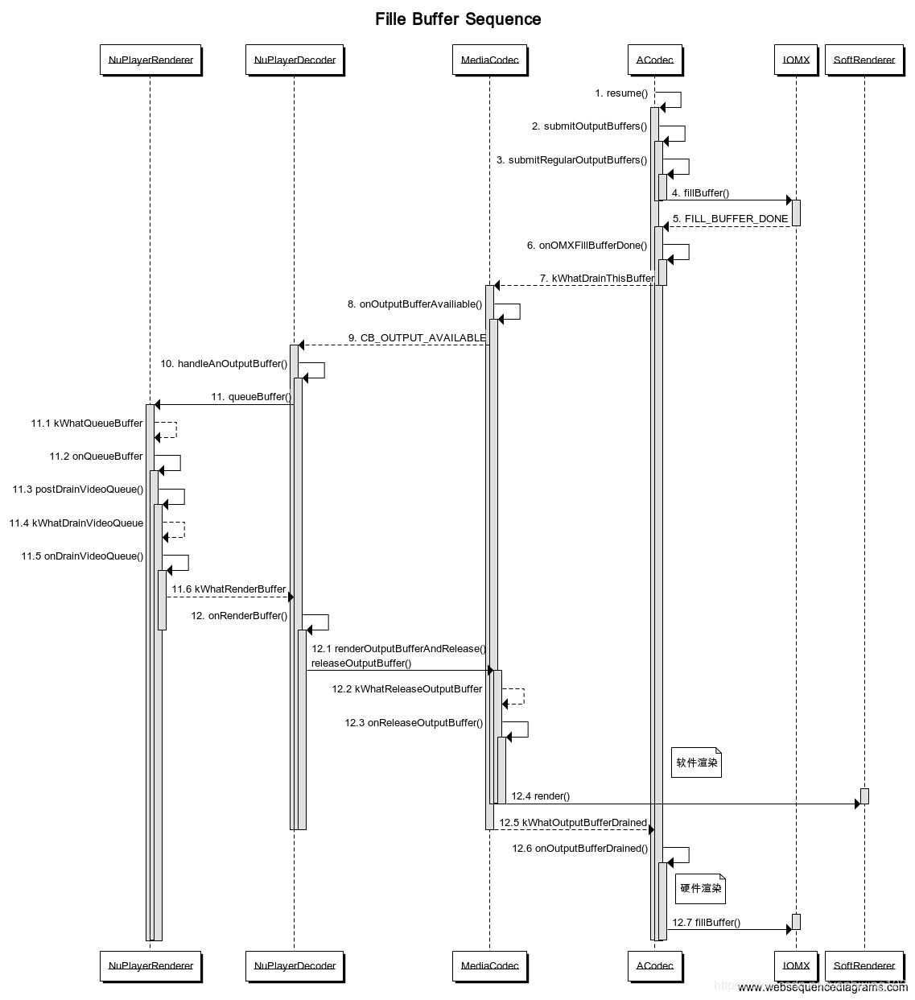

##### 8.Renderer过程
1. MediaCodec里面的kWhatDrainThisBuffer case会判断```mOutputFormat != buffer->format()```一般第一个buffer过来的时候会初始化mOutputFormat，在此之前mOutputFormat==NULL。
    1. 因为[5.8.4](#jump1)中如果把flag设置成async，就会调用onOutputFormatChanged方法，最终会调用到NuPlayerRenderer的changeAudioFormat方法，最后的最后调用onOpenAudioSink方法打开mAudioSink（AudioOutput）
    2. 因为[5.9.10](#jump2)中如果把flag设置成soft，且mime是以“video/”开始时，就会初始化mSoftRenderer（SoftwareRenderer）
2. onOpenAudioSink会调用到MediaPlayerService里面的AudioOutput::open方法。
3. open方法里面会新建AudioTrack对象t并保存在mTrack里面（[参考](https://www.cnblogs.com/TaigaCon/p/4772066.html)）
    1. AudioTrack的构造方法里面会调用set方法，set方法又会调用到createTrack_l方法
    2. 调用AudioFlinger的createTrack方法获取IAudioTrack对象track
        1. 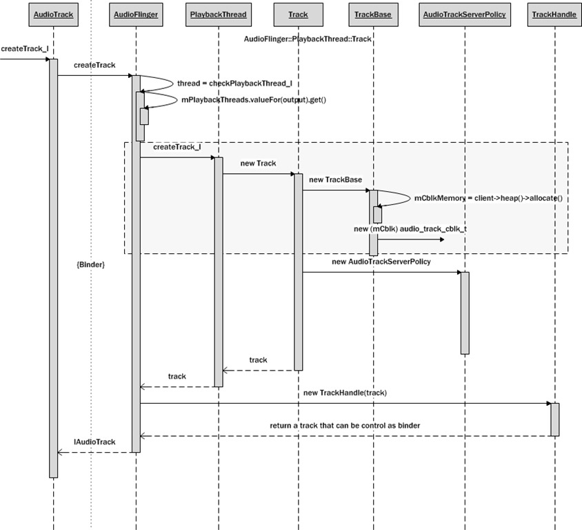
        1. 如果sessionId等于AUDIO_SESSION_ALLOCATE则调用newAudioUniqueId方法获取一个AUDIO_UNIQUE_ID_USE_SESSION的sessionId，如果不等则判断这个sessionId是否是AUDIO_UNIQUE_ID_USE_SESSION的，否则返回异常（sessionId是用来标识Track的，pid的话因为不足以标识Track的唯一性，同一个pid可能可以有多个Track）
        1. 调用AudioSystem的getOutputForAttr方法，最终调用到AudioPolicyManager的getOutputForAttr方法（根据Attr获取output [参考](https://blog.csdn.net/bberdong/article/details/80484568)）。
            1. 调用getStrategyForAttr方法
            2. 调用getDeviceForStrategy方法
            3. 调用getOutputForDevice方法 
                1. mOutputs数据的由来：AudioPolicyManager的构造方法会调用loadConfig方法加载audio_policy.conf（[参考，Android7以后用Xml-audio_policy_configuration.xml文件代替该配置仍然适用](https://source.android.google.cn/devices/audio/implement-policy?hl=zh-cn) audio-base.h里面有flags的含义）的配置，接着会调用initialize方法，遍历加载到的mHwModulesAll得到每一个hwModule，通过hwModule->getOutputProfiles并遍历其返回值得到outProfile，并新建SwAudioOutputDescriptor对象outputDesc并调用其open方法得到output，最后调用addOutput方法把output和outputDesc以键值对的形式保存起来。
                    1. 以高通660的audio_policy.conf（新版本用audio_policy_configuration.xml）为例，mHwModulesAll包括三个primary，a2dp，usb，r_submix；primary的outputProfiles包括primary，raw，deep_buffer，compress_passthrough，direct_pcm，compress_offload，dsd_compress_passthrough，incall_music，voip_rx；每个outputProfile几乎包括sampling_rates，channel_masks，formats，devices，flags。
                    2. SwAudioOutputDescriptor的open方法最后调用到了AF的openOutput方法，接着调用openOutput_l方法，该方法里面通过module跟devices在mAudioHwDevs找到AudioHwDevice对象，调用其openOutputStream方法得到outputStream；根据flag新建对应的PlaybackThread（新建的时候会调用Thread的run方法，进入threadLoop的循环，这个时候mStandbyTimeNs为当前时间，且mActiveTracks里面是没有Track的，所以Thread会进入待机状态```mWaitWorkCV.wait(mLock)```）传入openOutputStream保存在没mPlaybackThreads里面以output，thread为键值对保存。
            4. 根据device更新mSelectedDeviceId。
            5. 常见 FLAG
                1. AUDIO_OUTPUT_FLAG_DIRECT：不进行软件混音直接交HAL进行处理； Indicates cases that need to bypass AudioFlinger
                2. AUDIO_OUTPUT_FLAG_PRIMARY：软件解码、软件混音、采样率转换(SRC)基本都不能少；
                3. AUDIO_OUTPUT_FLAG_FAST（通常是OpenSL ES或AAudio的Android原生音频[参考](https://source.android.google.cn/devices/audio/latency/design)）：不进行采样率转换(SRC)；
                4. AUDIO_OUTPUT_FLAG_DEEP_BUFFER：经处理后(混音加音效等)交HAL进行处理；
                5. AUDIO_OUTPUT_FLAG_COMPRESS_OFFLOAD：编码数据直接交HAL进行处理(往往需要有DSP进行硬解码)； Indicates the stream should be offloaded
                6. AUDIO_OUTPUT_FLAG_NON_BLOCKING – Indicates the writes for this stream are nonblocking
            6. 常见Playback Mode
                1. Deep buffer Playback:音频文件是在AP侧解码成PCM文件，然后再送到ADSP中处理，音效处理在AP侧或者ADSP中进行。
Playback mode in which PCM data is sent to the aDSP, postprocessed, and rendered to output sound device; audio effects can also be applied in the ARM or aDSP.
FLAG： AUDIO_OUTPUT_FLAG_DEEP_BUFFER
                2. Low Latency Playback : 和Deep buffer Playback方式类似，但是它所分配的buffer更小些，并且在ADSP侧只做很少或者基本不做处理， 主要是播放一些对延迟要求较高的音频，
Playback mode similar to deep buffer that uses a smaller buffer size and minimal or no
postprocessing in the aDSP so that the PCM stream is rendered to the output sound
device
Use cases – Touchtone, gaming audio
FLAG：AUDIO_OUTPUT_FLAG_FAST
                3. Offload Playback: 音频解码部分的工作是在ADSP中完成，AP侧只负责把音频数据送到ADSP中，送出去后，AP侧会进行休眠，ADSP中会分配一块较大的buffer去处理此数据，在ADSP中进行解码，音效的处理工作，在ADSP解码器处理完数据之前，它会唤醒AP侧去送下一包数据。
Playback mode in which a large-sized buffer is sent to the aDSP and the APSS goes to sleep; the aDSP decodes, applies postprocessing effects, and outputs the PCM data to the physical sound device. Before the aDSP decoder input runs out of data, it interrupts the APSS to wake up and send the next set of buffers.
        2. 调用checkPlaybackThread_l获取和对应outputId的PlaybackThread（在上面调用SwAudioOutputDescriptor的open方法保存的）对象thread
        3. 调用registerPid 传入clientPid，新建一个AudioFlinger::Client（可以调用heap().allocate(size)获取IMemory对象）跟clientPid键值对保存在mClients
        4. 调用thread的createTrack_l方法
            1. 新建AudioFlinger::PlaybackThread::Track（是TrackBase的派生类，TrackBase里面会allocate一个IMemory对象mCblkMemory并调用其pointer方法获得一个audio_track_cblk_t对象mCblk，并通过 ```new(mCblk) audio_track_cblk_t();``` 在mCblk对应的内存新建audio_track_cblk_t对象）对象track 保存在mTrack里面并返回。
                > 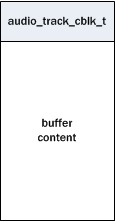
            2. TrackBase里面通过 ```mBuffer = (char*)mCblk + sizeof(audio_track_cblk_t);
                memset(mBuffer, 0, bufferSize);``` 初始化mBuffer。
        5. 把track封装成TrackHandle对象（可IPC）返回给AudioTrack。
    3. 通过track的getCblk方法获取IMemory对象保存在mCblkMemory里面，调用mCblkMemory的pointer方法获得audio_track_cblk_t对象保存在mCblk里面
    4. 把track保存到mAudioTrack里面，保存mFlags。mOutput等
    5. 获取buffer 
        ```
        if (mSharedBuffer == 0) {
            buffers = cblk + 1;
        } else {
            buffers = mSharedBuffer->pointer();
            if (buffers == NULL) {
                ALOGE("Could not get buffer pointer");
                status = NO_INIT;
                goto exit;
            }
        }
        ``` 
    并新建mProxy（AudioTrackClientProxy对象，Static模式为StaticAudioTrackClientProxy对象，服务端--AudioFlinger端为AudioTrackServerProxy，他们是两端用来管理共享内存的代理）
    6. 调用mProxy的setVolumeLR、setSendLevel、setSampleRate、setPlaybackRate、setMinimum...等方法。
4. mAudioSink open之后会调用他的start方法。
    1. 调用AudioTrack的[start](https://www.cnblogs.com/TaigaCon/p/4803952.html)方法，调用到PlaybackThread::Track的start方法，最终会调用```mWaitWorkCV.broadcast```退出standby，开始读取mix，write。
    2. Track的start方法的最后会把自己调用Thread的addTrack_l方法把自己添加到其mActiveTracks里面。
        1. addTrack_l方法会调用AudioSystem的startOutput方法，最后会调到AudioPolicyManager的startSource方法把当前Track的stream设置为Active，代码：```outputDesc->changeRefCount(stream, 1);mRefCount[stream] += delta;```。
        > 判断当前流是否是isActive，也是通过mOutputsa（SwAudioOutputCollection）的isStreamActive方法，遍历里面的output（AudioOutputDescriptor）调用其isStreamActive，最后通过```mRefCount[stream] !=0```来确定该流是否Active。 
    3. 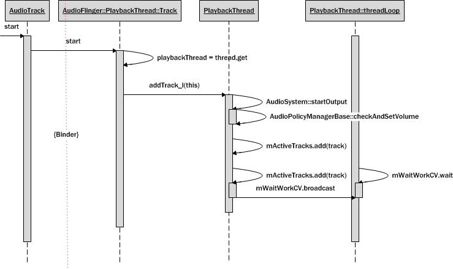
5. NuPlayerDecoder里面的handleAnOutputBuffer方法会调用```mRenderer->queueBuffer(mIsAudio, buffer, reply);```，实际上是调用了NuPlayerRenderer的onQueueBuffer方法。
    1. 调用postDrainAudioQueue_l方法，实际上是调用了onDrainAudioQueue方法。里面调用了mAudioSink->write方法，把buffer写进去。
    2. mAudioSink->write 调用的是mTrack（AudioTrack）的write方法
6. AudioTrack的write方法
    1. 调用obtainBuffer方法获取上面新建的buffer，并memcpy把传进来的buffer cpy 到obtain的buffer，释放obtainBuffer获取的buffer。
7. AudioFlinger端的PlaybackThread的threadLoop方法也在不断的在audio_track_cblk_t里面取共享内存的数据写进硬件。
    >- mNormalSink其实是NBAIO_Sink，实现类是：AudioStreamOutSink（[参考](https://blog.csdn.net/bberdong/article/details/78346729)）
8. MixerThread（[参考](https://www.cnblogs.com/taigacon/p/4827227.html)）
    1. 主要流程 </br>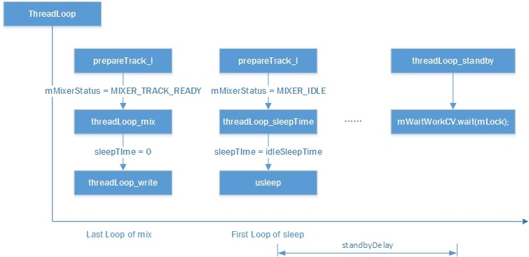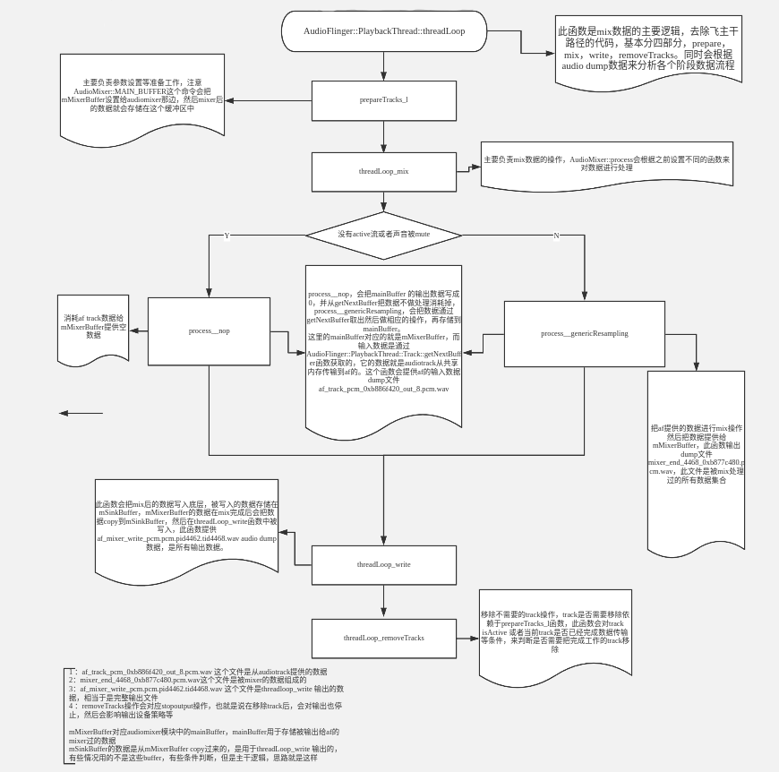
        1. prepareTracks_l的三个目的。
            1. 设置混音所需要的参数，包括：音量，混音的源buffer，混音目的buffer，音频格式，是否重采样等。   
            2. 删除被加入tracksToRemove的track
            3. 返回当前状态mMixerStatus
    2. sleep流程 </br>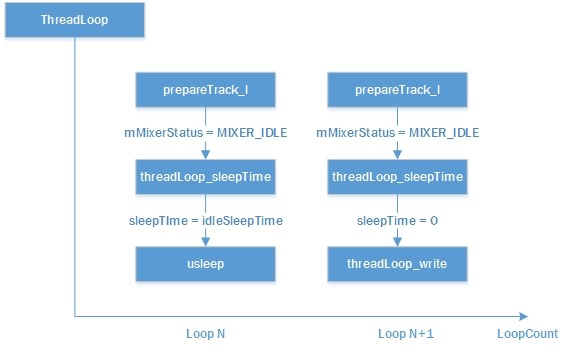
9. AudioMixer（[参考](https://www.cnblogs.com/TaigaCon/p/4844919.html)）
    1. AudioMixer里面会调用mTracks[name]->bufferProvider->getNextBuffer传入buffer(AudioBufferProvider::Buffer对象，传入前会先设置buffer.frameCount，表明想获取多少frame)获取nextbuffer 在传入的buffer里面返回。
        >- mTracks[name]为AudioMixer::Track对象。
        >- mTracks[name]->bufferProvider为AudioFlinger::PlaybackThread::Track对象，其getNextBuffer方法会调用```mServerProxy->obtainBuffer(&buf)```获取buffer，mServerProxy为AudioTrackServerProxy对象。
10. FastMixer
    1. MixerThread的构造方法会判断，如果```mFrameCount < mNormalFrameCount && (mOutDevice & AUDIO_DEVICE_OUT_ALL_A2DP) == 0```就新建FastMixer对象（这个采样率sampleRate有关），获取并配置FastMixerStete和里面的FastTrack，调用FastMixer的run方法，进入threadLoop。
        > mFrameCount跟mNormalFrameCount都是在readOutputParameters_l方法里面赋值的，mFrameCount为传进来的mOutput（AudioStreamOut）对象对应的流的mBufferSize/mFrameSize，mNormalFrameCount为mFrameCount乘与一个倍数，跟FastMixer有关。
    2. 如果是FastMixer，则mNormalSink为mPipeSink（```new MonoPipe(mNormalFrameCount * 4, format, true /*writeCanBlock*/)```），否则为mOutputSink。
    3. prepareTracks_l，如果是FastTrack的话配置AudioMixer是在FastMixer的onStateChange里面完成的，prepareTracks_l里面只是把应有的参数push到sq()里面；否则才在prepareTracks_l方法里面进行普通Track的AudioMixer配置。mActiveTracks里面不同的Track会做不同的处理，但是一般一个Thread里面只有一个Track是Active的，所以大多数情况下FastTrack跟普通的Track只进行一个，所以可能普通的(PlaybackThread的)threadLoop_write都不会走，因为thread没有mix出来的数据（mBytesRemaining等于0）。
11. hidl层（#TODO）
12. video的渲染
    1. onReleaseOutputBuffer方法里面会调用SoftRenderer的render方法，进行video的渲染。

##### 9.音视频同步过程（[参考](https://blog.csdn.net/cheriyou_/article/details/101207443)）
1. 音视频同步是通过设置锚点完成的，第一帧视频或音频到来时（或者seek）会设置mAnchorTimeMediaUs（锚点media时间），mAnchorTimeRealUs（锚点Real时间），通过```mAnchorTimeMediaUs + (realUs - mAnchorTimeRealUs) * (double)mPlaybackRate;```可以算出当前realTime所对应的mediaTime，反之也可。然后比较现在的时间跟realTime的时间是否相差40000毫秒以上，如是丢弃。
2. 例子： 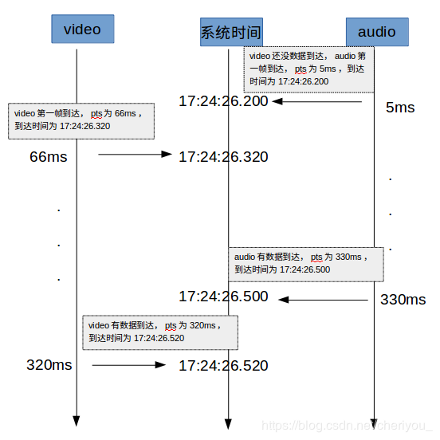
    - step1: audio第一帧到达，pts为5ms，到达时间为17:24:26.200，此时会更新mAnchorTimeMediaUs为5ms，　mAnchorTimeRealUs为17:24:26.200。
    - step2: 当video第一帧到达时，nowUs=17:24:26.320，mediaTimeUs＝66ms。</br>
    realTimeUs = mediaTimeUs -  (mAnchorTimeMediaUs + (nowUs - mAnchorTimeRealUs)) + nowUs</br>
    = 66ms - (5ms + (17:24:26.320 - 17:24:26.200)) + 17:24:26.320</br>
    = 17:24:26.271</br>
    delaytime =  nowUs - realTimeUs = 17:24:26.320 - 17:24:26.271 = 49ms</br>
    delaytime > 40ms, 所以drop第一帧
    - step3: audio又有数据到达，此处无特殊处理，忽略。
    - step4: video又有数据到达。nowUs=17:24:26.520， mediaTimeUs＝320ms。</br>
    realTimeUs = mediaTimeUs - (mAnchorTimeMediaUs + (nowUs - mAnchorTimeRealUs)) + nowUs</br>
    = 320ms - (5ms + (17:24:26.520 - 17:24:26.200)) + 17:24:26.520</br>
    = 17:24:26.515</br>
    delaytime =  nowUs - realTimeUs = 17:24:26.520 - 17:24:26.515 = 5ms</br>
    delaytime < 40ms, 所以render这一帧

##### 10. seekTo
1. 其实就是调用extractor的read方法从特定的offset开始读，之后就跟正常的read一样了，extractor里面会保存一个当前读到的position，之后正常的往下读不需要传入seek值。

##### 11. offload
1. mUseAudioCallback = true，不再用postDrainAudioQueue_l主动往mAudioSink里面write数据，而是通过AudioSinkCallback回调，把buffercopy到回调的buffer里面。

<!--OmxStore(
            const char* owner = "default",
            const char* const* searchDirs
                = MediaCodecsXmlParser::defaultSearchD irs,
            const char* mainXmlName
                = MediaCodecsXmlParser::defaultMainXmlName,
            const char* performanceXmlName
                = MediaCodecsXmlParser::defaultPerformanceXmlName,
            const char* profilingResultsXmlPath
                = MediaCodecsXmlParser::defaultProfilingResultsXmlPath);

    static constexpr char const* defaultSearchDirs[] =
            {"/odm/etc", "/vendor/etc", "/etc", nullptr};
    static constexpr char const* defaultMainXmlName =
            "media_codecs.xml";
    static constexpr char const* defaultPerformanceXmlName =
            "media_codecs_performance.xml";
    static constexpr char const* defaultProfilingResultsXmlPath =
            "/data/misc/media/media_codecs_profiling_results.xml";
            -->
