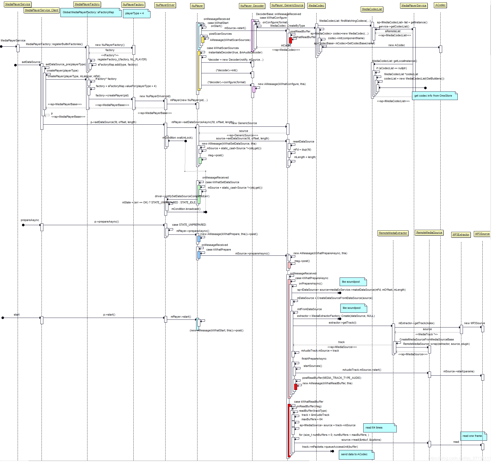
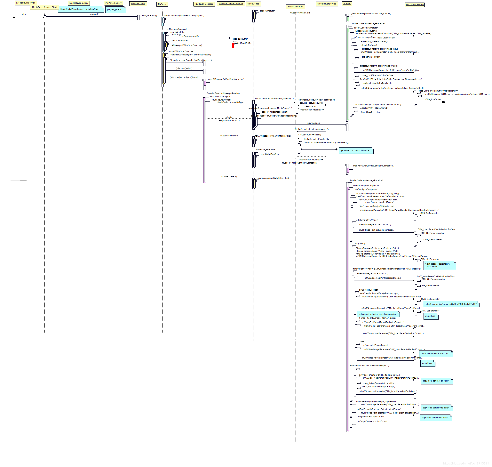

#### 消息系统
1. <font color="#ff0000">ALooper</font>::start()会新建一个<font color="#ff0000">LooperThread
</font>（继承Thread）并且调用其run方法，最终调用ALooper::loop()（可对比java层的Looper，功能一致）
    > GenericSource的prepareAsync方法里面就会新建一个ALooper并调用start方法开始loop处理message
2. 一般<font color="#ff0000">AMessage</font>的使用是 new AMessage(what, handler)，new的时候AMessage里面的mLooper会用handler.getLooper赋值；最后调用AMessage::post把msg post到looper里面的<font color="#ff0000">EventQueue</font>里面，通过Condition的wait，signal和waitRelaßtive方法在适当的时间取出queue的msg并调用其deliver方法；实际上是调用handler的deliverMessage方法；AHandler::deliverMessage里面调用了自己的虚方法onMessageReceived；<font color="#ff0000">AHandler</font>派生类只需要重写onMessageReceived方法即可在这个方法里面接收msg。

#### 某些概念
1. mOffloadAudio这个参数为true表示音频可以用硬件解码。
2. generation：里面很多用到了这个概念，其实是一个int值，每次环境改变+1，如果方法执行完后generation改变了，即在方法执行的过程中环境已经变了，方法执行的结果忽略。这是因为执行方法的时候没有加锁使用的一种方案，验证方法前后的代数是否一致保证方法执行前后环境的一致性。
3. share

#### 主要流程
##### 1 . 文件关系
- MediaPlayer.java -> android_media_MediaPlayer.cpp （连接native和java层的MediaPlayer） -> mediaplayer.cpp（native 层的MediaPlayer）-> MediaPlayerService.cpp（Client） ->（通过MediaPlayerFactory.cpp）-> NuPlayerDriver.cpp -> （通过AVNuFactory.cpp）-> NuPlayer.cpp -> GenericSource.cpp（[NuPlayerDecoder.cpp，NuPlayerRenderer]（通过AVNuFactory.cpp））-> ACodec.cpp
##### 2. 时序图


##### 3. setDataSource（[参考](https://blog.csdn.net/qq_27136111/article/details/94594673) java层省略）
1. native MediaPlayer（下称nMP，是一个可IPC的对象<font color=#ff0000>IMediaPlayerClient</font>） 调用 MediaPlayerService（下称MPS）的create方法创建一个可IPC的player（<font color=#ff0000>IMediaPlayer</font> MPS端的Client，下称MPSC的Bp）并保存为mPlayer；同时也把自己传递过去保存在MPSC的mClient（IMediaPlayerClient）里面，用于远程的回调。
2. 调用player（MPSC）的setDataSource方法 
3. MPSC调用MediaPlayerFactory（下称MPF）的getPlayerType方法，根据相应的DataSource类型获取对应的PlayerType，Android9.0的Type只有NU_PLAYER（5.1.1还有STAGEFRIGHT_PLAYER，SONIVOX_PLAYER，TEST_PLAYER）
4. MPSC调用setDataSource_pre方法做一些设置DataSource之前的准备。
    1. 根据PlayerType 调用MPF的createPlayer方法，最终调用了NuPlayerFactory的createPlayer生成NuPlayerDriver（<font color=#ff0000>MediaPlayerBase</font>；把pid和listener保存在里面，下称NPD），NPD通过AVNuFactory生成NuPlayer保存在mPlayer里面。
    2. 设置分离器binder（media.extractor）和解码器binder（omx）的死亡通知监听。
    3. 调用NPD的setAudioSink 保存新建的AudioOutput。
5. MPSC调用setDataSource_post保存生成的NPD到mPlayer里面。
6. 调用NuPlayerDriver的setDataSource方法，实际上是调用了NuPlayer的setDataSourceAsync方法，根据不同的播放DataSource生成不同的<font color=#00ff00>Nuplayer::Source</font>（GenericSource，HttpLiveSource，RtspSource，StreamingSource）并调用它的setDataSource方法（保存DataSource，如：fd，offset，length），最后把生成的source保存在mSource里面。
7. 通知NPDsetDataSource setDataSource completed 设置mState为 STATE_UNPREPARED。
##### 4. prepare（[参考](https://blog.csdn.net/qq_27136111/article/details/95357167)）
1. 同步的话调用nMP的prepare方法，异步调用nMP的prepareAsync方法（prepare 先设置 mPrepareSync=true 后调用prepareAsync_l方法，再用mSignal.wait等待方法执行结束；prepareAsync则直接调用prepareAsync_l方法）
2. 调用MPSC的prepareAsync方法，最后调用到NuPlayer的mSource（GenericSource）的prepareAsync方法，通过消息系统实际上是调用了onPrepareAsync。
3. 调用MediaExtractorService（下称MES）的makeIDataSource方法获取<font color=#ff0000>IDataSource</font>对象，MES调用DataSourceFactory的CreateFromFd获取FileSource（<font color=#ff0000>DataSource</font>）对象，再调用CreateIDataSourceFromDataSource把DataSource包装成可IPC的RemoteDataSource（IDataSource）。
4. GenericSource获取到IDataSource后调用CreateDataSourceFromIDataSource把其包装成TinyCacheSource（DataSource）并保存在mDataSource里面。
5. GenericSource调用initFormDataSource方法初始化extractor，实际上调用了MediaExtractorFactory的Create方法新建一个<font color=#ff0000>IMediaExtractor</font>对象（9.0 MediaPlayerService和Extractor不在一个进程，需要IPC）；接着调用CreateFromService，这个方法里面会判断是否需要调用UpdateExtractors更新Extractor信息（遍历system/lib64/extractors和vendor/lib64/extractors里面的extractor，解析后保存在一个List里面）；遍历List调用每个extractor的sniff方法，找到最适合source的<font color=#ff0000>MediaExtractor</font>，并调用CreateIMediaExtractorFromMediaExtractor方法把其封装成一个可IPC的IMediaExtractor（RemoteMediaExtractor）；
6. 根据返回的IMediaExtractor对象，获取保存mDurationUs，[mAudioTrack，mVideoTrack]（track都保存在mSources里面）,mBitrate
7. 如果有视频notifyVideoSizeChanged；
8. finishPrepareAsync
    1. 调用startSources配置IMediaExtractor一些初始参数
    2. 调用notifyPrepared，其调用了NPD的notifyPrepareCompleted方法，里面会调用mListener（MediaPlayerService里面的Listener类）的notify方法，createPlayer的时候setNotifyCallback设置的，接着调用到nMP的notify方法，里面会判断如果是同步的prepare会调用mSignal.signal。
    3. 调用postReadBuffer预读一些source里面的视频音频数据（在start里面分析）
##### 5. start（[参考](https://blog.csdn.net/qq_27136111/article/details/94594719?utm_source=distribute.pc_relevant.none-task)）
1. java层最后调用到nMP的start方法，设置mPlayer（NuPlayerDriver）的Looping，音量之类的数据，把mCurrentState改为MEDIA_PLAYER_STARTED，调用NuPlayerDriver的start方法，接着根据当前的状态STATE_PREPARED调用NuPlayer的start方法。
2. 调用NuPlayer的onStart方法，调用mSource（GenericSource）的start方法，调用postReadBuffer方法读取source数据（prepare的最后也有这个阶段）
3. 调用readBuffer方法，video类型读取8个buffer，audio类型读取64个buffer，调用source（prepare的时候从IMediaExtractor里面get到track 保存在mAudioTrack或者mVideoTrack的mSource（<font color=#ff0000>IMediaSource</font>）里面）的readMultiple或read方法，取决于supportReadMultiple。获取到MediaBufferBase类型的buffer数据。
4. 调用mediaBufferToABuffer把MediaBufferBase类型的buffer数据换成ABuffer类型的buffer数据保存在track（mAudioTrack，mVideoTrack，或其他）的mPackets对象里面。
5. mSource的start后，NuPlayer会通过AVNuFactory的createRenderer方法新建渲染器mRenderer（<font color=#00ff00>NuPlayer::Renderer</font>），新建ALooper对象mRendererLooper，并跟mRenderer（AHandler的派生类对象）绑定，然后进行mRenderer的各种设置（setPlaybackSettings，setVideoFrameRate）。
6. 接着调用instantiateDecoder（mAudioDecoder，mVideoDecoder的实例化），调用AVNuFactory的createDecoder来新建一个NuPlayer::Decoder对象decoder（<font color=#00ff00>NuPlayer::DecoderBase</font>）
    1. 调用decoder的init方法registerHandler(this)
    2. 调用decoder的configure方法配置解码器（见7）
7. configure方法实际上是调用了NuPlayerDecoder的onConfigure方法
    1. 通过AVUtils的createCustomComponentByName方法获取一个自定义的MediaCodec对象mCodec，默认返回NULL。
    2. 通过MediaCodec的CreateByType方法获取一个MediaCodec对象mCodec。
        1. 通过MediaCodecList的findMatchingCodecs方法获取跟mime匹配的```Vector<AString> matchingCodecs```，遍历matchingCodecs得到componentName。
            > MediaCodecList的构造方法里会去OmxStore获取一个解码列表，这个解码列表是在开机的时候OmxStore使用MediaCodecsXmlParser去解析xml文件得到的。
        2. 新建MediaCodec对象mCodec，并调用其init方法传入componentName（形如：OMX.google.vorbis.decoder）。
            1. 调用GetCodecBase获取mCodec（CodecBase的派生类Acodec）
            2. 调用mCodec的setCallback方法设置解码回调CodecBase::CodecCallback
            3. 调用mCodec的getBufferChannel方法获取mBufferChannel（BufferChannelBase），并设置其回调CodecBase::BufferCallback。
            4. post what=kWhatInit的message异步做一些最后的init，调用到mCodec的initiateAllocateComponent方法，最后调用到UninitializedState状态的onAllocateComponent方法（见8）。
    3. 调用mCodec（MediaCodec）的configure方法
        1. 配置一些format信息
        2. PostAndAwaitResponse what=kWhatConfigure的message（需要异步的一些configure操作）
        3. what=kWhatConfigure的message最后会调用MediaCodec的mCodec（的ACodec）的initiateConfigureComponent方法做最后的配置（见9）
8. ACodec的onAllocateComponent方法
    1. 新建CodecObserver对象地址保存在observer
    2. 新建OMXClient对象并调用connect方法获取对应service(<font color=#ff0000>OMX</font>)，并包装成LWOmx对象omx
    3. 调用omx的allocateNode传入componentName，message里面的"componentName"，最后很明显就调用到service的allocateNode方法。
    4. 新建<font color=#ff0000>OMXNodeInstance</font>对象instance，保存componentName，service，和ACodec新建的observer的封装``` new LWOmxObserver(new TWOmxObserver(observer))```
    5. 调用<font color=#ff0000>OMXMaster</font>对象的makeComponentInstance方法（传入```OMX_COMPONENTTYPE *handle```，```&OMXNodeInstance::kCallbacks```）。这个方法会找到包含componentName的一个Plugin（SoftOMXPlugin，还有其他如硬解，由Master管理这这些Plugin）调用对应Plugin的makeComponentInstance方法。
    6. SoftOMXPlugin的makeComponentInstance方法主要是根据componentName找到对应的so，dlopen出来，再通过```(CreateSoftOMXComponentFunc)dlsym(libHandle, "_Z22createSoftOMXComponentPKcPK16OMX_CALLBACKTYPE"
    "PvPP17OMX_COMPONENTTYPE");```获取createSoftOMXComponent方法，然后调用这个createSoftOMXComponent方法获取到对应的软解codec（SoftOMXComponent）。
    7. 调用OMXNodeInstance的setHandle方法吧handle保存起来。
    8. 保存instance和observer（```new TWOmxObserver(observer)```）对象到mLiveNodes，吗NodeObserver。
    9. 把instance封装成TWOmxNode返回。
    10. ACodec中保存componentName，omx，omxNode（```new TWOmxNode(instance)```），回调MediaCodec的onComponentAllocated方法，把状态机的状态变成LoadedState
    > 补充:ACodec里面使用了状态机的机制有UninitializedState，LoadedState，LoadedToIdleState，IdleToExecutingState，ExecutingState，OutputPortSettingsChangedState，ExecutingToIdleState，IdleToLoadedState，FlushingState九种状态，初始化的最后会changeState到UninitializedState状态。Acodec派生于状态机控制类AHierarchicalStateMachine和消息控制类AHandler，ACodec重写了AHandler的onMessageReceived方法调用AHierarchicalStateMachine的handleMessage方法，该方法里面会根据当前的状态调用对应状态的onMessageReceived方法。

9. ACodec的initiateConfigureComponent会异步调用到其onConfigureComponent方法。
    
##### 6. MediaCodecList解析
1. 解析media_codecs.xml文件得到对应的数据详见OmxStore，MediaCodecsXmlParser


<!--OmxStore(
            const char* owner = "default",
            const char* const* searchDirs
                = MediaCodecsXmlParser::defaultSearchDirs,
            const char* mainXmlName
                = MediaCodecsXmlParser::defaultMainXmlName,
            const char* performanceXmlName
                = MediaCodecsXmlParser::defaultPerformanceXmlName,
            const char* profilingResultsXmlPath
                = MediaCodecsXmlParser::defaultProfilingResultsXmlPath);

    static constexpr char const* defaultSearchDirs[] =
            {"/odm/etc", "/vendor/etc", "/etc", nullptr};
    static constexpr char const* defaultMainXmlName =
            "media_codecs.xml";
    static constexpr char const* defaultPerformanceXmlName =
            "media_codecs_performance.xml";
    static constexpr char const* defaultProfilingResultsXmlPath =
            "/data/misc/media/media_codecs_profiling_results.xml";-->
