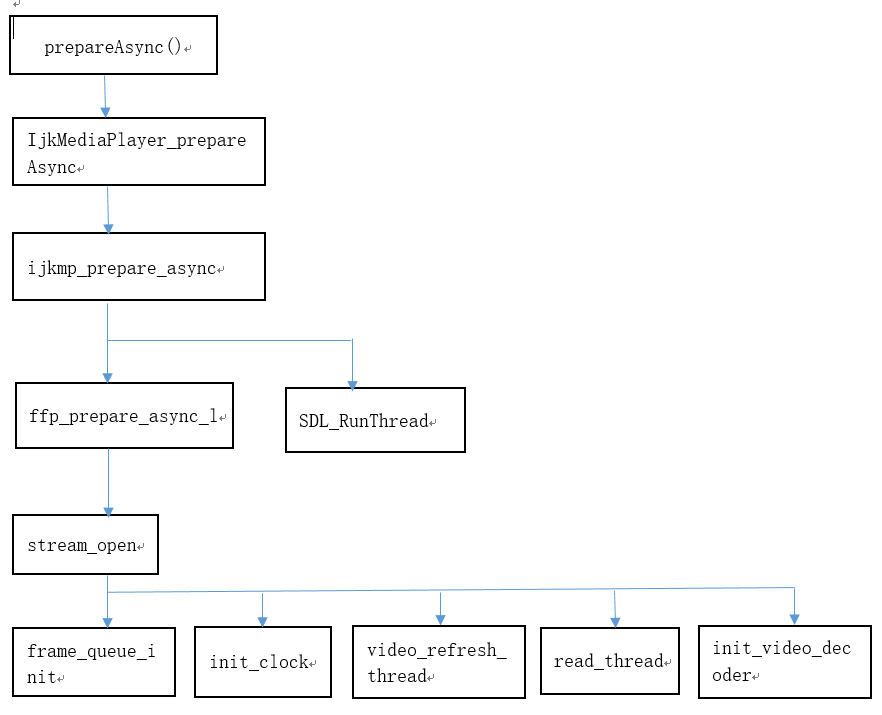
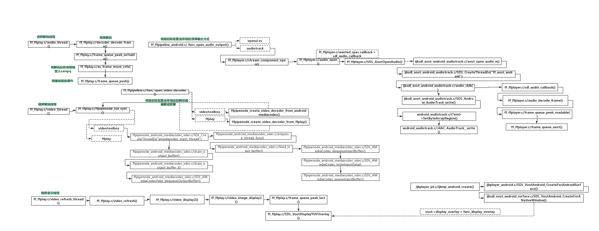

##### 一. 数据结构
1. AVPacket: 用于存储压缩的数据，分别包括有音频压缩数据，视频压缩数据和字幕压缩数据。它通常在解复用操作后存储压缩数据，然后作为输入传给解码器。或者由编码器输出然后传递给复用器。对于视频压缩数据，一个AVPacket通常包括一个视频帧。对于音频压缩数据，可能包括几个压缩的音频帧。
    - 在read_thread函数中，通过av_read_frame函数读取数据包，然后调用packet_queue_put将AVPacket添加到PacketQueue中。
2. AVFrame: 用于存储解码后的音频或者视频数据。AVFrame必须通过av_frame_alloc进行分配，通过av_frame_free释放。两者之间的关系: av_read_frame得到压缩的数据包AVPacket，一般有三种压缩的数据包(视频、音频和字幕)，都用AVPacket表示。然后调用avcodec_decode_video2对AVPacket进行解码得到AVFrame。
    - 在video_thread函数中，通过get_video_frame函数读取数据帧，然后调用queue_picture将AVFrame添加到FrameQueue中。7

##### 二. 函数
1. read_thread：首先，创建解复用和解码所需要的数据结构。其次，分别通过stream_component_open函数打开三种数据流。最后，通过av_read_frame将解复用后的数据包分别添加到对应的PacketQueue中。在stream_component_open函数主要负责解码工作，ffplay中为解码工作专门设置了一个数据结构Decoder，Decoder结构中有一个成员queue，这个queue就是指的输入的PacketQueue，通过decoder_init函数来指定PacketQueue。这个工作就是在stream_component_open中执行的。指定PacketQueue之后通过get_video_frame函数从PacketQueue中解码出AVFrame结构，最后通过queue_picture函数将解码得到的帧添加到FrameQueue。
2. ffplay_video_thread: video软解线程。

##### 三. 流程图
1. prepareAsync   
2. 解码显示：<table><tr><td bgcolor=white></td></tr></table>