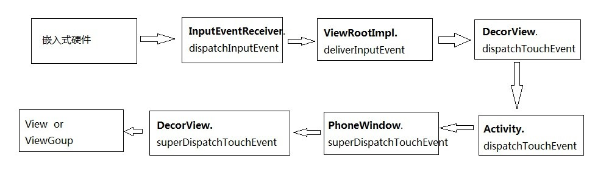
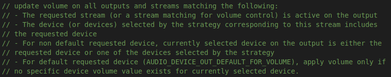

##### 开机音量预设
1. AudioService的构造方法里面调用了createStreamStates方法。system_process进程创建的时候会新建AudioService并start。在SystemServer的startOtherService方法里面。
2. createStreamStates根据NUM_STREAM_TYPES新建对应的VolumeStreamState对象，保存在mStreamStates数组里面；每个VolumeStreamState（mIndexMin，mIndexMax为实际配置的*10）对象里面每个device对应一个index（音量），保存在对象的mIndexMap（SparseIntArray）里面。
3. VolumeStreamState的构造方法会调用readSettings配置各个device的音量。如果mStreamType为STREAM_SYSTEM或者STREAM_SYSTEM_ENFORCED的话读取配置的默认值如果mCameraSoundForced为true，则读取配置的最大值，设置到default的device（代码：```mIndexMap.put(AudioSystem.DEVICE_OUT_DEFAULT, index)```），其他的读取保存在Settings.System里面的settings值，key格式volume_music_speaker（volume_music为Settings.VOLUME_SETTINGS_INT里面各个流的对应值，speaker为```AudioSystem.getOutputDeviceName(int device)```返回的）如果值==-1就不保存，否则保存（```mIndexMap.put(device, getValidIndex(10 * index))```，ps:不保存的获取的时候会用对应的default的index）。
4. 调用checkAllFixedVolumeDevices方法，如果当前流或流的alias是STREAM_MUSIC且divice是mFullVolumeDevices或mFixedVolumeDevices且index不为零（静音）对应的流类型的VolumeStreamState里面对应device的index设为mIndexMax并设置到底层（AudioPolicyService）使之生效。
5. 调用checkAllAliasStreamVolumes方法，把所有Alias对应的流对应的device的index设置上，最后调用applyAllVolumes方法把各个Stream对应的device的音量值设置到底层（AudioPolicyService）使之生效。
6. 调用checkMuteAffectedStreams方法，排除call流对于静音状态影响的标签，如果应用有MODIFY_PHONE_STATE权限是可以吧call设置成静音的（call流默认最小音量为1）
7. 调用updateDefaultVolumes方法，更新所有default的volume（前面check的时候可能音量会改变）
##### 开机后应用对音量设置的调用
1. PhoneWindow的onKeyDown和onKeyUp方法都对音量上下键做了监听，并调用了getMediaSessionManager().```dispatchVolumeKeyEventAsSystemService(event, mVolumeControlStreamType);```方法，最终调用到MediaSessionService的dispatchVolumeKeyEventLocked方法，这个方法会根据音量上下键设置音量设置的direction，并且当是action up的时候direction=0，只需要发一个beep不需要再调节音量，真正的音量调节在action down里面调用。设置的音量设置界面重写了onKeyDown方法屏蔽了PhoneWindow的onKeyDown对音量设置的操作。最后调用到AudioService的adjustSuggestedStreamVolume方法。
2. AudioManager对外提供了两种设置音量的方式：setStreamVolume和adjustStreamVolume。第一种是直接设置对应的index，第二个是设置direction。
    1. setStreamVolume(int streamType, int index, int flags, String callingPackage)
        1. 对streamType是STREAM_ACCESSIBILITY或STREAM_VOICE_CALL的一些特殊情况不处理音量调节请求，直接return。记录eventlog。
        2. 获取streamType对应的alias和device。如果device不包括A2DP但flags里面有FLAG_BLUETOOTH_ABS_VOLUME的return；判断callingPackage有没有修改当前流音量的权限，没有的return；判断应用的targetSDK是否大于N。如果大于，且当前的音量调节会改变zen的状态而callingPackage没有修改该状态的权限的，抛出异常（修改方案可以在这个```Settings.Secure.ENABLED_NOTIFICATION_POLICY_ACCESS_PACKAGES```Settings值里面添加对应的包名":"冒号隔开，或者在某个地方加白名单，这个权限仅限系统进程的应用所有）。
        3. 如果device是A2DP，HERING，HEMI时，先调用对应设备方法调节设备音量；如果device是FIXED的调整index。
        4. 如果当前流的音量是超出对应device的safe，一般是device为耳机且index比较大的时候，回调postDisplaySafeVolumeWarning方法，systemUI弹出音量太高的提示dialog；否则调用onSetStreamVolume方法。
            1. 调用setStreamVolumeInt方法，修改当前stream的index，如果成功的话同步修改对应以该stream为alias的流的index。发送VOLUME_CHANGED_ACTION广播，如果index有更新的话。
                1. 调用setDeviceVolume方法。
            2. 如果flags包含FLAG_ALLOW_RINGER_MODES且alias为```getUiSoundsStreamType()```，调用setRingerMode方法。
        5. 回调sendVolumeUpdate通知systemUI更新音量大小。
    2. adjustStreamVolume(int streamType, int direction, int flags, String callingPackage)
        1. 同上1
        2. 获取streamType对应的alias和device。如果device不包括A2DP但flags里面有FLAG_BLUETOOTH_ABS_VOLUME的return；判断callingPackage有没有修改当前流音量的权限，没有的return。
        3. 设置步长step=10，如果device为FIXED则调整。
        4. 如果flags包含FLAG_ALLOW_RINGER_MODES且alias为```getUiSoundsStreamType()```,获取当前internal ringerMode，调用checkForRingerModeChange方法，如果当前ringerMode为normal，如果direction为与mute相关的ADJUST_TOGGLE_MUTE或ADJUST_MUTE且mIsSingleVolume，则返回不需要调节音量；如果当前ringerMode为vibrate或silent，也返回不需要调节音量。最后调用setRingerMode方法更新当前的ringerMode。
        5. 如果返回需要调节音量，如果当前流的音量是超出对应device的safe，一般是device为耳机且adjust之后index比较大的时候，回调postDisplaySafeVolumeWarning方法，systemUI弹出音量太高的提示dialog；否则修改当前stream的index，如果成功的话同步修改对应以该stream为alias的流的index。发送VOLUME_CHANGED_ACTION广播，如果index有更新的话。
        6. 调用setDeviceVolume方法。
        7. 如果device是A2DP，HERING，HEMI时，调用对应设备方法调节设备音量。发送VOLUME_CHANGED_ACTION广播。
    3. setDeviceVolume(VolumeStreamState streamState, int device)方法
        1. 调用streamState的applyDeviceVolume_syncVSS方法
            1. 调用alias为streamState的流的applyDeviceVolume_syncVSS方法
        2. 调用AudioSystem的setStreamVolumeIndex方法，调用AudioPolicyService的setStreamVolumeIndex方法并检查```android.permission.MODIFY_AUDIO_SETTINGS```权限，最后调用到AudioPolicyManager的setStreamVolumeIndex方法。
            1. 检查index是否在该stream对应的Min和Max之间，或者流为call且index为0时，放回BAD_VALUE错误。
            2. 调用IVolumeCurvesCollection对象mVolumeCurves的canBeMuted，如果false，重设index为Max（ mVolumeCurves->getVolumeIndexMax(stream)）
                > mVolumeCurves为AudioPolicyManager构造方法里面new的一个而VolumeCurvesCollection对象，VolumeCurvesCollection的构造方法里面则for循环了Stream的个数，执行```KeyedVector::add(stream, VolumeCurvesForStream())```，新建了每个stream对应的VolumeCurvesForStream对象。
                VolumeCurvesForStream类包括：mIndexCur，保存则device对应的index；mIndexMin，mIndexMax和mCanBeMuted。开机设置的Max跟Min都会设置到这个对象对应stream的VolumeCurvesForStream里面。
            3. 调用mVolumeCurves的addCurrentVolumeIndex方法，在mVolumeCurves中找到对应stream的VolumeCurvesForStream，并调用其addCurrentVolumeIndex方法把device和对应index保存在mIndexCur里面。
            4. 更新mOutputs里面desc的device的音量；遍历mOutputs获取desc，如果stream在desc上面个是Active的，通过stream获取策略在获取策略对应的curStreamDevice，如果当前desc对应的device里面有curStreamDevice的device则更新该desc对应device（curDevice）的音量。
                1. 
                2. 调用```computeVolume(stream, index, device)```计算出index对应的db
                2. 调用desc的setVolume方法设置db，最后调用到AudioPolicyService的setStreamVolume方法。在mAudioCommandThread里面插入一个volumeCommand。在time到的时候会调用AudioSystem的setStreamVolume方法。最后调到AudioFlinger的streamVolume方法，AudioFlinger里面会根据output在mPlaybackThreads获取到对应的PlaybackThread并调用其streamVolume，把stream和对应的index保存，代码：```mStreamTypes[stream].volume```
                    > MixerThread的prepareTracks_l方法里面会给Active的Track设置音量。
        2. 调用persistVolume方法保存流的对应设备的对应index到Settings（对应开机音量预设.3）
 3. 调节音量的最后都会调用setRingerMode来修改当前的ringerMode，mRingerMode是内部的，一般只有systemUI会直接修改这个，其他第三方包括设置都是直接修改mRingerModeExternal（通过AudioManager调用的），最后两个会同步，ringerMode的不同会影响到状态栏上的图标是震动还是静音等。mRingerMode和mRingerModeExternal在dnd（zen）的表现上有点差异（ZenModeHelper的onSetRingerModeExternal，onSetRingerModeInternal）。mRingerModeExternal直接对应了zen的变化（slient->ZEN_MODE_IMPORTANT_INTERRUPTIONS，normal->ZEN_MODE_OFF）,mRingerMode跟zen的对应受VolumePolicy对象的影响，SystemUI会设置这个值。