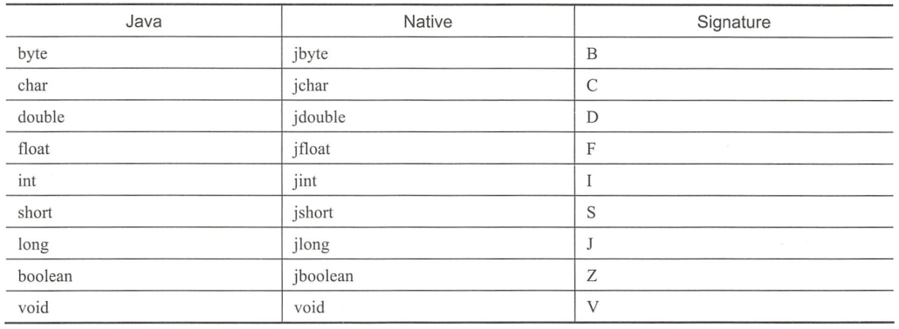
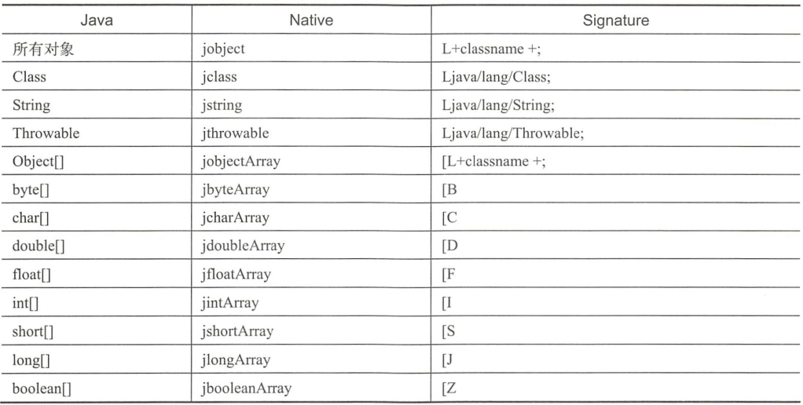
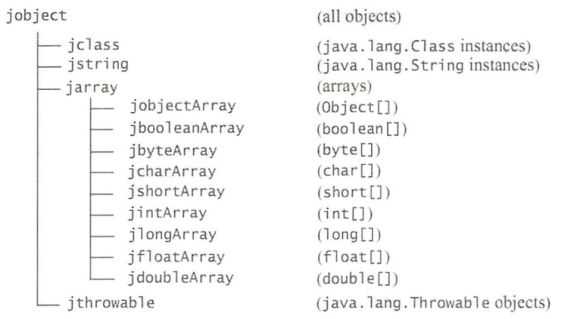
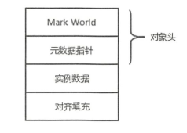

1. jni
    1. 主要文件
        1. prebuilts/jdk/jak9/linux-x86/include/jni.h
        2. libcore/ojluni/src/main/native/jvm.h
        3. art/runtime/jni_internal.cc
    1. JavaVM:这个代表java的虚拟机。所有的工作都是从获取虚拟机的接口开始的。
        1. 第一种方式，在加载动态链接库的时候，JVM会调用JNI_OnLoad(JavaVM* jvm, void* reserved)（如果定义了该函数）。第一个参数会传入JavaVM指针。
        2. 第二种方式，在native code中调用JNI_CreateJavaVM(&jvm, (void**)&env, &vm_args)可以得到JavaVM指针。
            两种情况下，都可以用全局变量，比如JavaVM* g_jvm来保存获得的指针以便在任意上下文中使用。
        3. Android系统是利用第二种方式Invocation interface来创建JVM的。
    2. JNIEnv:JNI Interface Pointer, 是提供JNI Native函数的基础环境，线程相关，不同线程的JNIEnv相互独立。
    3. [Android官方一些解读](https://developer.android.com/training/articles/perf-jni.html#faq_FindClass)
    4. 获取JNIEnv
        ```
        JNIEnv* getEnv() {
            JNIEnv *env;
            int status = gJvm->GetEnv((void**)&env, 
            JNI_VERSION_1_6);
            if(status < 0) {
                status = gJvm->AttachCurrentThread(&env, NULL);
                if(status < 0) {
                    return nullptr;
                }
            }
            return env;
        }
        ```
    5. 注册方法
        ```
        static const JNINativeMethod gMethods[] = {
            { "class_init_native","()V", (void *)jni_class_init_native },
            { "native_input_pen_init","()Z", (void *)jni_input_pen_init },
            { "native_input_pen_exit","()V", (void *)jni_input_pen_exit },
        };

        static int registerMethods(JNIEnv* env) {
            const char* const kClassName = CLASS_NAME;
            jclass clazz;
            /* look up the class */
            clazz = env->FindClass(kClassName);
            if (clazz == NULL) {
                LOGE("Can't find class %s/n", kClassName);
                return -1;
            }
            /* register all the methods */
            if (env->RegisterNatives(clazz,gMethods,sizeof(gMethods)/sizeof(gMethods[0])) != JNI_OK) {
                LOGE("Failed registering methods for %s/n", kClassName);
                return -1;
            }
            /* fill out the rest of the ID cache */
            return 0;
        }

        jniRegisterNativeMethods方法也是走了上面的流程。
        ```
    6. 基本数据类型的转换
    7. 引用数据类型的转换
    8. 引用数据类型的继承关系
    9. 方法签名：(参数签名格式. .. )返回值签名格式
        > (Ljava/lang/Object;Ljava/lang/String;Ljava/lang/String;) V
        > ()[B

2. enum
    1. Java 中的每一个枚举都继承自 java.lang.Enum 类。当定义一个枚举类型时，每一个枚举类型成员都可以看作是 Enum 类的实例，这些枚举成员默认都被 final、public, static 修饰，当使用枚举类型成员时，直接使用枚举名称调用成员即可。

3. <span id="ThreadLocal">ThreadLocal</span>
    - new ThreadLocal().set，get 是在new ThreadLocal的Thread里面保存或者获取value，以new ThreadLocal为key
    - android的Looper里面用一个静态变量sThreadLocal来set，get value，是在对应的Thread保存Looper，key为sThreadLocal，由于是静态的ThreadLocal，故不同的Thread里面，Looper对应的key是一样的。
    - InheritableThreadLocal 可以实现多个线程访问ThreadLocal
        >  因为其重写了createMap和getMap，都在Thread的另一个属性里面create和get（inheritableThreadLocals，正常是在threadLocals）。
        > 子线程在创建的时候会拷贝父类的inheritableThreadLocals。

4. java虚拟机
    1. [新生代用标记-复制，老年代用标记-重排](https://blog.csdn.net/kzadmxz/article/details/96574203)
        1. 年龄达到MaxTenuringThreshold或Survivor（标记-复制算法把空间分为三部分，一块大的Eden空间和两块较小的Survivor空间，内存分配的时候只用一块Eden和一块Survivor，另一块Survivor用来复制）空间中相同年龄所有对象大小的总和大于Survivor空间的一半，年龄大于或等于该年龄的对象就可以直接进入老年代。
        2. 堆大小=新生代+老年代（新生代占堆空间的1/3、老年代占堆空间2/3）
    2. class文件里面有各种表，格式都是定死的，这样可以方便解析，见深入理解Java虚拟机第六章。
    3. class的加载流程：加载-验证-准备-解析-初始化
        1. 在加载阶段，虚拟机需要完成以下事情：
            1. 通过一个类的权限定名来获取定义此类的二进制字节流
            2. 将这个字节流所代表的静态存储结构转化为方法区的运行时数据结构
            3. 在java堆中生成一个代表这个类的java.lang.Class对象，作为方法去这些数据的访问入口
        2. 在验证阶段，虚拟机主要完成：
            1. 文件格式验证：验证class文件格式规范
            2. 元数据验证：这个阶段是对字节码描述的信息进行语义分析，以保证起描述的信息符合java语言规范要求
            3. 字节码验证：进行数据流和控制流分析，这个阶段对类的方法体进行校验分析，这个阶段的任务是保证被校验类的方法在运行时不会做出危害虚拟机安全的行为
            4. 符号引用验证：符号引用中通过字符串描述的全限定名是否能找到对应的类、符号引用类中的类，字段和方法的访问性(private、protected、public、default)是否可被当前类访问
        3. 准备阶段是正式为类变量分配内存并且设置类变量的零值（局部变量不会设置零值，局部变量没有初始化不能用），这些变量所使用的内存都将在方法去中进行分配。
        4. 解析阶段是虚拟机将常量池内的符号引用替换成直接引用的过程，常见的解析有四种：
            1. 类或接口的解析
            2. 字段解析
            3. 类方法解析
            4. 接口方法解析
        5. 初始化阶段就是执行\<cinit\>()方法的过程（类构造器，这要区别于\<init\>()实际构造器），这个方法是由编译器自动收集类中的所有类变量的赋值动作和静态代码块中的语句合并产生的，顺序与源文件的顺序相同。虚拟机保证父类的\<cinit\>()方法先于子类（父类的静态构造块先于子类）。
    4. Java虚拟机运行时数据区域包括：方法区、堆、虚拟机栈、本地方法栈、程序计数器，前两个是线程共享的。
        1. 方法的执行都是用一个个“栈帧”代表的，一个栈帧包括：局部变量表、操作数栈、动态链接、方法出入口。
            1. 局部表量表中的第0位索引的SLot默认是用于传递方法所属的对象实例引用，在方法中可以通过关键字‘this’来访问这个隐含的参数。
            2. 在做算数运算的时候是通过操作数栈来进行的，在调用其他方法的时候是通过操作数栈来进行参数传递的。两个栈帧作为虚拟机栈的元素是完全相互独立的，但大多说虚拟机的实现都会做一些优化处理，领两个栈帧的操作数栈和局部变量表重叠。
            3. 每个栈帧都包含了一个指向运行时常量池中该栈帧所属方法的引用，持有这个引用是为了支持方法调用过程中的动态链接。符号引用（常量池里面pand有大部分）一部分会在类加载阶段货值第一次使用的时候就转化为直接引用，这种转化称为静态转化。另外的一部分将在每一次运行期间转化为直接引用，这部分称为动态链接。
    5. 在不同的虚拟机里面，执行引擎在执行Java代码的时候可能会有解释执行（通过解释器执行）和编译执行（通过即时编译器产生本地代码执行）两种选择，也可能两只兼备。
    6. 锁优化
        1. 自旋锁和自适应自旋：共享数据的锁定状态只会持续很短的一段时间，为了这段时间去挂起和恢复线程并不值得，为了让线程等待，我们只需要让线程执行一个忙循环（自旋），这项技术就是所谓的自旋锁。这样虽然避免了线程切换的开销，但是它是要占用处理器时间的。一般自旋次数默认值为10次，超过自旋次数还没有得到锁的，就应当用传统的方式去挂起线程。
        2. 锁消除：虚拟机即时编译器在运行时，对一些代码上要求同步，但是被检测到不可能存在共享数据竞争的锁进行消除。
        3. 锁粗化：频繁的进行互斥同步操作会导致不必要的性能损耗（加锁操作出现在循环里面），虚拟机探测到有这样一串零碎的操作都对同一个对象加锁，将会把加锁同步的范围扩展（粗化）。
        4. 轻量级锁
        5. 偏向锁：这个锁会偏向第一个获得他的线程，如果在接下来的执行过程中，该锁没有被其他的线程获取，则持有偏向锁的线程将永远不需要进行同步。 
    7. 静态方法，私有方法，实力构造器，父类方法4类，他们在类加载的时候就会把符号引用解析成该方法的直接引用。
    8. 重载：相同方法名参数列表不同，在同一个类里面；重写：相同方法名和参数列表，在存在子类对父类某些方法的覆写。
    9. 双亲委派模型：class的load会先传给父类load，一层层往上传，如果父类不能load这个class，才会给子类load。同一个class文件被同一个类加载器加载才算同一个类；如果被不同的类加载器加载，那么就不是同一个类（instanceof方法判断）。
    10. 对象的内存布局：
        1. 对象头：对象头包括两部分信息，分别是Mark World和类型指针。Mark World用于存储对象运行时的数据，如：HashCode、锁状态标志、GC分代年龄、线程持有的锁、偏向线程ID、偏向时间戳等；类型指针即对象指向他的类元数据的指针，虚拟机通过这个指针来确定这个对象是那个类的实例。
        2. 实例数据：用于存储对象中的各种类型的字段信息（包括从父类集成下来的）
        3. 对其填充：不是必然存在的在HotSpot VM的自动内存管理系统要求对象的其实地址必须是8字节的整数倍，即对象的大小必须是8字节的整数倍。
        4. 
    11. 对象的内存分配，Java对象的内存分配有两种情况，由Java堆是否规整来决定（Java堆是否规整由所采用的垃圾收集器是否带有压缩整理功能决定）：
        1. 指针碰撞(Bump the pointer)：如果Java堆中的内存是规整的，所有用过的内存都放在一边，空闲的内存放在另一边，中间放着一个指针作为分界点的指示器，分配内存也就是把指针向空闲空间那边移动一段与内存大小相等的距离
        2. 空闲列表(Free List)：如果Java堆中的内存不是规整的，已使用的内存和空闲的内存相互交错，就没有办法简单的进行指针碰撞了。虚拟机必须维护一张列表，记录哪些内存块是可用的，在分配的时候从列表中找到一块足够大的空间划分给对象实例，并更新列表上的记录
5. 乐观锁与悲观锁
        1. CAS算法（即compare and swap（比较与交换）涉及到三个操作数，需要读写的内存值 V,进行比较的值 A,拟写入的新值 B），不能解决ABA问题（栈），开销大（自旋CAS），只能保证一个共享变量的原子操作;version算法。
        2. 两者使用场景不同。
6. sleep，wait的区别
    1. sleep不会释放锁，wait会。
        - Thread.join方法就是在主线程里面调用了子线程lock的wait方法，使主线程block，当子线程执行完成之后会自动调用notify（如Android中，art/runtime/thread.cc的Thread::Destroy方法)
            ```
            // Thread.join() is implemented as an Object.wait() on the Thread.lock object. Signal anyone who is waiting.
            ObjPtr<mirror::Object> lock = jni::DecodeArtFiel(WellKnownClasses::java_lang_Thread_lock)->GetObject(tlsPtr_.opeer);
            // (This conditional is only needed for tests, where Thread.lock won't have been set.)
            if (lock != nullptr) {
                StackHandleScope<1> hs(self);
                Handle<mirror::Object> h_obj(hs.NewHandle(lock));
                ObjectLock<mirror::Object> locker(self, h_obj);
                locker.NotifyAll();
            }
            ```
7. 并发编程
    1. 原子性问题，可见性问题（volatile），有序性
        - volatile: 
            1. 保证了不同线程对这个变量进行操作时的可见性，即一个线程修改了某个变量的值，这新值对其他线程来说是立即可见的。
                1. 强制将修改的值立即写入主存；
                2. 除了修改值的线程，其他的取值的线程缓存标记为无效
                3. 缓存无效的的线程会等待缓存行对应的主存地址被更新之后，重新读取主存中的新值
            2. 禁止进行指令重排序。

3. 找机会阅读java编程思想，java虚拟机（阅读了第一遍，粗略的有个概念），Linux相关的东西